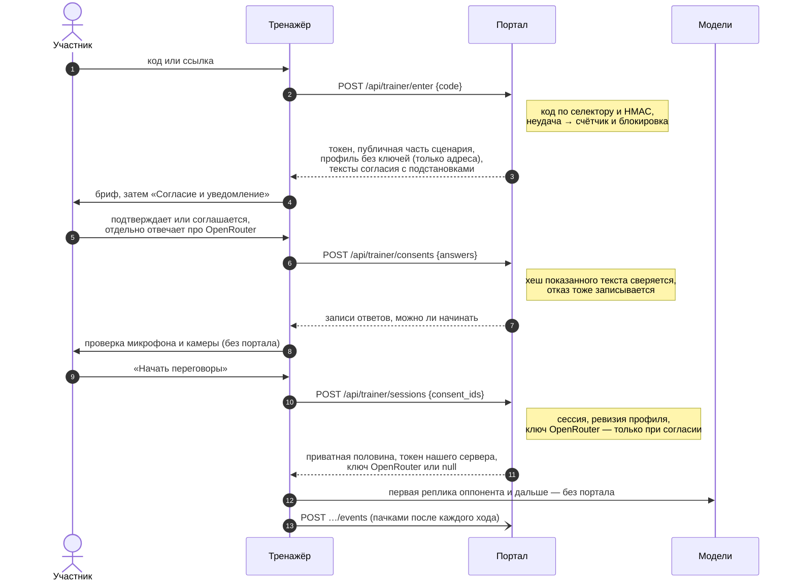
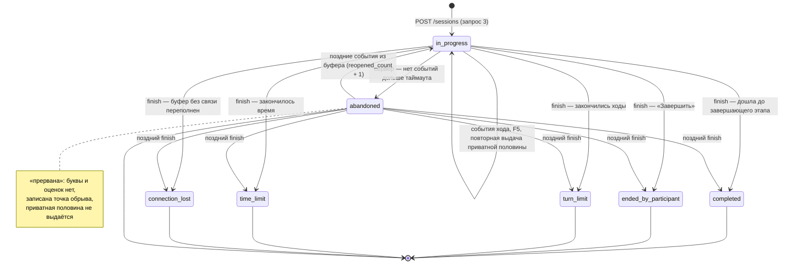
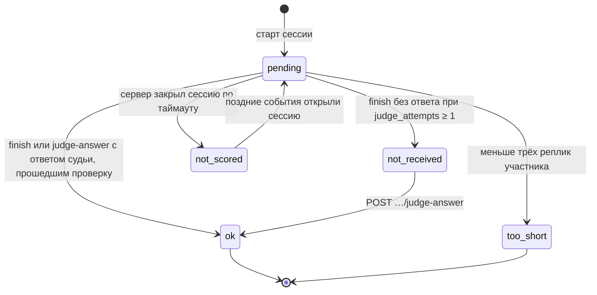
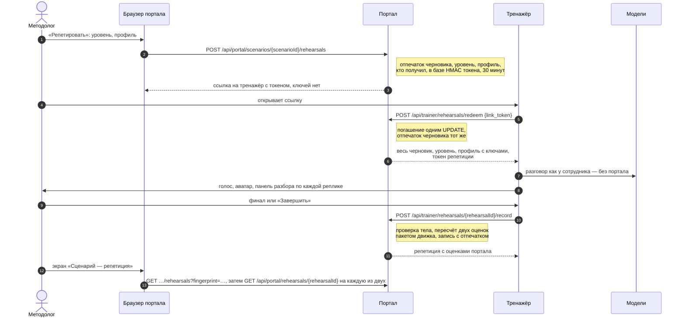
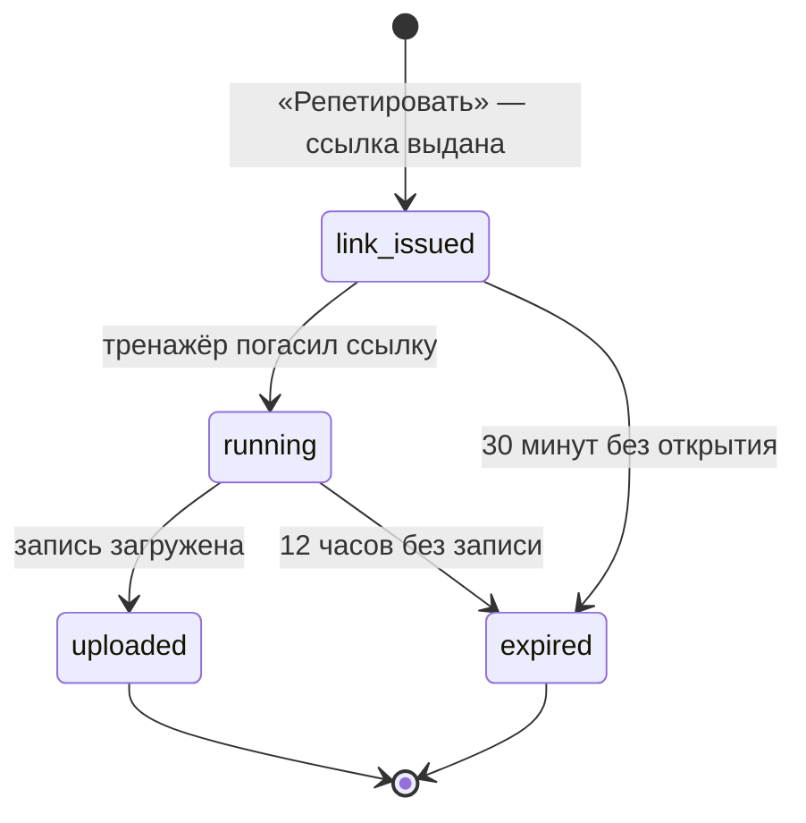

# API портала

*Арена переговоров · спецификация*

Какие адреса есть у портала, кто их вызывает и по каким правилам. Формы запросов и ответов — в [`arena-api.yaml`](arena-api.yaml) (OpenAPI 3.1); здесь их нет, чтобы не было двух источников. Таблицы и имена — из [`arena-db.md`](arena-db.md), документ сценария — из [`arena-scenario.schema.json`](arena-scenario.schema.json), оценки — из `arena-scoring.md`, тексты согласий — из `arena-consent-texts.md`.

**Версия** 0.2 — черновик к обсуждению · **Адресов** 82: тренажёр 14, портал 68 · **Проверка** `check_openapi.py` — пройдена

Обсуждаем по `operationId`: «`saveDraft` — не согласен, потому что…».

## Содержание

1. Два потребителя
2. Соглашения
3. Вход и права
4. Три запроса до первой реплики
5. Жизненный цикл сессии
6. Репетиция в тренажёре
7. Все адреса
8. Что сознательно не в API и где отступили от документов
9. Потом

---

## 1. Два потребителя

| Префикс | Кто вызывает | Как входит | Что делает |
|---|---|---|---|
| `/api/trainer/*` | приложение-тренажёр (его пишет другой разработчик): участник, а на репетиции — методолог | код доступа → токен участника; в демо — гостевой токен; на репетиции — одноразовая ссылка из портала → токен репетиции | настройки, согласие, старт, события хода, завершение, свои результаты и возражения; репетиция по ссылке и загрузка её записи |
| `/api/portal/*` | веб-портал HR | логин и пароль → cookie сессии входа | сценарии, ссылки на репетицию и записи репетиций, назначения, люди, результаты, аналитика, выгрузки, профили тренажёра, доступ, журнал |

Портал — один процесс на Node.js: он подключает тот же пакет движка на TypeScript, что и тренажёр. Тренажёр ведёт на пакете сессии, репетиции и демо. Портал использует пакет только для проверки сценария (сюда же входят отпечаток и деление документа на части для тренажёра) и для пересчёта оценок; разговоров портал не ведёт. Внутрь объектов пакета (документ сценария, настройки профиля, разбор хода, блок оценок) портал не заглядывает — в YAML они описаны как `EngineObject` или ссылкой на схему сценария.

---

## 2. Соглашения

**Формат.** JSON в UTF-8, имена полей `snake_case`. Ключи — UUID. Время — ISO 8601 с часовым поясом (`2026-09-18T10:15:00Z`), даты документов — `YYYY-MM-DD`. Пустое значение — `null`, а не пропущенное поле. Буква финала и два числа оценок — всегда отдельными полями; поля с суммой или средним двух оценок нет нигде (FR-RS-04).

**Списки.** `?limit=50&offset=0`, `limit` до 200. Ответ — `{items, page: {total, limit, offset}}`. Короткие справочники (группы, версии, профили, шаблоны) отдаются массивом без страниц.

**Фильтры.** В строке запроса, имена — как столбцы базы: `group_id`, `scenario_version_id`, `difficulty`, `mode`, `status`, `from`, `to` (период: `from` включительно, `to` — нет). Несколько значений — повтором параметра: `?group_id=…&group_id=…`. Фильтр по группе, к которой нет доступа, — **403, а не пустой список** (FR-AC-08). Выгрузки получают фильтры в теле `POST`, потому что пишутся в журнал.

**Ошибки.** `application/problem+json` (RFC 9457). `title` — готовая фраза по-русски для экрана, `errors[]` — поля: `path` (JSON Pointer к полю тела) и `message` обычными словами. У проверки сценария пути ведут в поле документа (`/document/issues/0/opponent/limit`) — по ним редактор открывает нужное поле (FR-SC-07). `data` — сведения для экрана: `{done, required}` у нехватки репетиций, `missing_seqs` у завершения. Коды `type`:

| `type` | HTTP | Когда |
|---|---|---|
| `invalid_body` | 400 | тело не разобрано, лишнее поле, объект движка не прошёл закрытую схему пакета, ключ с именем ровно `emotion` на любой глубине |
| `unauthenticated` | 401 | нет входа, токен истёк, неверный логин или пароль |
| `forbidden_role` · `forbidden_group` | 403 | роль не позволяет · нет доступа к группе (отказ пишется в журнал) |
| `code_blocked` | 403 | код заблокирован после серии неудачных вводов |
| `not_found` · `code_not_found` · `demo_disabled` | 404 | нет такого · код не найден (попытка засчитана) · демо выключено |
| `code_revoked` · `assignment_cancelled` · `assignment_expired` | 410 | код перевыпущен · назначение отменено · срок истёк |
| `rehearsal_link_used` · `rehearsal_link_expired` | 410 | ссылка на репетицию уже открыта · истекла |
| `session_finished` · `session_running` · `assessment_passed` · `consent_required` · `no_model_route` | 409 | состояние сессии или согласия не позволяет действие |
| `missing_turns` | 409 | завершение раньше, чем дошли все ходы |
| `mode_locked` · `admission_insufficient` · `fingerprint_changed` · `nothing_changed` · `archived` | 409 | правила сценария; `nothing_changed` — «Содержание не изменилось — публиковать нечего» (отпечаток равен опубликованному) |
| `already_answered` · `already_reviewed` · `not_reviewable` | 409 | повтор действия или отметка «просмотрено» не к месту |
| `draft_changed` | 412 | `If-Match` не совпал |
| `too_large` | 413 | тело больше 1 МБ (запись репетиции — 5 МБ), в пачке больше 100 событий |
| `validation_failed` · `scenario_check_failed` · `decision_ineligible` | 422 | данные не прошли проверку; у профиля тренажёра — в том числе поле вне закрытой схемы настроек и адрес с логином или параметрами запроса |
| `rate_limited` | 429 | частота; `Retry-After` в секундах |

**Повторы.** Заголовка `Idempotency-Key` и хранилища повторов нет. Где клиент повторяет запрос после обрыва связи, повтор безопасен и так:

| Адрес | Как |
|---|---|
| события хода | ключ `(session_id, seq)` у реплики и `event_id` у отказа компонента — дубли отбрасывает база |
| старт сессии | если сессия уже идёт, возвращается она же (200) |
| завершение | повтор возвращает сохранённый результат; тело повтора не сравнивается |
| согласие | повтор добавляет ещё одну запись — безвредно: таблица только дополняется, сессия ссылается на один ответ |
| запись репетиции | повтор возвращает сохранённую запись; тело повтора не сравнивается |
| погашение ссылки репетиции | не повторяется: второй раз — 410. Оборвалась связь — методолог нажимает «Репетировать» ещё раз |
| возражение, кадровое решение, создание назначений | кнопка блокируется до ответа; повторная отправка создаст вторую запись |

Счётчики частоты — в памяти процесса (одна копия портала на хакатоне).

**Частота запросов.** Четыре ограничения: три из NFR-S-02 и вход в портал.

| Что | Предел | Сверх того |
|---|---|---|
| ввод кода `POST /api/trainer/enter` | 10 в минуту с адреса | плюс постоянная блокировка кода после N неудачных вводов (`portal_settings.code_max_failed_attempts`, по умолчанию 10); снимает администратор |
| выдача настроек и приватной половины: демо-вход, старт сессии, `…/private`, `…/judge-retry`, погашение ссылки репетиции | 30 в минуту на токен; демо-вход и погашение ссылки репетиции — 10 в минуту с адреса | — |
| генерация из брифа (создание и повтор шага) | 10 в час на пользователя | — |
| вход в портал | 5 в минуту на пару «адрес + логин» | — |

**Эмоций в API нет (FR-RS-02).** Ни в одной схеме нет поля для метки эмоции, а все тела тренажёра закрыты (`additionalProperties: false`). Формы объектов внутри события (`engine_step`, `judge`, `opponent_judge`, `offer`, `terms`, `client_scores`) задаёт пакет движка, поэтому пакет экспортирует их закрытые JSON-схемы, и портал проверяет по ним до записи тела куда-либо. Дополнительно портал ищет на любой глубине ключ с именем **ровно** `emotion` и отвечает 400. Именно точное совпадение имени, а не подстрока: иначе не сохранится профиль с полем `camera.emotion_labels_to_opponent`. В разборе хода, который шлёт тренажёр, нет текста запроса к оппоненту — в нём метка.

**Время ответа (NFR-P-01).** Чтение ≤ 200 мс, запись ≤ 500 мс в 95 % запросов; запросы 1 и 3 тренажёра ≤ 800 мс (NFR-P-02). Исключения, которые ждут модели: генерация (асинхронна, экран опрашивает ход раз в 2 секунды) и проверка профиля (до 20 с). Репетиция моделей на портале не вызывает — её ведёт тренажёр (раздел 6).

---

## 3. Вход и права

### 3.1. Тренажёр

- **Токен участника.** `POST /api/trainer/enter` меняет код на подписанный токен (HMAC-секрет сервера). В токене — назначение, номер участника и срок: 12 часов. Клиент держит его в `sessionStorage` вкладки. После F5 или упавшей вкладки код вводится снова или берётся из ссылки — вход по коду возвращает в ту же сессию (FR-AC-03): к устройству ничего не привязано.
- **Права проверяются по базе на каждом запросе.** Отменили назначение или перевыпустили код — токен больше не начинает новые сессии и не выдаёт настройки, но идущая сессия доигрывается: её события, завершение и повторный запрос к судье принимаются.
- **Свои данные.** Токен видит сессии своего номера участника по всем его назначениям («Мои результаты»), чужие — 403.
- **Токен репетиции** выдаёт `POST /api/trainer/rehearsals/redeem` в обмен на одноразовую ссылку из портала (раздел 6). Он привязан к одной репетиции и пользователю портала, который получил ссылку, годится только для загрузки её записи и живёт 12 часов.
- **Гостевой токен демо** выдаётся `POST /api/trainer/demo/enter` без кода. Он несёт новый `demo_guest_id`; демо-сессии пишутся на одного демо-участника, но с этим номером гостя (`sessions.demo_guest_id`), и «Мои результаты» фильтруют по нему — гости не видят разговоры друг друга. Уведомление и ответ про внешнюю нейросеть в демо обязательны, как и везде (FR-AC-13, FR-AC-07). Ключей моделей гость не получает: разговор идёт на заглушке (раздел 8). Выключено демо переменной окружения — 404 «Демо выключено на этом сервере».

### 3.2. Портал

- **Вход по логину и паролю** (`portal_users.login`, argon2id). Ответ ставит cookie `arena_session`: httpOnly, Secure, SameSite=Strict, 8 часов без действий. Защита от чужих сайтов — SameSite=Strict и то, что все изменяющие запросы принимают только `application/json`.
- **Роль и доступ к группам в cookie не хранятся** — читаются из базы на каждом запросе, поэтому снятый доступ действует сразу (UC-A-06).
- **Роли:**

| Что | Методолог | Наблюдатель | Администратор |
|---|---|---|---|
| Сценарии: создание, правка, публикация, репетиции, здоровье, урезанный вид сессии | да | нет | да |
| Библиотека и версии — чтение | да | да (только опубликованные) | да |
| Назначения, результаты, сравнение, аналитика, выгрузки, «просмотрено», решения, возражения | с доступом к группе | с доступом к группе | с доступом к группе |
| Сотрудники: список и карточка | группы с доступом | группы с доступом | все (ведёт справочник), но результаты — только с доступом |
| Сотрудники и группы: заведение, правка, отзыв согласия, снятие блокировки кода | нет | нет | да |
| Профили тренажёра | чтение без ключей | чтение без ключей | всё; ключ — только запись и последние 4 символа |
| Пользователи, доступ к группам, журнал, изменение настроек | нет | нет | да |

«HR» в документах — методолог или наблюдатель с доступом к группе. Результаты любой роли, в том числе администратора, открываются только по доступу к группе (FR-AC-08). Администратор может открыть доступ себе — это такая же запись `access_granted` в журнале.

**Доступ к сессии** проверяется по группе **назначения** (`sessions.group_id`), а не по текущей группе сотрудника (arena-db.md, раздел 9).

**Журнал (NFR-S-03).** Открытие результата и записи сессии, урезанного вида, каждая выгрузка (по строке на каждую группу), отказ в доступе, изменение ключа, выдача и снятие доступа, создание и правка групп, отзыв согласия, создание, отмена и продление назначений, выпуск и перевыпуск кодов, «просмотрено», кадровое решение, ответ на возражение, публикация, смена режима и архивация сценария, изменение настроек, вход — каждое действие добавляет строку `audit_log` с видом из перечисления `audit_action`. Имён и текстов реплик в журнал не пишем. В API значения те же, что в базе: `actor_kind` — `user` · `participant` · `system`, `outcome` — `ok` · `denied`.

---

## 4. Три запроса до первой реплики

NFR-P-02: до первой реплики тренажёр делает к порталу не больше трёх запросов, у каждого своё назначение.

**Возврат после F5 (UC-P-06)** — два запроса: `POST /api/trainer/enter` отвечает `next = resume` и `running_session_id`, затем `GET /api/trainer/sessions/{sessionId}/private` отдаёт ту же приватную половину, доступ к моделям и состояние для продолжения (ходы, этап, шкалы, прошедшее время). Согласие повторно не спрашивается.

**Что где лежит.** Точный состав частей сценария — формат, раздел 16; делит документ одна функция пакета движка. Автотест FR-AC-04 берёт все адреса из роутера и проверяет, что до старта ни один ответ не содержит пределов оппонента, текстов скрытых фактов, условий переходов и названий скрытых предметов, а для завершённой сессии `…/private` отвечает 409. Единственное исключение — `GET …/judge-retry` для сессии без «процесса»: только транскрипт, решения судьи по репликам, журнал предложений, интересы оппонента и тексты раскрытых фактов (arena-scoring 8.3).

**Демо.** Гость проходит те же запросы 2 и 3, но в ответе старта `model_access` — `null` в обоих полях, и тренажёр ведёт разговор на заглушке. Исключение — переменная окружения `DEMO_MODEL_KEYS=1`, её включают только на стенде жюри (раздел 8).

**Когда начать нельзя.** `settings.consent_screen.can_proceed = false` уже в первом ответе, если в оценке нет отметки о письменном согласии или не заполнены обязательные подстановки текста — участник видит причину до экрана согласия. Отказ от согласия в оценке → `can_start = false` и текст из arena-consent-texts.md, 6.1. Нет согласия на OpenRouter, а нашего сервера в профиле нет → старт отвечает 409 `no_model_route` с текстом 6.2.

**Новая попытка в тренировке** снова проходит запросы 2 и 3: ответ на согласие привязан к попытке. В оценке после завершённой сессии старт отвечает 409 `assessment_passed`, вход — `next = results`.

---

## 5. Жизненный цикл сессии

Семь статусов из требований (`session_status`). Итоговые ставит тренажёр в `POST …/finish`, «прервана» — только сервер.

| Статус | На экране | Как попадает | Оценки |
|---|---|---|---|
| `in_progress` | идёт | старт; поздние события открывают прерванную заново | — |
| `completed` | завершена | `finish`: разговор дошёл до завершающего этапа | обе |
| `ended_by_participant` | прервана участником | `finish` после «Завершить» | обе, по состоявшейся части |
| `turn_limit` | закончились ходы | `finish` по лимиту ходов | обе |
| `time_limit` | закончилось время | `finish` по лимиту времени | обе |
| `connection_lost` | прервана: потеря связи | `finish` после переполнения локального буфера | обе, как при «Завершить» |
| `abandoned` | прервана | задание сервера раз в минуту: нет событий дольше `abandon_timeout_minutes` (по умолчанию 10), считая от более позднего из «последнее событие» и «портал запущен» | не ставятся |

**Поздние события (FR-ST-03, FR-AC-11).** Пачка событий для прерванной сессии дописывает ходы и возвращает статус `in_progress`, `process_status` снова `pending`. Пока сессия идёт или прервана, отметку «просмотрено» поставить нельзя (409): поздние ходы ещё могут добавить нарушения оппонента. Если по тому же назначению уже идёт другая сессия, база не даст вторую идущую: ходы дописываются, статус остаётся `abandoned`, в ответе `reopened = false` и пояснение. Поздний `finish` закрывает прерванную сессию обычным образом, и её оценки считаются (arena-scoring 3.4).

**Оценка «процесс»** ведёт свой статус (`process_status`) рядом:

Сохранённый и проверенный ответ судьи больше не перезапрашивается: `judge-answer` при `ok` отвечает 409.

---

## 6. Репетиция в тренажёре

**Решение: репетиция идёт в тренажёре** (FR-SC-10). Цикл хода живёт в одном месте — в тренажёре; портал его не повторяет и для репетиции моделей не вызывает. Портал делает две вещи: выдаёт одноразовую ссылку и принимает запись.

Состояние репетиции (`RehearsalStatus`) выводится из столбцов `rehearsals`, отдельно не хранится:

**Ссылка.** Одноразовая, живёт 30 минут, привязана к отпечатку черновика, уровню, профилю и пользователю, который её получил. Токен стоит после `#` и не попадает в журналы веб-серверов; в базе — только его HMAC, как у кодов доступа. Ссылка показывается один раз, в ответе на «Репетировать». Если пользователь к моменту погашения отключён или больше не методолог и не администратор — 403. Обрыв связи на погашении — методолог нажимает «Репетировать» ещё раз.

**Ключи (FR-PF-04).** Браузеру портала ключи не уходят — требование выполняется как написано. Ключи получает тренажёр при погашении ссылки, только в память, как при старте сессии. Экрана согласия нет: разговаривает автор сценария, данных сотрудников в репетиции нет. **Риск:** методолог может достать ключи из памяти тренажёра, как и любой участник, а ссылка, пересланная до первого открытия, сработает у другого — поэтому ссылка одноразовая и короткая, а лимит расходов на самом ключе (NFR-C-01) обязателен.

**Отпечаток и допуск (FR-SC-11).** Тренажёр получает документ ровно с отпечатком ссылки: черновик успели поменять — погашение отвечает 409 `fingerprint_changed`, запись с другим отпечатком не принимается. Правка черновика во время репетиции её не портит — разговор идёт на документе, полученном по ссылке. Допуск = репетиции сценария с `rehearsals.fingerprint`, равным отпечатку черновика, и загруженной записью (`counts_for_admission`).

**Разбор и сравнение.** Запись содержит реплики в той же форме, что события сессии, и разбор каждой реплики; в режиме репетиции тренажёр не передаёт оппоненту меток эмоций, поэтому в разборе есть текст запроса к оппоненту. Экран «Сценарий — репетиция» берёт список по отпечатку версии и открывает две репетиции двумя запросами `GET /api/portal/rehearsals/{rehearsalId}`; разборы ставятся рядом по номеру реплики. Отдельного адреса сравнения нет.

**Репетиция не сессия:** в `sessions` не пишется, в статистику, здоровье сценария и выгрузки не входит.

---

## 7. Все адреса

Роли: **М** — методолог, **Н** — наблюдатель, **А** — администратор; «+ группа» — нужен доступ к группе (FR-AC-08); «методолог в тренажёре» — токен репетиции. Таблица собрана скриптом из `x-roles`, `x-uc`, `x-fr` в YAML — при правке YAML её пересобирают, а не правят руками.

| Метод | Адрес | Что делает | Кто | UC | Требования |
|---|---|---|---|---|---|
| POST | `/api/trainer/enter` | Запрос 1: ввод кода — токен участника и настройки | без входа | UC-P-01, UC-P-06, UC-P-09 | FR-AC-02, FR-AC-03, FR-AC-04, FR-AC-07, FR-AC-13, FR-PF-02, NFR-P-02, NFR-S-01, NFR-S-02 |
| POST | `/api/trainer/consents` | Запрос 2: ответ на согласие или уведомление | участник, гость демо | UC-P-02, UC-P-11 | FR-AC-05, FR-AC-06, FR-AC-07, FR-AC-13, NFR-P-02 |
| POST | `/api/trainer/sessions` | Запрос 3: старт сессии — приватная половина и доступ к моделям | участник, гость демо | UC-P-03, UC-P-11 | FR-AC-03, FR-AC-04, FR-AC-06, FR-AC-07, FR-AC-10, FR-PF-02, FR-PF-03, NFR-P-02, NFR-S-01, NFR-S-02 |
| GET | `/api/trainer/sessions/{sessionId}/private` | Повторная выдача приватной половины идущей сессии (F5) | участник, гость демо | UC-P-06 | FR-AC-03, FR-AC-04, FR-AC-07, NFR-S-02 |
| POST | `/api/trainer/sessions/{sessionId}/events` | Пачка событий хода: реплики и отказы компонентов | участник, гость демо | UC-P-04, UC-P-07, UC-S-01, UC-S-02, UC-S-04, UC-S-05 | FR-AC-11, FR-ST-03, FR-ST-08, FR-RS-01, FR-RS-02, FR-RS-13, NFR-R-01, NFR-R-02 |
| POST | `/api/trainer/sessions/{sessionId}/finish` | Завершение сессии с ответом судьи после разговора | участник, гость демо | UC-P-04, UC-P-05, UC-P-07, UC-P-08, UC-S-03 | FR-RS-01, FR-RS-03, FR-RS-04, FR-RS-06, FR-RS-07, FR-ST-03, NFR-R-02 |
| GET | `/api/trainer/sessions/{sessionId}/judge-retry` | Данные для повторного запроса к судье после разговора | участник, гость демо | UC-P-08, UC-P-09 | FR-AC-04, FR-AC-07, FR-RS-01 |
| POST | `/api/trainer/sessions/{sessionId}/judge-answer` | Ответ судьи после разговора, полученный повторно | участник, гость демо | UC-P-08 | FR-RS-01, FR-RS-07 |
| POST | `/api/trainer/sessions/{sessionId}/objections` | Подать возражение к результату | участник | UC-P-10 | FR-RS-09, NFR-R-03 |
| GET | `/api/trainer/results` | Мои результаты: попытки и динамика | участник, гость демо | UC-P-09 | FR-RS-09, FR-RS-12, FR-RS-04, FR-MD-02, NFR-R-02 |
| GET | `/api/trainer/results/{sessionId}` | Разбор одной своей сессии | участник, гость демо | UC-P-08, UC-P-09, UC-P-10 | FR-RS-04, FR-RS-05, FR-RS-06, FR-RS-07, FR-RS-09, FR-MD-02 |
| POST | `/api/trainer/demo/enter` | Демо: гостевой токен и настройки без кода | без входа | UC-P-11, UC-A-07 | FR-AC-09, FR-AC-10, FR-AC-13, FR-PF-05, NFR-D-02 |
| POST | `/api/trainer/rehearsals/redeem` | Открыть ссылку на репетицию: весь черновик, профиль с ключами, токен репетиции | без входа | UC-M-08 | FR-SC-10, FR-PF-02, FR-PF-05, NFR-M-02 |
| POST | `/api/trainer/rehearsals/{rehearsalId}/record` | Загрузить запись репетиции с пошаговым разбором | методолог в тренажёре | UC-M-08, UC-M-09 | FR-SC-10, FR-SC-11, FR-RS-02, FR-RS-04, NFR-R-03 |
| POST | `/api/portal/auth/login` | Вход по логину и паролю | без входа | UC-A-06 | FR-AC-08, NFR-S-03 |
| POST | `/api/portal/auth/logout` | Выход | М, Н, А | — | — |
| GET | `/api/portal/auth/me` | Кто я: роль и группы с доступом | М, Н, А | — | FR-AC-08 |
| GET | `/api/portal/scenarios` | Библиотека сценариев с фильтрами | М, Н, А | UC-M-10, UC-H-01, UC-H-02 | FR-SC-14 |
| POST | `/api/portal/scenarios` | Создать сценарий: из брифа, из шаблона, копией или вручную | М, А | UC-M-01, UC-M-02, UC-M-03, UC-M-04 | FR-SC-01, FR-SC-02, FR-SC-03, FR-SC-04, FR-SC-12, FR-MD-01, NFR-S-02 |
| GET | `/api/portal/scenario-templates` | Шесть шаблонов с главными весами доводов | М, А | UC-M-02 | FR-SC-12 |
| POST | `/api/portal/scenarios/import` | Импорт сценария из файла JSON | М, А | UC-M-10 | FR-SC-14, FR-SC-09 |
| GET | `/api/portal/scenarios/{scenarioId}` | Карточка сценария: версии, черновик, допуск к оценке | М, Н, А | UC-M-07, UC-M-09, UC-M-10 | FR-SC-09, FR-SC-11, FR-MD-01 |
| GET | `/api/portal/scenarios/{scenarioId}/draft` | Черновик: документ, отпечаток, результат проверки | М, А | UC-M-05, UC-M-06, UC-M-09, UC-A-10 | FR-SC-06, FR-SC-07, FR-SC-11 |
| PUT | `/api/portal/scenarios/{scenarioId}/draft` | Сохранить черновик целиком | М, А | UC-M-05, UC-M-06, UC-M-09, UC-A-10 | FR-SC-05, FR-SC-06, FR-SC-07, FR-SC-08, FR-SC-11, FR-SC-15, FR-MD-01 |
| POST | `/api/portal/scenarios/{scenarioId}/draft/check` | Проверить документ без сохранения | М, А | UC-M-06, UC-M-09 | FR-SC-07, FR-SC-08, FR-SC-11 |
| POST | `/api/portal/scenarios/{scenarioId}/publish` | Опубликовать черновик как неизменяемую версию | М, А | UC-M-07, UC-M-09 | FR-SC-08, FR-SC-09, FR-SC-11, FR-MD-01, FR-AC-01 |
| GET | `/api/portal/scenarios/{scenarioId}/versions` | Опубликованные версии сценария | М, Н, А | UC-M-07, UC-M-11, UC-H-01 | FR-SC-09 |
| GET | `/api/portal/scenarios/{scenarioId}/versions/{versionNumber}` | Одна версия с документом | М, А | UC-M-03, UC-M-11 | FR-SC-09 |
| GET | `/api/portal/scenarios/{scenarioId}/export` | Экспорт документа в файл JSON | М, А | UC-M-10 | FR-SC-14 |
| POST | `/api/portal/scenarios/{scenarioId}/archive` | Убрать сценарий в архив или вернуть из архива | М, А | UC-M-10 | FR-SC-14 |
| GET | `/api/portal/scenarios/{scenarioId}/generation` | Ход генерации: шаг, состояние, результат шага | М, А | UC-M-01 | FR-SC-03, FR-SC-04, NFR-P-01, NFR-R-03 |
| POST | `/api/portal/scenarios/{scenarioId}/generation/steps/{step}/confirm` | Подтвердить шаг с правками человека и запустить следующий | М, А | UC-M-01 | FR-SC-04, FR-SC-05, FR-SC-07, FR-SC-13 |
| POST | `/api/portal/scenarios/{scenarioId}/generation/steps/{step}/regenerate` | Сгенерировать шаг заново | М, А | UC-M-01 | FR-SC-03, FR-SC-04, NFR-S-02 |
| GET | `/api/portal/scenarios/{scenarioId}/rehearsals` | Репетиции сценария или одной версии и счётчик допуска | М, А | UC-M-08, UC-M-09 | FR-SC-10, FR-SC-11 |
| POST | `/api/portal/scenarios/{scenarioId}/rehearsals` | Выдать одноразовую ссылку на репетицию текущего черновика | М, А | UC-M-08, UC-M-09 | FR-SC-10, FR-SC-11, FR-PF-02, FR-PF-04, FR-PF-05 |
| GET | `/api/portal/rehearsals/{rehearsalId}` | Репетиция с записью и разбором каждой реплики | М, А | UC-M-08 | FR-SC-10, FR-RS-04 |
| GET | `/api/portal/scenarios/{scenarioId}/versions/{versionNumber}/health` | Здоровье версии сценария | М, А | UC-M-11, UC-S-01, UC-S-05 | FR-ST-01, FR-ST-03, FR-ST-09, FR-AC-10, FR-RS-13 |
| GET | `/api/portal/scenarios/{scenarioId}/versions/{versionNumber}/health/sessions` | Сессии, в которых встретилась проблема | М, А | UC-M-11 | FR-ST-01, FR-ST-02 |
| GET | `/api/portal/sessions/{sessionId}/reduced` | Урезанный вид сессии: без имени и текста реплик | М, А | UC-M-11 | FR-ST-02, FR-AC-08, NFR-S-03 |
| GET | `/api/portal/assignments` | Назначения со статусом прохождения | М, Н, А + группа | UC-H-03 | FR-AC-12, FR-AC-08, FR-ST-03 |
| POST | `/api/portal/assignments` | Назначить версию сценария одному сотруднику или списку | М, Н, А + группа | UC-H-01, UC-H-02 | FR-AC-01, FR-AC-02, FR-AC-05, FR-AC-12, FR-PF-02, FR-PF-04, FR-PF-05, FR-SC-09, FR-MD-01, NFR-S-03 |
| POST | `/api/portal/assignments/reissue-codes` | Перевыпустить коды — одному или нескольким | М, Н, А + группа | UC-H-03, UC-H-01, UC-H-02 | FR-AC-12, FR-AC-02, NFR-S-03 |
| PATCH | `/api/portal/assignments/{assignmentId}` | Продлить срок назначения | М, Н, А + группа | UC-H-03 | FR-AC-12, NFR-S-03 |
| POST | `/api/portal/assignments/{assignmentId}/cancel` | Отменить назначение | М, Н, А + группа | UC-H-03 | FR-AC-12, NFR-S-03 |
| POST | `/api/portal/assignments/{assignmentId}/unblock-code` | Снять блокировку кода | А | UC-A-05 | NFR-S-02, NFR-S-03 |
| GET | `/api/portal/groups` | Группы с признаком доступа | М, Н, А | UC-A-05, UC-A-06, UC-H-02 | FR-AC-08 |
| POST | `/api/portal/groups` | Создать группу | А | UC-A-05 | FR-AC-08, FR-PF-02 |
| PATCH | `/api/portal/groups/{groupId}` | Изменить группу: название, подразделение, профиль, архив | А | UC-A-05 | FR-PF-02 |
| GET | `/api/portal/people` | Сотрудники группы | М, Н, А + группа | UC-A-05, UC-H-01, UC-H-02, UC-H-06 | FR-AC-08, FR-AC-05 |
| POST | `/api/portal/people` | Завести сотрудника — получает обезличенный номер | А | UC-A-05 | FR-AC-05, NFR-PR-01 |
| GET | `/api/portal/people/{subjectId}` | Карточка сотрудника | М, Н, А + группа | UC-H-03, UC-H-06, UC-H-11, UC-A-05, UC-A-08 | FR-AC-08, FR-RS-09, FR-RS-08 |
| PATCH | `/api/portal/people/{subjectId}` | Изменить данные сотрудника или перевести в другую группу | А | UC-A-05 | FR-AC-05, NFR-PR-01 |
| GET | `/api/portal/people/{subjectId}/progress` | Динамика сотрудника по попыткам | М, Н, А + группа | UC-H-06 | FR-RS-12, FR-ST-05, FR-ST-09, FR-MD-02, NFR-R-02, FR-RS-13 |
| POST | `/api/portal/people/{subjectId}/written-consents` | Отметить письменное согласие на оценку | М, Н, А + группа | UC-A-05, UC-H-01 | FR-AC-06 |
| POST | `/api/portal/people/{subjectId}/consent-withdrawal` | Обработать отзыв согласия | А | UC-A-08 | NFR-PR-01, NFR-S-03, FR-AC-06, FR-AC-07, NFR-S-01 |
| GET | `/api/portal/people/{subjectId}/decision-candidates` | Оценочные сессии сотрудника для кадрового решения | М, Н, А + группа | UC-H-11, UC-H-10 | FR-RS-08, FR-MD-02, NFR-R-02, FR-RS-13, FR-RS-09 |
| GET | `/api/portal/sessions` | Сессии групп с доступом | М, Н, А + группа | UC-H-04, UC-H-06, UC-H-07 | FR-AC-08, FR-ST-05, FR-RS-04 |
| GET | `/api/portal/sessions/{sessionId}` | Сессия — результат: обе оценки до цитаты | М, Н, А + группа | UC-H-04, UC-H-10, UC-H-11, UC-H-12, UC-P-10, UC-S-02, UC-S-04, UC-S-05 | FR-RS-01, FR-RS-04, FR-RS-05, FR-RS-06, FR-RS-07, FR-RS-09, FR-RS-13, FR-MD-02, NFR-R-02, FR-AC-08, NFR-S-03, FR-ST-03 |
| GET | `/api/portal/sessions/{sessionId}/record` | Сессия — запись: ходы, шкалы, решения судей, условия проведения | М, Н, А + группа | UC-H-05, UC-H-04, UC-H-10, UC-H-12, UC-S-01, UC-S-02, UC-S-05 | FR-RS-11, FR-RS-01, FR-PF-03, NFR-R-01, NFR-M-02, FR-RS-13, FR-AC-08, NFR-S-03 |
| POST | `/api/portal/sessions/{sessionId}/review` | «Просмотрено, сессия годится» для помеченной сессии | М, Н, А + группа | UC-H-10, UC-S-05 | FR-RS-13, NFR-R-02, NFR-S-03 |
| GET | `/api/portal/analytics/comparison` | Сравнение сотрудников в равных условиях | М, Н, А + группа | UC-H-07, UC-S-04 | FR-ST-05, FR-ST-09, FR-MD-02, NFR-R-02, FR-RS-04, FR-RS-13 |
| GET | `/api/portal/analytics/groups` | Аналитика группы: слабые критерии и распределение оценок | М, Н, А + группа | UC-H-08 | FR-ST-04, FR-ST-07, FR-ST-09, FR-ST-10, FR-ST-05 |
| GET | `/api/portal/analytics/criteria/{criterion}/sessions` | Сессии, где критерий просел, с примерами цитат | М, Н, А + группа | UC-H-08 | FR-ST-04, FR-RS-05 |
| POST | `/api/portal/exports` | Выгрузка CSV или XLSX: итоговая или по репликам | М, Н, А + группа | UC-H-09 | FR-ST-07, FR-RS-10, FR-RS-04, FR-ST-08, FR-AC-08, NFR-S-03 |
| POST | `/api/portal/decisions` | Записать кадровое решение с основаниями | М, Н, А + группа | UC-H-11, UC-H-12 | FR-RS-08, FR-MD-02, NFR-R-02, FR-RS-13, FR-AC-08, NFR-S-03 |
| GET | `/api/portal/objections` | Возражения сотрудников | М, Н, А + группа | UC-H-12 | FR-RS-09, FR-AC-08 |
| POST | `/api/portal/objections/{objectionId}/response` | Ответить на возражение | М, Н, А + группа | UC-H-12 | FR-RS-09, NFR-S-03 |
| GET | `/api/portal/trainer-profiles` | Профили тренажёра | М, Н, А | UC-A-01, UC-A-03, UC-A-04, UC-H-01, UC-M-08 | FR-PF-01, FR-PF-04, FR-PF-05 |
| POST | `/api/portal/trainer-profiles` | Создать профиль или копию существующего | А | UC-A-01 | FR-PF-01, NFR-C-01, NFR-C-02 |
| GET | `/api/portal/trainer-profiles/{profileId}` | Профиль тренажёра | М, Н, А | UC-A-01, UC-A-04, UC-M-08 | FR-PF-01, FR-PF-04 |
| PATCH | `/api/portal/trainer-profiles/{profileId}` | Изменить настройки профиля | А | UC-A-01, UC-A-04 | FR-PF-01, FR-PF-03, NFR-C-01, NFR-C-02, NFR-S-03 |
| PUT | `/api/portal/trainer-profiles/{profileId}/keys` | Задать или заменить ключ OpenRouter и токен нашего сервера | А | UC-A-03, UC-A-01, UC-A-04 | FR-PF-04, NFR-S-01, NFR-S-03 |
| POST | `/api/portal/trainer-profiles/{profileId}/check` | Проверить профиль: три модели и синтез речи | А | UC-A-02, UC-A-04 | FR-PF-06, NFR-R-03, NFR-P-03 |
| POST | `/api/portal/trainer-profiles/{profileId}/archive` | Архивировать профиль | А | UC-A-04 | FR-PF-05 |
| GET | `/api/portal/users` | Пользователи портала с ролями и группами | А | UC-A-06, UC-A-09 | FR-AC-08 |
| POST | `/api/portal/users` | Завести пользователя портала | А | UC-A-06 | FR-AC-08, NFR-S-03 |
| PATCH | `/api/portal/users/{userId}` | Изменить роль, имя, пароль или отключить вход | А | UC-A-06 | FR-AC-08, FR-PF-04, NFR-S-03 |
| PUT | `/api/portal/users/{userId}/group-access` | Задать список групп, к результатам которых открыт доступ | А | UC-A-06 | FR-AC-08, FR-RS-10, FR-ST-02, NFR-S-03 |
| GET | `/api/portal/audit-log` | Журнал доступа и действий | А | UC-A-09, UC-A-01, UC-A-03, UC-A-08, UC-H-09 | NFR-S-03, FR-RS-10, FR-PF-04, NFR-PR-01 |
| POST | `/api/portal/audit-log/export` | Выгрузить отфильтрованный журнал в CSV | А | UC-A-09 | NFR-S-03, FR-RS-10 |
| GET | `/api/portal/settings` | Настройки портала и состояние демо-режима | М, Н, А | UC-A-07, UC-M-09 | FR-AC-09, FR-SC-11 |
| PATCH | `/api/portal/settings` | Изменить порог репетиций, таймаут брошенной сессии, порог блокировки кода | А | UC-A-07 | FR-SC-11, FR-ST-03, NFR-S-02, NFR-S-03 |

Все 49 вариантов использования встречаются в `x-uc` хотя бы одного адреса. Отдельных адресов чтения одного назначения, возражения и решения нет: назначение и возражение — фильтр `id` в списке, решения — в карточке сотрудника и в результате сессии. Предпросмотр выгрузки — `POST /api/portal/exports` с `dry_run: true`, список равных условий — ответ сравнения при неполных условиях, возврат из архива — `…/archive` с `archived: false`, сравнение двух репетиций — два запроса `GET /api/portal/rehearsals/{rehearsalId}`. UC-S-02…S-05 происходят в тренажёре; в API они видны как события хода (`model_route`, `move_source = keywords`, `opponent_violation`, отказы компонентов) и пометки на результате.

---

## 8. Что сознательно не в API и где отступили от документов

**Требования, у которых нет адреса,** — они целиком в движке, в тренажёре или в развёртывании: FR-ST-06 (сознательно не строим — и в API этого нет), NFR-P-04, NFR-P-05, NFR-M-01, NFR-PR-02 (движок и тренажёр), NFR-D-01, NFR-D-03, NFR-D-04, NFR-L-01 (сборка, демо-данные, язык интерфейса), NFR-PR-03 (таблица полей и тест по столбцам базы).

**Схема этапов и конструктор условий** (FR-SC-05, FR-SC-06) строятся в браузере функциями пакета движка из документа черновика; отдельных адресов для них нет.

**Отступления — решить до начала кода:**

| Где | Что в документах | Что в API | Почему |
|---|---|---|---|
| Вход в портал | в задаче — «email и пароль» | `login` + пароль | база (`portal_users.login`, строчная латиница без `@`) и макет экрана «Вход» — по логину. Нужен email — меняется одно ограничение базы и имя поля |
| JSON-редактор (FR-SC-15, UC-A-10) | «запрос на сохранение не от администратора получит отказ» | вид JSON — только в интерфейсе администратора; сохраняет он тем же `PUT …/draft`, что и обычный редактор | обычный редактор и так отправляет документ целиком: отдельный адрес ничего не защищает. Решение открыто, требование — SHOULD |
| Фильтр «сложность» в библиотеке (FR-SC-14) | фильтр по уровню | нет | каждый документ содержит все три уровня — фильтровать нечего. Уровень выбирается в назначении и в фильтрах результатов |
| Новая попытка в тренировке | не сказано | снова запросы 2 и 3 | ответ на согласие привязан к попытке — проще и честнее, чем решать, какой прошлый ответ ещё действует |
| Отметка о письменном согласии | открытый вопрос arena-consent-texts.md, 9.1 | `POST /api/portal/people/{subjectId}/written-consents`; без неё оценка не начинается | так заложено в базе (`sessions_written_consent`). Снимут требование — адрес остаётся неиспользованным, ограничение базы убирается |
| Доступ к сессии после перевода сотрудника | открытый вопрос arena-db.md, 9 | по группе назначения | как в базе |
| Ключ в профиле (FR-PF-04) | «видеть целиком и менять их может только администратор» | ключ только на запись: целиком не отдаётся никому, в том числе администратору; ему — последние 4 символа | ключ, который нельзя прочитать из портала, не утечёт через экран, журнал браузера или подобранный пароль администратора. Утёк — администратор задаёт новый (UC-A-03) |
| Ключи моделей в демо (FR-AC-09) | демо включено по умолчанию, гость проходит сценарий | гость получает `model_access = null`, разговор на заглушке; ключи отдаются гостям только при `DEMO_MODEL_KEYS=1` | **риск:** иначе любой в интернете проходит `/demo/enter` → согласие → старт и уносит токен нашего сервера и ключ OpenRouter. `DEMO_MODEL_KEYS=1` включают только на стенде жюри и выключают после показа; лимит расходов на самом ключе (NFR-C-01) обязателен |
| Сравнение без набора критериев и профиля оценки (FR-ST-05, UC-H-07) | все пять условий | обязательна группа; режим выводится из версии; пока не выбраны версия и уровень — ответ со списком условий; набор критериев и профиль оценки спрашиваются, только если в выборке они разные | при неполных условиях ответ 200 с `available_conditions` вместо 422 — экран сразу показывает, из чего выбрать; смешать условия в одной сортировке по-прежнему нельзя |

---

## 9. Потом

- Смена профиля по умолчанию на другой профиль (сейчас профиль по умолчанию только правится).
- Тексты согласий в портале: просмотр версий и выпуск новой версии. На хакатоне тексты с реквизитами заливает скрипт демо-данных.
- Ручной пересчёт оценок сессии администратором после выхода новой версии движка — с новой записью, без затирания прежней.
- Асинхронные выгрузки с файлом по ссылке — когда выгрузка перестанет укладываться в один ответ.
- Счётчики частоты в базе или Redis вместо памяти процесса — когда копий портала станет больше одной.
- Заголовок `Idempotency-Key` с хранилищем повторов — если двойные отправки назначений и решений станут проблемой.
- Остальные ограничения частоты: выдача ссылки на репетицию, проверка профиля, повторный запрос к судье.
- Выгрузка журнала в XLSX (сейчас только CSV).
- Отдельные адреса чтения одного назначения, возражения, решения — если фильтра по `id` станет мало.
- Токен сервера речи в профиле — третья пара `*_enc` и `*_last4` в `trainer_profiles`, если серверу речи понадобится токен. Сейчас речь работает на компьютере участника, а в настройки профиля токен не положить: схема закрыта.
- Отзыв токена участника до истечения срока (список отозванных) — сейчас достаточно проверок по базе на каждом запросе.
- Сессии входа в базе с просмотром «где я вошёл» и принудительным выходом.
- Постраничный вывод и сортировки в коротких справочниках (группы, профили, пользователи).
- Уведомления сотрудникам и HR по почте, рассылка кодов из портала.
- Сборка заданий для моделей на портале, если понадобится защита приватной половины от участника с инструментами разработчика (FR-AC-04, «Зачем»).
- Запись голоса (FR-RS-11) — отдельные адреса с отдельным согласием.
- Полнотекстовый поиск по библиотеке.
