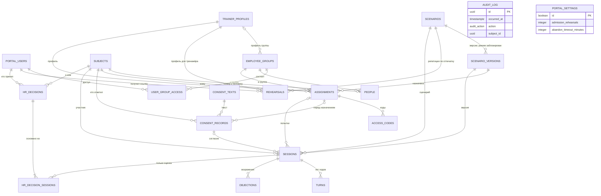

# База данных портала

*Арена переговоров · спецификация*

Из каких таблиц состоит база портала HR, что в каждой лежит и как база сама держит требования, без которых результат нельзя законно использовать. Схема целиком — в [`arena-db.sql`](arena-db.sql): PostgreSQL 16, файл выполняется на пустой базе одной командой. Требования и варианты использования — в `arena-portal-requirements.md` и `arena-use-cases.md`, формат сценария — в `arena-scenario-format.md`, оценки — в `arena-scoring.md`, тексты согласий — в `arena-consent-texts.md`.

**Версия** 0.2 — черновик к обсуждению · **Таблиц** 20 и одно представление · **Триггеров** 2

Обсуждаем по названиям таблиц и ограничений: «`sessions_review_needed` — не согласен, потому что…».

## Содержание

1. Принципы
2. Схема связей
3. Таблицы
4. Как база держит требования
5. Шифрование и отзыв согласия
6. Где лежат персональные данные
7. Что читают экраны аналитики и выгрузки
8. Демо-данные
9. Открытые вопросы
10. Потом

---

## 1. Принципы

- **Одна схема `arena`, одна роль приложения `arena_app`.** Схему создаёт роль-владелец при развёртывании; приложение не может менять структуру таблиц. Что приложению можно в каждой таблице, решают права (раздел 4, «Только добавление»).
- **Ключи — UUID** (`gen_random_uuid()` есть в ядре, расширения не нужны). Два исключения: у лога ходов ключ `(session_id, seq)` — повторная доставка хода из буфера клиента отбрасывается сама (FR-AC-11); у таблицы настроек одна строка с ключом `true`.
- **Время — `timestamptz`** везде. `date` — только у дат документов (дата письменного согласия).
- **JSONB там, где форма данных принадлежит пакету движка:** документ сценария, настройки профиля тренажёра, результат проверки сценария, решения судей, пошаговый разбор хода, блок оценок, ответ судьи после разговора. Портал внутрь не заглядывает, а вызывает функции пакета. Исключение — несколько проверок полей паспорта сценария (раздел 4).
- **Обычные столбцы там, где портал фильтрует, сортирует и соединяет:** режим, версия, уровень сложности, статус, буква, оба числа оценок, пометки, этап, тип хода, шкалы.
- **Перечисления — только для списков портала** (роли, статусы, виды согласий, режим, уровень, буква). Списки формата сценария — сфера, типы ходов, этапы, опоры доводов, финалы — хранятся текстом: их проверяет пакет движка, и новая версия формата не требует правки базы.
- **Тексты участника зашифрованы приложением** его личным ключом: реплики, ответ судьи после разговора с цитатами, возражения. База не видит ни открытого текста, ни ключей (раздел 5). Столбцы с шифром оканчиваются на `_enc`.
- **Чего в базе нет и не будет:** столбца с кодом доступа в открытом виде (FR-AC-02), столбца для метки эмоции, кадров и точек лица (FR-RS-02), общего числа из двух оценок (FR-RS-04).
- **Демо-данные** заливает скрипт приложения, а не SQL: отпечатки сценариев и оценки считает пакет движка (раздел 8).

---

## 2. Схема связей



У журнала нет внешних ключей: запись журнала должна пережить всё, на что она ссылается. Таблица настроек — одна строка.

---

## 3. Таблицы

Колонка «Пусто» — может ли значение быть `NULL`. Колонка «Требование» — ради чего столбец есть; прочерк — служебный столбец.

### 3.1. Люди и доступ

#### `portal_users` — пользователи портала

Сотрудники HR, которые входят в портал. Участники сюда не попадают: они приходят по коду.

| Столбец | Тип | Пусто | Что значит | Требование |
|---|---|---|---|---|
| `id` | uuid | нет | ключ | — |
| `login` | text | нет | логин, строчная латиница; уникален | экран «Вход» |
| `password_hash` | text | нет | хеш пароля (argon2id, считает приложение) | экран «Вход» |
| `full_name` | text | нет | имя — в журнале, в отметке «просмотрено», в записи решения | FR-RS-08, FR-RS-13 |
| `role` | user_role | нет | методолог · наблюдатель · администратор | FR-AC-08 |
| `is_active` | boolean | нет | вход разрешён | UC-A-06 |
| `created_at`, `last_login_at` | timestamptz | нет · да | — | — |

#### `employee_groups` — группы сотрудников

| Столбец | Тип | Пусто | Что значит | Требование |
|---|---|---|---|---|
| `id` | uuid | нет | ключ | — |
| `name` | text | нет | название, уникально | UC-A-05 |
| `department` | text | да | подразделение | UC-A-05 |
| `trainer_profile_id` | uuid → `trainer_profiles` | да | профиль группы; пусто — профиль по умолчанию | FR-PF-02 |
| `created_at`, `created_by`, `archived_at` | | | — | — |

#### `user_group_access` — кто видит результаты какой группы

Строка — доступ пользователя к группе: видеть поимённо, сравнивать, выгружать, назначать. Снятие доступа — удаление строки и запись в журнал; действует сразу, потому что права проверяются по базе на каждом запросе, а не хранятся в токене входа.

| Столбец | Тип | Пусто | Что значит | Требование |
|---|---|---|---|---|
| `user_id` | uuid → `portal_users` | нет | кто | FR-AC-08 |
| `group_id` | uuid → `employee_groups` | нет | к какой группе | FR-AC-08 |
| `granted_by`, `granted_at` | | нет | кто и когда открыл | UC-A-06 |

Ключ — `(user_id, group_id)`.

#### `subjects` — обезличенный номер участника

На номер ссылаются назначения, согласия, сессии, решения и журнал — никогда на человека напрямую. Строки не удаляются.

| Столбец | Тип | Пусто | Что значит | Требование |
|---|---|---|---|---|
| `id` | uuid | нет | ключ | NFR-PR-01 |
| `number` | text | нет | номер для экранов и журнала («N-7K3Q9D»), уникален | UC-A-05, UC-A-09 |
| `is_demo` | boolean | нет | единственный демо-участник, на которого пишутся демо-сессии; гостей друг от друга отличает `sessions.demo_guest_id` | FR-AC-10 |
| `data_key_wrapped` | bytea | да | ключ данных участника, зашифрованный мастер-ключом; пусто — ключ уничтожен | NFR-PR-01 |
| `key_destroyed_at` | timestamptz | да | когда ключ уничтожен; заполнено тогда и только тогда, когда ключа нет | NFR-PR-01 |
| `created_at` | timestamptz | нет | — | — |

#### `people` — таблица «номер → человек»

Та самая отдельная таблица из NFR-PR-01. При отзыве согласия строка удаляется (раздел 5).

| Столбец | Тип | Пусто | Что значит | Требование |
|---|---|---|---|---|
| `subject_id` | uuid → `subjects` | нет | ключ; один человек — один номер | NFR-PR-01 |
| `group_id` | uuid → `employee_groups` | нет | текущая группа; перевод — смена значения | UC-A-05 |
| `full_name` | text | да | ФИО; без него оценочное назначение не создаётся | FR-AC-05 |
| `pseudonym` | text | да | псевдоним, допустим только в тренировке; нужно ФИО или псевдоним | FR-AC-05 |
| `personnel_no` | text | да | табельный номер — подставляется в текст согласия; уникален | FR-AC-06 |
| `job_title` | text | да | должность | UC-A-05 |
| `external_ai_withdrawn_at` | timestamptz | да | отозвано только согласие на OpenRouter: настройки больше не содержат его адреса и ключа | UC-A-08, FR-AC-07 |
| `created_at`, `created_by`, `updated_at` | | | — | — |

### 3.2. Профили тренажёра и настройки

#### `trainer_profiles` — профили тренажёра

Удаления нет ни у одного профиля: на профиль ссылаются прошедшие сессии. Ненужный профиль архивируется; профиль по умолчанию архивировать нельзя (FR-PF-05).

| Столбец | Тип | Пусто | Что значит | Требование |
|---|---|---|---|---|
| `id` | uuid | нет | ключ | — |
| `name` | text | нет | название, уникально | FR-PF-01 |
| `is_default` | boolean | нет | профиль по умолчанию; такой ровно один: второго не даёт частичный уникальный индекс, а снять отметку нельзя — права `UPDATE` на этот столбец у роли приложения нет | FR-PF-05 |
| `settings` | jsonb | нет | адреса моделей, модели оппонента и двух судей с окнами контекста, распознавание и синтез речи, режим ввода, камера и метки эмоций, лимиты ходов, времени и длины ответа. Форма закрыта схемой API (`TrainerProfileSettings`): лишнее поле и адрес с логином или параметрами запроса не сохраняются, поэтому ключа здесь быть не может. Пустые поля берутся из профиля по умолчанию | FR-PF-01, NFR-C-01, NFR-C-02 |
| `revision` | integer | нет | растёт при каждом сохранении; сессия запоминает ревизию | FR-PF-03 |
| `openrouter_key_enc` | bytea | да | ключ OpenRouter, зашифрован мастер-ключом. Целиком уходит только тренажёру: при старте сессии с согласием и при погашении ссылки репетиции; администратору — только последние 4 символа | FR-PF-04, NFR-S-01 |
| `openrouter_key_last4` | text | да | последние 4 символа — для администратора и для поиска одного ключа в нескольких профилях | FR-PF-04, UC-A-03 |
| `model_server_token_enc`, `model_server_token_last4` | bytea, text | да | то же для токена нашего сервера с моделями | FR-PF-04 |
| `keys_changed_at`, `keys_changed_by` | | да | последняя замена ключа (сама замена — ещё и в журнале) | UC-A-03 |
| `created_at`, `updated_at`, `updated_by`, `archived_at` | | | — | — |

**Представление `trainer_profiles_public`** — те же профили без ключей и без последних символов, только с признаками «ключ задан». Все ответы API не-администраторам строятся из него (FR-PF-04: «не содержит ключа даже в замаскированном виде»).

#### `portal_settings` — настройки портала

Одна строка, создаётся тем же SQL-файлом. Пределы — те же, что в API (`PortalSettings`). Демо-режим сюда не входит: это переменная окружения (FR-AC-09).

| Столбец | Тип | Пусто | Что значит | Требование |
|---|---|---|---|---|
| `id` | boolean | нет | всегда `true` — вторую строку вставить нельзя | — |
| `admission_rehearsals` | integer | нет | N репетиций для допуска к оценке, 1–20, по умолчанию 3 | FR-SC-11, UC-A-07 |
| `abandon_timeout_minutes` | integer | нет | через сколько минут без событий сервер закрывает сессию, 2–120, по умолчанию 10 | FR-ST-03 |
| `code_max_failed_attempts` | integer | нет | после скольких неудачных вводов код блокируется, 3–50, по умолчанию 10 | NFR-S-02 |
| `updated_at`, `updated_by` | | | — | — |

### 3.3. Сценарии

#### `scenarios` — сценарий в библиотеке и его черновик

Черновик — одно поле `draft_document`: у сценария не бывает двух черновиков. После публикации черновик остаётся, и первая правка продолжает его; опубликованная версия уже скопирована в `scenario_versions` и не меняется.

Название, сфера, тип переговоров и теги **не дублируются** столбцами: библиотека читает их из `draft_document->'passport'`, а у сценария, который ещё генерируется из брифа и черновика не имеет, — из `generation->'questionnaire'` (сфера и тема обязательны в анкете, тип — нет). Таблица крошечная, индексы для этих фильтров не нужны.

| Столбец | Тип | Пусто | Что значит | Требование |
|---|---|---|---|---|
| `id` | uuid | нет | ключ | — |
| `slug` | text | нет | `passport.id`, постоянное имя. **Не уникален**: импорт на тот же портал даёт второй сценарий с тем же `passport.id` — иначе приёмку FR-SC-14 «экспорт → импорт — тот же хеш» на одном портале не пройти | формат, раздел 2; FR-SC-14 |
| `mode` | scenario_mode | нет | тренировка или оценка; с первой публикации заблокирован | FR-MD-01 |
| `origin` | scenario_origin | нет | из брифа · из шаблона · копия · вручную | FR-SC-01 |
| `draft_document` | jsonb | да | документ черновика целиком, формат `arena-scenario/1`; `passport.mode` и `passport.id` обязаны совпадать со столбцами | FR-SC-01…08 |
| `draft_fingerprint` | text | да | отпечаток черновика (формат, раздел 19); считается при каждом сохранении | FR-SC-11 |
| `draft_check` | jsonb | да | последний результат проверки сценария: сообщения, пути к полям, число блокирующих ошибок | FR-SC-07, FR-SC-08 |
| `draft_updated_at`, `draft_updated_by` | | да | — | — |
| `generation` | jsonb | да | ход генерации из брифа: анкета, шаг, состояние, ошибка. Черновика до подтверждения шага 3 ещё нет, анкета при сбое не теряется. Задание живёт в памяти процесса, поэтому при старте портал переводит оставшиеся `running` в `failed` с текстом «Портал перезапускался — повторите шаг». Хотя бы одно из `draft_document` и `generation` заполнено (`scenarios_has_content`) | FR-SC-03, FR-SC-04, NFR-P-01 |
| `archived_at` | timestamptz | да | в архиве: не предлагается для новых назначений | FR-SC-14 |
| `created_at`, `created_by` | | нет | — | — |

#### `scenario_versions` — опубликованные версии

Неизменяемы: у роли приложения нет `UPDATE` и `DELETE`.

| Столбец | Тип | Пусто | Что значит | Требование |
|---|---|---|---|---|
| `id` | uuid | нет | ключ | — |
| `scenario_id` | uuid → `scenarios` | нет | чья версия | — |
| `number` | integer | нет | номер версии ≥ 1; равен `passport.version` в документе | FR-SC-09 |
| `fingerprint` | text | нет | отпечаток: SHA-256 от канонической записи JSON (формат, раздел 19); уникален внутри сценария | FR-SC-09 |
| `format` | text | нет | `arena-scenario/1`; равен полю `format` документа | формат, раздел 19 |
| `engine_version` | text | нет | версия пакета движка, который проверил документ | FR-SC-10 |
| `document` | jsonb | нет | документ целиком | FR-SC-09 |
| `mode`, `title`, `sphere`, `negotiation_type` | | нет | копии из паспорта для фильтров и выгрузок; все четыре проверяются по документу. `(scenario_id, mode)` — внешний ключ на `scenarios (id, mode)`: пока есть хоть одна версия, режим сценария не меняется | FR-MD-01, FR-ST-07 |
| `admission_rehearsals` | integer | да | сколько засчитанных репетиций было на этом отпечатке в момент публикации | FR-SC-11 |
| `admission_required` | integer | да | каким был N в момент публикации; для оценки `admission_rehearsals ≥ admission_required` | FR-SC-11 |
| `published_by`, `published_at` | | нет | — | UC-M-07 |

#### `rehearsals` — репетиции автора

Репетиция идёт в тренажёре, портал моделей для неё не вызывает (FR-SC-10). Строка появляется, когда методолог нажимает «Репетировать» и получает одноразовую ссылку; тренажёр гасит ссылку, а по окончании загружает запись с разбором. Не сессии: в статистику и здоровье сценария не входят и на назначения не ссылаются. Состояние для экрана (ссылка выдана, идёт, загружена, истекла) выводится из столбцов, отдельно не хранится.

| Столбец | Тип | Пусто | Что значит | Требование |
|---|---|---|---|---|
| `id` | uuid | нет | ключ | — |
| `scenario_id` | uuid → `scenarios` | нет | какой сценарий | FR-SC-10 |
| `fingerprint` | text | нет | отпечаток черновика в момент выдачи ссылки; тренажёр получает документ ровно с ним, запись с другим отпечатком не принимается | FR-SC-11 |
| `difficulty` | difficulty_level | нет | уровень | UC-M-08 |
| `trainer_profile_id` | uuid → `trainer_profiles` | нет | профиль, который тренажёр получит вместе с ключами | FR-PF-02 |
| `issued_by`, `issued_at` | uuid → `portal_users`, timestamptz | нет | кто получил ссылку и когда; только он и репетирует | FR-SC-10 |
| `link_hash` | bytea | нет | HMAC-SHA256 токена ссылки, 32 байта, уникален; самого токена в базе нет, как и кода доступа | FR-SC-10 |
| `link_expires_at` | timestamptz | нет | до какого времени ссылку можно погасить — 30 минут после выдачи | FR-SC-10 |
| `redeemed_at` | timestamptz | да | когда тренажёр погасил ссылку; заполнено — второй раз ссылка не сработает | FR-SC-10 |
| `profile_revision` | integer | да | ревизия профиля в момент погашения; заполняется вместе с `redeemed_at` | FR-PF-03 |
| `uploaded_at` | timestamptz | да | когда тренажёр загрузил запись | FR-SC-10 |
| `engine_version` | text | да | версия движка, на которой шёл разговор; есть, когда запись загружена | FR-SC-10 |
| `record` | jsonb | да | запись репетиции как пришла: реплики, отказы компонентов, разбор каждой реплики с текстом запроса к оппоненту, финал, ответ судьи. Тексты — автора, не участника | FR-SC-10 |
| `result` | jsonb | да | обе оценки по отдельности — пересчёт портала по записи | UC-M-08, FR-RS-04 |
| `final_id`, `result_rank` | text, final_rank | да | финал и буква — для списка репетиций | UC-M-08 |
| `counts_for_admission` | boolean | нет | идёт ли в допуск своего отпечатка: вычисляемый столбец, «запись загружена» | FR-SC-11 |

Ограничения держат порядок жизни строки: ссылку гасят не позже `link_expires_at` (`rehearsals_redeemed_in_time`), запись загружают только после погашения (`rehearsals_upload_after_redeem`), а `record`, `result` и `engine_version` заполнены тогда и только тогда, когда есть `uploaded_at` (`rehearsals_upload_fields`). У роли приложения `UPDATE` только на столбцы погашения и записи: отпечаток, уровень, профиль, ссылку и получателя поменять нельзя.

### 3.4. Назначения и коды

#### `assignments` — назначения

Режим в назначении не хранится: он берётся из версии и измениться не может.

| Столбец | Тип | Пусто | Что значит | Требование |
|---|---|---|---|---|
| `id` | uuid | нет | ключ | — |
| `subject_id` | uuid → `subjects` | нет | кому — номер, не человек | FR-AC-01, NFR-PR-01 |
| `group_id` | uuid → `employee_groups` | нет | группа **на момент назначения**; по ней проверяется доступ к сессиям и строится аналитика группы | FR-AC-08 |
| `scenario_version_id` | uuid → `scenario_versions` | нет | версия, а не сценарий: новая версия назначение не меняет | FR-AC-01, FR-SC-09 |
| `difficulty` | difficulty_level | нет | уровень | FR-AC-01 |
| `trainer_profile_id` | uuid → `trainer_profiles` | нет | профиль; при создании подставляется профиль группы или по умолчанию | FR-PF-02, FR-PF-05 |
| `due_at` | timestamptz | нет | срок; продление — новое значение и запись в журнал | FR-AC-01, UC-H-03 |
| `batch_id` | uuid | да | общий номер массового назначения — для журнала и таблицы кодов | FR-AC-12, UC-H-02 |
| `created_by`, `created_at` | | нет | — | — |
| `cancelled_at`, `cancelled_by`, `cancel_reason` | | да | отменено HR или из-за отзыва согласия | FR-AC-12, UC-A-08 |

**Статус на экране «Назначения — список»** (UC-H-03) не хранится, а выводится по порядку: «отменено» — `cancelled_at`; «код заблокирован» — `blocked_at` у действующего кода; «идёт» — есть сессия `in_progress`; «прошёл» — есть завершённая сессия; «прервана» — последняя сессия `abandoned`; «срок истёк» — `due_at` прошёл; иначе «не начал».

#### `access_codes` — коды доступа

Код `ARENA-XXXX-XXXX-XXX`: десять случайных символов Crockford Base32 (50 бит) и контрольный. В базе только два HMAC-SHA256 с секретом сервера из переменной окружения:

- `code_hash` — от всего кода; по нему код проверяется;
- `selector_hash` — от первых четырёх случайных символов; по нему находится, **к какому коду** относится неудачная попытка. Без этого неудачные попытки не с чем связать и блокировать нечего.

Ввод кода: нашли действующий код по `selector_hash` → сравнили `code_hash` → совпало — вход; не совпало — `failed_attempts + 1`, на пороге из настроек — `blocked_at`. Подбирающий должен сначала попасть в чей-то селектор (20 бит), а потом у него есть 10 попыток на оставшиеся 30 бит: вероятность угадать один код — не больше 10 из 2³⁰. Ограничение частоты по адресу (NFR-S-02) держит приложение.

**Совпадение селектора при выпуске.** Селектор уникален среди действующих кодов (`access_codes_active_selector`), а в нём всего 20 бит: при ~1000 действующих кодов пачка на 500 человек примерно в половине случаев встретит совпадение. Поэтому массовое назначение и перевыпуск вставляют каждый код через точку сохранения (`SAVEPOINT`) и при ошибке 23505 на этом индексе выпускают код заново — до 5 попыток. Пачка целиком не откатывается.

| Столбец | Тип | Пусто | Что значит | Требование |
|---|---|---|---|---|
| `id` | uuid | нет | ключ | — |
| `assignment_id` | uuid → `assignments` | нет | чей код; у назначения один действующий код | FR-AC-01 |
| `selector_hash` | bytea | нет | HMAC первых четырёх символов; уникален среди действующих | NFR-S-02 |
| `code_hash` | bytea | нет | HMAC всего кода; уникален | FR-AC-02 |
| `issued_by`, `issued_at` | | | кто выпустил | FR-AC-12 |
| `failed_attempts`, `last_failed_at` | integer, timestamptz | нет · да | неудачные вводы | NFR-S-02 |
| `blocked_at` | timestamptz | да | заблокирован навсегда; снимает только администратор (обнуляет оба поля, пишет в журнал) | NFR-S-02, UC-A-05 |
| `revoked_at`, `revoke_reason` | | да | недействителен: перевыпущен · назначение отменено · согласие отозвано | FR-AC-12, UC-A-08 |

Перевыпуск — одна транзакция: у старой строки `revoked_at`, новая строка. Старый код перестаёт работать немедленно (FR-AC-12).

### 3.5. Согласия

#### `consent_texts` — тексты согласий и уведомлений

Четыре вида из `arena-consent-texts.md`, раздел 0: `notice_training`, `consent_assessment`, `consent_external_ai`, `notice_demo`. Действует последняя версия своего вида. Правки нет — только новая версия.

| Столбец | Тип | Пусто | Что значит | Требование |
|---|---|---|---|---|
| `id` | uuid | нет | ключ | — |
| `kind` | consent_kind | нет | вид текста | FR-AC-06, FR-AC-07, FR-AC-13 |
| `version` | text | нет | версия; уникальна внутри вида | FR-AC-06 |
| `body` | text | нет | текст с заполненными реквизитами оператора; подстановки участника (ФИО, табельный номер) остаются в скобках | FR-AC-06 |
| `body_sha256` | text | нет | SHA-256 текста; база сама проверяет, что он совпадает с `body` | FR-AC-06 |
| `created_at`, `created_by` | | | — | — |

#### `consent_records` — ответы и отметки о письменном согласии

Две разновидности строк в одной таблице:

- **ответ участника на экране** «Согласие и уведомление»: вид, ответ, версия текста, HMAC показанного текста (с подставленными ФИО и адресом моделей), время, кто — номер участника;
- **отметка HR о письменном согласии** (`written_assessment`) — рекомендация `arena-consent-texts.md`, раздел 9, пункт 1: реквизиты бумажного документа или документа в кадровом ЭДО, дата, кто из HR отметил.

Отказ тоже записывается («на портале записано, что вы отказались»). Строки только добавляются.

| Столбец | Тип | Пусто | Что значит | Требование |
|---|---|---|---|---|
| `id` | uuid | нет | ключ | — |
| `subject_id` | uuid → `subjects` | нет | кто дал | FR-AC-06 |
| `assignment_id` | uuid → `assignments` | да | перед каким назначением | UC-P-02 |
| `kind` | consent_kind | нет | вид | FR-AC-06, FR-AC-07, FR-AC-13 |
| `answer` | consent_answer | нет | уведомление — «прочитано»; согласие — «даю» или «не даю» | FR-AC-06 |
| `text_id` | uuid → `consent_texts` | да | версия текста; обязательна для ответа на экране | FR-AC-06 |
| `usable` | boolean | нет | вычисляется базой: ответ не «не даю». Вместе с `id` и `subject_id` — цель внешних ключей из `sessions` | FR-AC-06, FR-AC-07 |
| `shown_text_hmac` | bytea | да | HMAC-SHA256 текста в том виде, в каком его увидел участник, на ключе данных участника. Не простой хеш: шаблон известен, и перебор по списку сотрудников нашёл бы, кто стоит за номером. Клиент присылает SHA-256, портал сверяет его со своим текстом, а в базу пишет HMAC | FR-AC-06, NFR-PR-01 |
| `document_ref` | text | да | номер и дата письменного согласия или его номер в ЭДО | consent-texts, 9.1 |
| `document_channel` | text | да | `paper` или `edo` | consent-texts, 9.1 |
| `signed_on`, `valid_until` | date | да | дата подписания и срок действия | consent-texts, 9.1 |
| `recorded_by` | uuid → `portal_users` | да | кто из HR отметил письменное согласие | consent-texts, 9.1 |
| `answered_at` | timestamptz | нет | время ответа или отметки | FR-AC-06 |

Сессия ссылается на свои записи (`sessions.main_consent_id`, `external_ai_consent_id`, `written_consent_id`), поэтому видно, на каком именно согласии она шла. Ссылки — составные внешние ключи `(…_consent_id, subject_id, consent_ok) → consent_records (id, subject_id, usable)`: запись должна принадлежать тому же участнику и не быть отказом. Один основной ответ — одна попытка (`sessions_one_per_consent`).

### 3.6. Сессии и ходы

#### `sessions` — запись сессии

| Столбец | Тип | Пусто | Что значит | Требование |
|---|---|---|---|---|
| `id` | uuid | нет | ключ | — |
| `assignment_id` | uuid → `assignments` | да | назначение; у демо пусто, у остальных обязательно | FR-AC-10 |
| `subject_id` | uuid → `subjects` | нет | участник — номер; у демо — демо-участник | NFR-PR-01 |
| `group_id` | uuid → `employee_groups` | да | группа из назначения; у демо пусто | FR-AC-08 |
| `scenario_id`, `scenario_version_id` | uuid | нет | сценарий и версия; вместе с `mode` — составной внешний ключ на версию (раздел 4) | FR-MD-01, FR-RS-01 |
| `mode` | scenario_mode | нет | режим версии | FR-MD-01, FR-MD-02 |
| `difficulty` | difficulty_level | нет | уровень из назначения | FR-ST-05 |
| `is_demo` | boolean | нет | демо-сессия | FR-AC-10 |
| `demo_guest_id` | uuid | да | номер гостя демо из гостевого токена; заполнен тогда и только тогда, когда `is_demo`. По нему гость видит только свои сессии | FR-AC-10 |
| `trainer_profile_id`, `profile_revision` | uuid, integer | нет | профиль и его ревизия на момент старта | FR-PF-03 |
| `profile_snapshot` | jsonb | нет | настройки профиля, с которыми прошла сессия, без ключей: модели, адреса, лимиты | FR-PF-03, FR-RS-01 |
| `engine_version` | text | нет | версия пакета движка | FR-RS-01 |
| `criteria_set` | text | нет | набор критериев, `harvard_spin_v1` | FR-RS-01, FR-ST-05 |
| `external_ai_allowed` | boolean | нет | было ли согласие на OpenRouter; без него ключ OpenRouter клиенту не выдавался. В демо ключи не выдаются вовсе (кроме стенда жюри) | FR-AC-07 |
| `main_consent_id` | uuid → `consent_records` | нет | уведомление или согласие, на котором начата сессия; обязательно везде, в том числе в демо. Одно на попытку | FR-AC-06, FR-AC-13 |
| `external_ai_consent_id` | uuid → `consent_records` | да | ответ «даю» про OpenRouter | FR-AC-07 |
| `written_consent_id` | uuid → `consent_records` | да | письменное согласие; обязательно в оценке | FR-AC-06 |
| `consent_ok` | boolean | нет | всегда `true`; третий столбец трёх составных ключей на `consent_records (id, subject_id, usable)` | FR-AC-06 |
| `status` | session_status | нет | идёт · завершена · прервана участником · закончились ходы · закончилось время · потеря связи · прервана (сервером) | FR-ST-03, UC-S-03 |
| `started_at`, `last_event_at`, `ended_at` | timestamptz | нет · нет · да | старт, последнее событие от клиента, окончание | FR-ST-03 |
| `break_stage`, `break_turn` | text, integer | да | точка обрыва: этап и номер реплики | FR-ST-01, FR-ST-03 |
| `reopened_count` | integer | нет | сколько раз сессию открывали поздние события | FR-ST-03 |
| `participant_turns` | integer | нет | реплик участника — средняя длина, правило «меньше трёх» | FR-ST-01 |
| `incidents` | jsonb | нет | отказы камеры, распознавания, синтеза, смены адреса моделей — с номером реплики | NFR-R-01, UC-H-05 |
| `simplified` | boolean | нет | упрощённый режим: хоть одна реплика разобрана по ключевым словам | NFR-R-02 |
| `stub_used` | boolean | нет | разговор шёл на заглушке | NFR-D-02 |
| `opponent_violation_count` | integer | нет | сколько реплик оппонента судья оппонента пометил нарушением | FR-RS-13 |
| `reviewed_at`, `reviewed_by`, `reviewed_violation_count` | timestamptz, uuid, integer | да | отметка «Просмотрено, сессия годится», кто её поставил и сколько нарушений было в тот момент. Ставится только у закрытой сессии (не `in_progress` и не `abandoned`). Пришли новые нарушения — отметка их не покрывает; упрощённый режим снимает отметку целиком | FR-RS-13, UC-H-10 |
| `final_id`, `final_title` | text | да | финал и его название (для выгрузки буква и название стоят рядом) | FR-RS-04 |
| `result_rank` | final_rank | да | буква финала S–F; только из оценки «результат» | FR-RS-04 |
| `result_number`, `result_max` | smallint | да | число «результата» 0–100 и максимум сценария; без сделки числа нет | arena-scoring 2 |
| `process_status` | process_status | нет | ждём · получен · не получен · слишком короткий разговор · не считается (закрыта сервером) | arena-scoring 3.4, 8.3 |
| `process_number` | smallint | да | число «процесса» 0–100; есть только при полученном разборе | FR-RS-04 |
| `criteria_bands` | jsonb | да | полосы 0–4 по шести критериям `{"diagnosis": 4, …}` — для аналитики группы и динамики | FR-ST-04, FR-RS-12 |
| `scoring_profile` | scoring_profile | да | обычный или короткая сессия | FR-ST-05 |
| `lucky` | boolean | нет | отметка «повезло» | FR-RS-06 |
| `scores` | jsonb | да | блок оценок в расчёте портала (arena-scoring, раздел 9): предметы, эпизоды засчитанные и отброшенные с причиной, потолки, отметки. Без цитат — эпизоды указывают на номер реплики | FR-RS-01, FR-RS-05 |
| `scored_at` | timestamptz | да | когда портал пересчитал | arena-scoring 1.3 |
| `judge_answer_enc` | bytea | да | ответ судьи участника после разговора как пришёл (эпизоды с цитатами, резюме), шифр ключом участника | FR-RS-01, FR-RS-07 |
| `judge_attempts` | integer | нет | сколько раз его запрашивали | arena-scoring 8.3 |

#### `turns` — лог ходов

Одна строка — одна реплика любой стороны. Это же хранилище аналитики из FR-ST-08: все экраны раздела и подробная выгрузка строятся отсюда. Заполнители в лог не пишутся.

| Столбец | Тип | Пусто | Что значит | Требование |
|---|---|---|---|---|
| `session_id`, `seq` | uuid, integer | нет | ключ: сессия и порядковый номер реплики в разговоре | FR-AC-11 |
| `speaker` | speaker_role | нет | участник или оппонент | FR-RS-05 |
| `reply_no` | integer | нет | номер для цитат: У3 — третья реплика участника, О3 — ответ на неё, О0 — первая реплика оппонента | arena-scoring 8.1 |
| `text_enc` | bytea | да | текст реплики, шифр ключом участника; пусто — ход пришёл после уничтожения ключа | FR-RS-01, NFR-PR-01 |
| `at_ms`, `duration_ms`, `pause_ms` | integer | нет · да · да | таймкод от начала, длительность, пауза перед репликой | FR-ST-08, FR-RS-05 |
| `model_route` | model_route | да | где реально работали модели на этой реплике: OpenRouter · наш сервер · заглушка | NFR-R-01, UC-S-02 |
| `stage`, `transition_to` | text | нет · да | этап после реплики и сработавший переход | FR-ST-01, FR-RS-11 |
| `move_type`, `move_source` | text, move_source | да | тип хода и кто его определил: судья или ключевые слова | FR-RS-01, NFR-R-02 |
| `judge_confidence` | real | да | уверенность судьи участника | FR-RS-01 |
| `evidence`, `interest` | text | да | опора довода и интерес оппонента | FR-ST-04 |
| `violations` | text[] | нет | грубость, попытка «сломать», искажение факта | FR-RS-01 |
| `judge` | jsonb | да | решение судьи участника целиком (без текста) | FR-RS-01 |
| `terms` | jsonb | да | что участник сам предложил в этой реплике | FR-RS-01 |
| `trust`, `pressure`, `credibility`, `patience`, `credit` | smallint, integer | да | доверие, давление, достоверность, терпение, очки доводов после реплики | FR-RS-11, FR-ST-08 |
| `revealed_facts` | text[] | нет | скрытые факты, раскрытые на этой реплике | FR-ST-01 |
| `engine_step` | jsonb | да | пошаговый разбор хода: быстрые проверки, сила довода, правила, шаг уступки, указание оппоненту. **Без текста запроса к оппоненту** — в нём метка эмоции | NFR-M-02, FR-RS-02 |
| `intent`, `offer` | text, jsonb | да | у реплики оппонента: намерение и предложение после неё | FR-RS-01 |
| `opponent_judge` | jsonb | да | решение судьи оппонента: в роли ли, за пределом ли, какие факты выдал, совпала ли названная цифра. **Без поля `comment`** — ограничение `turns_opponent_judge_no_comment` | FR-RS-13 |
| `opponent_violation` | boolean | нет | на этой реплике нарушение | FR-RS-13 |
| `interrupted` | boolean | нет | реплику оппонента перебили или нажали «Завершить», пока она звучала; перебитый ответ-согласие сделку не заключает — без признака пересчёт засчитал бы сделку | arena-scoring 3.4, FR-RS-01 |
| `opponent_judge_comment_enc` | bytea | да | пояснение судьи оппонента (`comment`) — может цитировать разговор, поэтому только здесь и только шифром; портал вырезает его из `opponent_judge` перед записью | FR-RS-13 |
| `received_at` | timestamptz | нет | когда портал получил ход — видно поздние события | FR-AC-11 |

Поля участника у реплики оппонента и поля оппонента у реплики участника пустые — это проверяет база. **Договорённость с клиентом:** каждая реплика отправляется одним событием, уже с решением своего судьи (у оппонента — после ответа судьи оппонента или с пометкой «судья не ответил»). Лог только дополняется, поэтому дописать решение потом нельзя.

### 3.7. Возражения и кадровые решения

#### `objections` — возражения

| Столбец | Тип | Пусто | Что значит | Требование |
|---|---|---|---|---|
| `id` | uuid | нет | ключ | — |
| `session_id`, `subject_id` | uuid | нет | к какой сессии и от кого | FR-RS-09 |
| `target` | jsonb | да | к чему относится: оценка, критерий, эпизод, реплика, пункт резюме | UC-P-10 |
| `text_enc` | bytea | нет | текст возражения, шифр ключом участника | FR-RS-09 |
| `submitted_at` | timestamptz | нет | время подачи — показывается рядом с результатом | FR-RS-09 |
| `response_enc`, `responded_by`, `responded_at` | bytea, uuid, timestamptz | да | ответ HR; три поля заполняются вместе | UC-H-12 |

#### `hr_decisions` — кадровые решения

Не правятся и не удаляются: пересмотр — новая запись со ссылкой на прежнюю (UC-H-12).

| Столбец | Тип | Пусто | Что значит | Требование |
|---|---|---|---|---|
| `id` | uuid | нет | ключ | — |
| `subject_id` | uuid → `subjects` | нет | о ком | FR-RS-08 |
| `decision` | text | нет | какое решение принято (повышение, перевод, обучение…) | UC-H-11 |
| `grounds` | text | нет | собственные основания принимающего; должна быть хотя бы одна буква | FR-RS-08 |
| `decided_by`, `decided_at` | uuid, timestamptz | нет | кто и когда | FR-RS-08 |
| `supersedes_id` | uuid → `hr_decisions` | да | какую запись пересматривает | UC-H-12 |

#### `hr_decision_sessions` — на какие сессии опирается решение

| Столбец | Тип | Пусто | Что значит | Требование |
|---|---|---|---|---|
| `decision_id` | uuid → `hr_decisions` | нет | решение | FR-RS-08 |
| `session_id` | uuid | нет | сессия | FR-RS-08 |
| `session_mode` | scenario_mode | нет | всегда «оценка»; входит во внешний ключ `(session_id, session_mode)` | FR-MD-02 |

### 3.8. Журнал

#### `audit_log` — журнал доступа и действий

| Столбец | Тип | Пусто | Что значит | Требование |
|---|---|---|---|---|
| `id` | uuid | нет | ключ | — |
| `occurred_at` | timestamptz | нет | время; `clock_timestamp()`, чтобы записи одной транзакции различались | NFR-S-03 |
| `actor_kind`, `actor_user_id` | text, uuid | нет · да | кто: `user` — пользователь портала, `participant` — участник (тогда виден только `subject_id`), `system` — сервер. В API — те же значения | NFR-S-03 |
| `action` | audit_action | нет | открыл сессию · открыл урезанный вид · выгрузил · изменил ключ · выдал доступ · отозвал согласие · закрыл брошенную сессию… | NFR-S-03, FR-RS-10, FR-PF-04 |
| `outcome` | text | нет | `ok` — выполнено, `denied` — отказано (отказы в доступе тоже пишутся) | UC-H-04, UC-A-09 |
| `subject_id` | uuid | да | чья сессия — номером, не именем | NFR-PR-01 |
| `session_id`, `group_id` | uuid | да | какая сессия, какая группа | FR-RS-10 |
| `rows_count` | integer | да | сколько строк выгружено. Выгрузка по нескольким группам пишет по строке на каждую группу со своим `group_id` и `rows_count` и общим `export_id` в `details` | FR-RS-10 |
| `details` | jsonb | да | фильтры выгрузки, вид таблицы, формат, профиль, реквизиты отзыва. **Имён и текстов реплик сюда не пишем** — это правило кода, проверяется ревью | NFR-S-03 |

---

## 4. Как база держит требования

«БД» — нарушение невозможно даже запросом в обход приложения. «Приложение» — проверку делает портал, база лишь хранит нужное.

| Требование | Как | Где |
|---|---|---|
| **FR-MD-01** Режим неизменяем | Режим фиксируется **с первой публикации**, а не с первой сессии: внешний ключ `scenario_versions_mode_locks_scenario (scenario_id, mode) → scenarios (id, mode) ON UPDATE RESTRICT`. Пока версий нет, режим меняется вместе с `passport.mode` черновика (`scenarios_draft_mode` требует их совпадения) — UC-M-09 не страдает, режим выбирается до публикации. Как только есть хоть одна версия, `UPDATE scenarios SET mode = …` падает на внешнем ключе, а API отвечает 409 «по сценарию уже есть версии — сделайте копию». Так выданные по версии коды не ломаются от смены режима в черновике. Ключ `sessions_version_matches (scenario_version_id, scenario_id, mode) → scenario_versions (id, scenario_id, mode)` не даёт начать сессию в режиме, отличном от режима версии, а режим версии проверяется по её документу. Приёмка требования говорит «check-ограничение»; внешний ключ — то же ограничение уровня базы, но смотрит в другую таблицу. | БД |
| **FR-MD-02** Решение не ссылается на тренировку | В `hr_decision_sessions` столбец `session_mode` с ограничением `= 'assessment'` и внешний ключ `(session_id, session_mode) → sessions (id, mode)`. Ссылка на тренировочную сессию не находит пары «эта сессия + оценка» и падает с ошибкой внешнего ключа. Демо — всегда тренировка (`sessions_demo_training`), поэтому к решению тоже не привязывается. | БД |
| **NFR-R-02, FR-RS-13** Упрощённый режим и непросмотренные нарушения — не в решение | Триггер `hr_decision_sessions_check` перед вставкой ссылки: сессия того же сотрудника, завершена, не в упрощённом режиме, а если есть нарушения оппонента — `opponent_violation_count = reviewed_violation_count`, то есть HR видел все нынешние нарушения. Отметку «просмотрено» нельзя поставить сессии без нарушений или в упрощённом режиме (`sessions_review_needed`), идущей или прерванной сервером (`sessions_review_closed`) и без имени и числа (`sessions_review_pair`). Снятие отметки, когда поздняя реплика разобрана по ключевым словам, делает приложение в том же UPDATE, что ставит `simplified`. | БД + приложение |
| **FR-RS-08** Основания — обязательный текст | `grounds NOT NULL` и ограничение `hr_decisions_grounds_filled`: хотя бы одна буква, поэтому пробелы, прочерк и пустая строка не проходят. Кто и когда — `NOT NULL`. Хотя бы одна сессия — отложенный триггер `hr_decisions_need_session` проверяет в конце транзакции. Решения не правятся: у роли только `INSERT` и `SELECT`. Что поле не предзаполняется резюме — правило интерфейса. | БД |
| **FR-SC-09** Версии неизменяемы, адресуются отпечатком | У `scenario_versions` у роли приложения нет `UPDATE` и `DELETE`. Отпечаток — 64 шестнадцатеричных знака, уникален внутри сценария; назначения и сессии ссылаются на версию. Номер, режим, название, сфера, тип и номер формата сверяются с документом ограничениями. Повторная публикация без изменений содержания (только теги) даёт тот же отпечаток — API отвечает 409 `nothing_changed`, а не падает на `scenario_versions_fingerprint_key`. Сам отпечаток считает пакет движка (канонический JSON по RFC 8785): база этого стандарта не знает, поэтому пересчёт и сверка — тест приложения. Правка опубликованной версии — это правка черновика в `scenarios`. | БД + приложение |
| **FR-SC-10** Ссылка на репетицию одноразовая | В базе только HMAC токена (`link_hash`, уникален). Погашение — один `UPDATE … SET redeemed_at = now() WHERE link_hash = … AND redeemed_at IS NULL AND link_expires_at > now()`: из двух одновременных открытий ключи получит одно. Погасить после срока нельзя и ограничением `rehearsals_redeemed_in_time`. Что ссылку гасит только тот, кто её получил, — забота приложения: ссылка показывается один раз, ему, и при погашении проверяется, что `issued_by` всё ещё методолог или администратор и вход ему не закрыт. | БД + приложение |
| **FR-SC-11** Репетиции считаются по отпечатку | Репетиция хранит отпечаток черновика, выданный вместе со ссылкой; тренажёр получает документ ровно с ним, и запись с другим отпечатком не принимается. Допуск = число репетиций этого сценария с `fingerprint` черновика и загруженной записью (`counts_for_admission`, индекс `rehearsals_admission_idx`). Правка черновика во время репетиции её не портит: разговор идёт на документе из ссылки. Правка, которая меняет отпечаток, «обнуляет счётчик» сама: у нового отпечатка просто нет репетиций; теги, происхождение и `authoring` в отпечаток не входят и счётчик не трогают. При публикации число и порог записываются в версию, и ограничение `scenario_versions_admission` не даёт опубликовать оценку с недобором. | БД + приложение |
| **FR-AC-02** Код только хешем | Столбцов с кодом нет, есть HMAC полного кода и HMAC селектора (раздел 3.4). | БД |
| **FR-AC-03** Повторный вход — в ту же сессию, одна сессия за раз | Частичный уникальный индекс `sessions_one_running_per_assignment`: по назначению не больше одной идущей сессии. По коду портал находит её и отдаёт состояние — к устройству ничего не привязано. | БД |
| **NFR-S-02** Попытки и постоянная блокировка | `failed_attempts`, `blocked_at` у кода; порог — в настройках. Снятие блокировки — только администратор, с записью в журнал. | БД + приложение |
| **FR-AC-12** Перевыпуск инвалидирует немедленно | Частичный уникальный индекс `access_codes_one_active`: действующий код у назначения один, поэтому новый нельзя вставить, не отозвав старый в той же транзакции. Совпадение селектора при выпуске — повтор через точку сохранения (раздел 3.4). | БД |
| **FR-AC-06** Согласие с реквизитами до старта | Текст хранится версиями с хешем, база сверяет хеш с текстом. Ответ хранится с видом, версией, HMAC показанного текста, временем и номером участника. `main_consent_id NOT NULL` — сессия, в том числе демо, не создаётся без записи ответа; `sessions_written_consent` — оценочная не создаётся без отметки о письменном согласии. Три составных ключа `(…_consent_id, subject_id, consent_ok) → consent_records (id, subject_id, usable)` не дают сослаться на отказ или на запись другого участника; `sessions_one_per_consent` — на ответ, уже использованный прошлой попыткой. **Что база не проверяет:** что вид записи подходит режиму (согласие на оценку — для оценки, уведомление — для тренировки) и что письменное согласие не истекло (`valid_until`) — это проверяет приложение. | БД + приложение |
| **FR-AC-07** Отдельное согласие на внешнюю нейросеть | Отдельная запись `consent_external_ai`; `sessions_external_ai`: флаг `external_ai_allowed` не может стоять без ссылки на неё, а ссылка — только на «даю» того же участника. Ключ OpenRouter портал кладёт в ответ старта сессии только при этом флаге; в демо — вообще нет (arena-api.md, 8). | БД + приложение |
| **FR-AC-13** Уведомление в обоих режимах | То же: `notice_training` или `notice_demo` — запись с ответом «прочитано»; демо не исключение. | БД + приложение |
| **FR-AC-05** В оценке — только поимённо | При создании оценочного назначения портал проверяет `people.full_name`. | приложение |
| **FR-AC-10** Демо отделено | `is_demo`; демо без назначения, без группы, только тренировка, на одном демо-участнике, гости различаются `demo_guest_id` (`sessions_demo_guest`) — это держит база. Исключение демо из здоровья сценария и статистики держится на условии `NOT is_demo` в каждом запросе (индексы аналитики построены с тем же условием) — это приложение. | БД + приложение |
| **NFR-S-03** Журнал только дополняется | У роли приложения на `audit_log` только `SELECT` и `INSERT`: нет `UPDATE`, `DELETE`, `TRUNCATE`. Внешних ключей нет — запись переживёт всё, на что ссылается. | БД |
| **NFR-PR-01** Псевдонимы и уничтожение связи | Журнал, лог ходов, сессии, согласия и решения ссылаются на `subjects`, а не на человека. Связь «номер → человек» — отдельная таблица `people`, ключ шифрования — в `subjects`. Отзыв согласия удаляет строку `people` и стирает ключ (раздел 5). `DELETE` у роли есть только на `people` и `user_group_access`. | БД + приложение |
| **FR-PF-04** Ключи скрыты | Ключи хранятся шифром мастер-ключа, в открытом виде — только последние 4 символа. Не-администраторам API отдаёт профили из представления `trainer_profiles_public`, где нет ни ключей, ни последних символов; фильтр по последним символам им запрещён (403). Администратору — только последние 4 символа, ключ целиком не отдаётся никому в портале (отступление — arena-api.md, 8); целиком его получает только тренажёр — при старте сессии и при погашении ссылки репетиции. В `settings` ключ положить нельзя: схема закрыта. Замена ключа — запись `profile_key_changed` в журнале. | БД + приложение |
| **FR-PF-05** Профиль по умолчанию всегда есть | Не больше одного — `trainer_profiles_one_default`; не меньше одного — у роли приложения нет права `UPDATE` на столбец `is_default` (права выданы на все столбцы, кроме `id`, `is_default` и `created_at`), поэтому снять отметку нельзя. Архивировать его нельзя (`trainer_profiles_default_not_archived`), удалять профили роль не может вовсе. Появляется при первом запуске из демо-данных. Смена профиля по умолчанию на другой — в «потом». | БД |
| **FR-PF-03** Правка профиля — со следующего старта | Сессия хранит ревизию и снимок настроек на момент старта; идущая сессия дальше профиль не читает. | БД + приложение |
| **FR-RS-01**, arena-scoring 9 — пересчёт без моделей | Всё, что нужно функциям `scoreResult`, `findCodeEpisodes`, `checkJudgeEpisodes`, `scoreProcess`: документ версии (по ссылке), уровень, версия движка, набор критериев, профиль тренажёра (лимиты решают короткую сессию) — в `sessions`; реплики, решения судьи по каждой реплике, шкалы, шаги, переходы, раскрытые факты, журнал предложений, признак перебитой реплики оппонента — в `turns`; ответ судьи после разговора как пришёл и число запросов — в `sessions.judge_answer_enc` и `judge_attempts`; посчитанные оценки — в `sessions.scores` и столбцах. Пересчёт расшифровывает тексты ключом участника: после отзыва согласия пересчитать сессию нельзя — так и задумано. | БД + приложение |
| **FR-ST-03** Закрытие сервером и поздние события | Задание раз в минуту закрывает идущие сессии без событий дольше таймаута (индекс `sessions_running_idx`, запрос в разделе 7): статус `abandoned`, точка обрыва, оценки не ставятся (`sessions_abandoned_no_grade`), запись в журнал. Таймаут считается от более позднего из «последнее событие» и «портал запущен» — время недоступности портала не входит. Поздние события: ходы вставляются (дубли отбрасывает первичный ключ), статус возвращается в `in_progress`, `ended_at` очищается (`sessions_open_state`), `process_status` снова `pending`, `reopened_count + 1`. Если по назначению тем временем идёт другая сессия, уникальный индекс не даст вернуть статус: ходы дописываются, статус остаётся «прервана». | БД + приложение |
| **FR-RS-13, NFR-R-02** Пометки и «просмотрено» | `opponent_violation_count` и `opponent_violation` у реплики; `simplified` и `move_source = 'keywords'` у затронутых реплик — отсюда номера реплик для пометки; `reviewed_at` + `reviewed_by` + `reviewed_violation_count`. Счётчики и снятие отметки при упрощённом режиме ведёт приложение при приёме событий. | БД + приложение |
| **FR-RS-04** Две оценки не складываются | Отдельные столбцы, общего нет. Буква — перечисление S…F, стоит только вместе с финалом (`sessions_rank_with_final`). | БД |
| **FR-RS-02** Эмоций в портале нет | Ни в одной таблице нет поля для метки эмоции; в `engine_step` не пишется текст запроса к оппоненту. Объекты движка в событии портал проверяет по закрытым схемам пакета движка и отклоняет ключ с именем ровно `emotion` до записи тела в лог. В записи репетиции (`rehearsals.record`) текст запроса к оппоненту есть: в режиме репетиции тренажёр не передаёт оппоненту меток эмоций; проверки тела те же. | БД + приложение |

**Что база не держит и не должна:** выдачу приватной половины только на время сессии (FR-AC-04), урезанный вид без имени и текста (FR-ST-02), пометку «мало данных» (FR-ST-09), частоту запросов (NFR-S-02). Это правила API.

---

## 5. Шифрование и отзыв согласия

**Ключи.** Мастер-ключ (32 байта) — переменная окружения портала, в базу не попадает. Каждый участник при заведении получает свой случайный ключ данных; в `subjects.data_key_wrapped` лежит этот ключ, зашифрованный мастер-ключом. Тексты участника — `turns.text_enc`, `turns.opponent_judge_comment_enc`, `sessions.judge_answer_enc`, `objections.text_enc`, `objections.response_enc` — шифруются его ключом (AES-256-GCM, случайный nonce перед шифром). Ключи в профилях тренажёра шифруются мастер-ключом напрямую. Всё это — один небольшой модуль приложения с двумя функциями «зашифровать» и «расшифровать».

Демо-сессии пишутся на одного демо-участника со своим ключом — поэтому код сессий одинаков для демо и не демо. Гостей друг от друга отличает `sessions.demo_guest_id` из гостевого токена.

**Отзыв согласия на обработку данных (UC-A-08)** — одна транзакция:

```sql
BEGIN;
UPDATE arena.assignments
   SET cancelled_at = now(), cancelled_by = $admin, cancel_reason = 'consent_withdrawn'
 WHERE subject_id = $subject AND cancelled_at IS NULL;
UPDATE arena.access_codes
   SET revoked_at = now(), revoke_reason = 'consent_withdrawn'
 WHERE revoked_at IS NULL
   AND assignment_id IN (SELECT id FROM arena.assignments WHERE subject_id = $subject);
DELETE FROM arena.people WHERE subject_id = $subject;
UPDATE arena.subjects
   SET data_key_wrapped = NULL, key_destroyed_at = now()
 WHERE id = $subject;
INSERT INTO arena.audit_log (actor_kind, actor_user_id, action, subject_id, details)
VALUES ('user', $admin, 'consent_withdrawn', $subject, jsonb_build_object('document_ref', $ref));
COMMIT;
```

После неё: имени нет нигде; журнал, лог ходов, сессии, согласия и решения на месте под номером; тексты разговора прочитать нельзя; HMAC показанного текста согласия больше нельзя пересчитать, поэтому и перебором по списку сотрудников человека за номером не найти. Идущая сессия доигрывает, но портал уже не может зашифровать её новые реплики и пишет их без текста (`text_enc = NULL`) — решения судей, шкалы и предложения сохраняются обезличенными. Это закрывает открытый вопрос из `arena-consent-texts.md` о записях, пришедших после уничтожения связи.

**Отзыв только согласия на OpenRouter:** `people.external_ai_withdrawn_at = now()` и запись `external_ai_withdrawn` в журнале. Данные не удаляются; следующие старты получают настройки без адреса и ключа OpenRouter.

**Резервные копии.** Стёртый ключ остаётся в копиях базы, сделанных до отзыва. Срок хранения копий должен быть не больше срока исполнения отзыва (до 30 дней) — это пункт для NFR-PR-03 и для юриста.

---

## 6. Где лежат персональные данные

Исходные данные для таблицы NFR-PR-03 («поле → категория → основание → срок → кто удаляет»). Основание и срок заполняет заказчик; здесь — что за данные и что с ними происходит при отзыве. Приёмка NFR-PR-03 — тест сверяет список столбцов схемы `arena` из `information_schema.columns` с таблицей NFR-PR-03; поэтому новая колонка без строки в той таблице роняет сборку.

| Где | Что за данные | При отзыве согласия |
|---|---|---|
| `people.full_name`, `pseudonym`, `personnel_no`, `job_title`, `group_id` | прямые идентификаторы сотрудника | удаляются вместе со строкой |
| `subjects.data_key_wrapped` | ключ, которым зашифрованы тексты участника | стирается |
| `turns.text_enc`, `turns.opponent_judge_comment_enc`, `sessions.judge_answer_enc`, `objections.text_enc`, `objections.response_enc` | содержание разговора, цитаты, резюме, возражение и ответ на него | остаются шифром, прочитать нельзя |
| `sessions` (оценки, пометки, статусы, этапы, время), `turns` (решения судей, шкалы, предложения, тайминги, разбор хода), `assignments`, `access_codes` (попытки ввода), `objections.target`, `audit_log.subject_id` | сведения о поведении и действиях сотрудника под номером | остаются обезличенными |
| `consent_records` | факт и время ответа, версия текста, реквизиты письменного согласия | остаются под номером — доказательство законности прошлой обработки |
| `consent_records.shown_text_hmac` | HMAC показанного текста с ФИО и табельным номером на ключе данных участника. Простой SHA-256 тут не годится: шаблон текста известен, и перебор по списку сотрудников восстановил бы человека за номером | остаётся, но без ключа не проверяется и ни с кем не связывается |
| `hr_decisions.decision`, `grounds` | кадровое решение и основания открытым текстом; основания могут называть человека | не шифруются: это кадровый документ с собственным сроком. Что с ним при отзыве — решает оператор (`arena-consent-texts.md`, раздел 9, пункт 10) |
| `portal_users.login`, `full_name`, `password_hash`, `last_login_at`; все столбцы `*_by`; `audit_log.actor_user_id` | данные сотрудников HR, работающих в портале | отзыв участника их не касается |
| `sessions` и `turns` демо-сессий (`is_demo`, `demo_guest_id`) | текст гостя демо; номер гостя — случайный, из гостевого токена | отдельный срок хранения демо-сессий |
| `rehearsals.record` | реплики автора сценария на репетиции | не данные участников |

**Не хранится нигде:** изображение с камеры, точки лица, метка эмоции, звук (FR-RS-02, NFR-PR-02), код доступа в открытом виде (FR-AC-02), ключи в открытом виде (FR-PF-04).

---

## 7. Что читают экраны аналитики и выгрузки

Каждый запрос HR к результатам несёт условие доступа — группа сессии среди групп пользователя:

```sql
AND s.group_id IN (SELECT group_id FROM arena.user_group_access WHERE user_id = $me)
```

Нет доступа к группе — ответ 403, а не пустой список (FR-AC-08); отказ пишется в журнал.

| Экран | Что спрашивает | Индекс |
|---|---|---|
| Сценарии — библиотека | сценарии с последней версией и статусом черновика; название, сфера, тип и теги — из `draft_document->'passport'` (у генерации — из анкеты) | `scenario_versions_number_key`; таблица маленькая, фильтры без индексов |
| Сценарий — здоровье (FR-ST-01) | сессии версии без демо: финалы, обрывы и точка обрыва, длина, уровни, доля сессий с нарушениями; по ходам — пройденные этапы и раскрытые факты | `sessions_version_conditions_idx`, дальше ходы по первичному ключу |
| Сравнение сотрудников (FR-ST-05) | сессии группы в одних условиях: версия (режим — из неё), уровень, набор критериев, профиль оценки; без упрощённых по умолчанию. Пока условия не выбраны — сочетания условий с числом сессий | `sessions_group_started_idx` или `sessions_version_conditions_idx` |
| Аналитика группы (FR-ST-04, FR-ST-10) | средняя полоса по каждому критерию из `criteria_bands`, распределение обеих оценок | `sessions_group_started_idx` |
| Сотрудник — карточка (FR-RS-12) | все сессии номера по времени, линии по «версия + уровень»; назначения, возражения, решения | `sessions_subject_started_idx`, `assignments_subject_idx`, `hr_decisions_subject_idx` |
| Назначения — список (UC-H-03) | назначения группы, последняя сессия и действующий код каждого | `assignments_group_created_idx`, `sessions_assignment_idx`, `access_codes_one_active` |
| Возражения (UC-H-12) | нерассмотренные возражения | `objections_open_idx` |
| Кадровое решение | оценочные сессии сотрудника с пометками и возражениями | `sessions_subject_started_idx`, `objections_session_idx`, `hr_decision_sessions_session_idx` |
| Журнал (UC-A-09) | период, пользователь, группа, номер участника | `audit_log_time_idx`, `audit_log_actor_idx`, `audit_log_group_idx`, `audit_log_subject_idx` |
| Выгрузки (FR-ST-07, FR-RS-10) | итоговая: строка на сессию — `sessions` + `people` + `scenario_versions`; подробная: плюс `turns`, строка на реплику. Перед выгрузкой — `count(*)` с теми же фильтрами | `sessions_group_started_idx`, `sessions_subject_started_idx`, `sessions_version_conditions_idx` |
| Ввод кода (тренажёр) | действующий код по селектору | `access_codes_active_selector` |
| Мои результаты гостя демо | сессии с его `demo_guest_id` | `sessions_demo_guest_idx` |
| Допуск к оценке | репетиции с загруженной записью по отпечатку | `rehearsals_admission_idx` |
| Закрытие брошенных (FR-ST-03) | идущие сессии без событий | `sessions_running_idx` |

На пилоте — сотни сессий и десятки тысяч ходов; этих индексов хватает с запасом, отдельное хранилище аналитики не нужно.

**Распределение по финалам** (здоровье сценария):

```sql
SELECT s.final_id, s.final_title, s.result_rank, count(*) AS n
FROM arena.sessions s
WHERE s.scenario_version_id = $1
  AND NOT s.is_demo
  AND s.status <> 'in_progress'
GROUP BY s.final_id, s.final_title, s.result_rank
ORDER BY n DESC;
```

**Какие скрытые факты находили** (остальные из документа версии — «никто не нашёл»; этапы — так же по `turns.stage`):

```sql
SELECT f.fact, count(DISTINCT t.session_id) AS sessions_n
FROM arena.sessions s
JOIN arena.turns t ON t.session_id = s.id
CROSS JOIN LATERAL unnest(t.revealed_facts) AS f(fact)
WHERE s.scenario_version_id = $1 AND NOT s.is_demo
GROUP BY f.fact;
```

**Слабые места группы** (первый блок «Аналитики группы»):

```sql
SELECT b.criterion, avg(b.band::int) AS avg_band, count(*) AS n
FROM arena.sessions s
CROSS JOIN LATERAL jsonb_each_text(s.criteria_bands) AS b(criterion, band)
WHERE s.group_id = $1
  AND NOT s.is_demo
  AND s.process_status = 'ok'
  AND s.criteria_set = 'harvard_spin_v1'
GROUP BY b.criterion
ORDER BY avg_band;
```

**Сравнение сотрудников** — последняя попытка каждого и число попыток; сортировка по одной оценке, «результат» — по букве, затем по числу:

```sql
SELECT x.subject_id, x.attempts, x.result_rank, x.result_number,
       x.process_number, x.final_title, x.lucky,
       x.opponent_violation_count, x.reviewed_at
FROM (
  SELECT s.*,
         count(*)     OVER (PARTITION BY s.subject_id) AS attempts,
         row_number() OVER (PARTITION BY s.subject_id ORDER BY s.started_at DESC) AS rn
  FROM arena.sessions s
  WHERE s.group_id = $1
    AND s.mode = $2 AND s.scenario_version_id = $3 AND s.difficulty = $4
    AND s.criteria_set = $5 AND s.scoring_profile = $6
    AND NOT s.is_demo AND NOT s.simplified
    AND s.result_rank IS NOT NULL
) x
WHERE x.rn = 1
ORDER BY x.result_rank, x.result_number DESC NULLS LAST;
```

Для сортировки по «процессу» — `ORDER BY x.process_number DESC NULLS LAST`. Нигде нет выражения, где две оценки складываются (FR-RS-04).

**Закрытие брошенных сессий** — задание раз в минуту; `$1` — таймаут из настроек, `$2` — время запуска портала:

```sql
UPDATE arena.sessions s
   SET status = 'abandoned',
       ended_at = now(),
       process_status = 'not_scored',
       break_turn = s.participant_turns,
       break_stage = (SELECT t.stage FROM arena.turns t
                      WHERE t.session_id = s.id
                      ORDER BY t.seq DESC LIMIT 1)
 WHERE s.status = 'in_progress'
   AND greatest(s.last_event_at, $2::timestamptz) < now() - make_interval(mins => $1)
RETURNING s.id;
```

По каждому `id` — запись `session_closed_by_server` в журнал.

---

## 8. Демо-данные

NFR-D-04: после первого запуска все экраны портала непустые. Данные заливает скрипт приложения при пустой базе (нет ни одного пользователя): документы сценариев проверяет и отпечатывает пакет движка, разговоры прогоняются через движок на заглушке с записанным диалогом, оценки считают те же функции, что в работе. Так демо-данные не расходятся с настоящими.

| Что | Сколько | Зачем |
|---|---|---|
| `portal_settings` | 1 строка | создаёт сам SQL-файл |
| `portal_users` | методолог `metodist` (пароль — в README), администратор `admin` | демо-аккаунт методолога — NFR-D-04; администратор — для профилей, доступа и журнала |
| `trainer_profiles` | «Профиль по умолчанию» | FR-PF-05; без ключа — демо и сессии идут на заглушке |
| `employee_groups`, `user_group_access` | группа «Отдел закупок (демо)», методологу открыт доступ | методолог работает и как HR |
| `subjects`, `people` | 4 вымышленных сотрудника с пометкой «вымышленный» в должности и 1 демо-участник | 3 сессии + 1 активное назначение |
| `consent_texts` | 4 текста версии 1 из `arena-consent-texts.md`, реквизиты заполнены демо-значениями | экран согласия и записи согласий |
| `scenarios`, `scenario_versions` | 1) короткий демо-сценарий из пакета движка — для `/demo`; 2) «Редукторы к сроку» из `arena-scenario-example.json` — закупка | два сценария разных типов |
| `rehearsals` | 3 с загруженной записью на отпечатке «Редукторов» (ссылки уже погашены) | допуск, если «Редукторы» публикуются в режиме оценки (см. ниже) |
| `assignments`, `access_codes` | 3 назначения с завершёнными сессиями и 1 активное; код активного — фиксированный, напечатан в README | «Назначения — список», вход по коду без HR |
| `consent_records` | ответы к 3 сессиям и отметки о письменном согласии с реквизитом «ДЕМО» | согласия видны в карточке |
| `sessions`, `turns` | 3 завершённые сессии одной версии и одного уровня с разными финалами — S, C, D; у одной — нарушение оппонента без отметки «просмотрено» | здоровье сценария, сравнение, динамика, пометки |
| `objections` | 1 возражение без ответа | экран «Возражения» |
| `audit_log` | записи о создании назначений и открытии сессий | экран «Журнал» |

**Оценка или тренировка у «Редукторов» зависит от решения 03** (требования, раздел 06). Если оценочный контур показываем вживую — «Редукторы» публикуются в режиме оценки с тремя репетициями и отметками «ДЕМО, вымышленный сотрудник», и экран «Кадровое решение» можно пройти до конца, в том числе увидеть отказ на сессии с непросмотренным нарушением. Если нет — «Редукторы» в режиме тренировки, всё остальное то же, а экран «Кадровое решение» покажет только отказ «тренировка — не основание для кадрового решения».

---

## 9. Открытые вопросы

- **Отметка о письменном согласии** (`arena-consent-texts.md`, раздел 9, пункт 1) заложена в схему как обязательная для оценки: ограничение `sessions_written_consent`. Если команда её не принимает, это ограничение снимается, а вид `written_assessment` остаётся неиспользованным.
- **Доступ после перевода сотрудника в другую группу.** Схема проверяет доступ по группе назначения, а не по текущей: HR новой группы не видит старые попытки, пока ему не откроют старую группу. Если нужно наоборот — условие доступа в запросах меняется на `people.group_id`, схема та же.
- **Сессии на заглушке и кадровое решение.** Требования не запрещают привязывать их к решению; по смыслу, видимо, стоит. Если да — одна строка в триггере `hr_decision_sessions_check` (`stub_used`).

---

## 10. Потом

- Задание по срокам хранения (NFR-PR-03) и отдельная роль для него с правом удаления старых сессий, ходов и журнала — до первого пилота, не для хакатона.
- Смена мастер-ключа с перешифровкой ключей участников и профилей.
- Защита на уровне строк (row level security) по группам как второй рубеж к проверке доступа в API.
- Отдельная база или схема для демо-сессий вместо флага.
- Очередь задач генерации сценариев в отдельной таблице вместо поля `generation`; ограничения частоты запросов в общем хранилище — сейчас в памяти процесса.
- Полнотекстовый поиск по библиотеке (`pg_trgm`) — когда сценариев станут сотни.
- Разбиение `turns` и `audit_log` по месяцам и готовые сводные таблицы для аналитики — когда сессий станут десятки тысяч.
- Проверка в базе, что оценочное назначение выдано человеку с ФИО (FR-AC-05), что вид согласия подходит режиму и что письменное согласие не истекло (`valid_until`); сейчас это проверяет приложение. «Не отказ» и «тот же участник» база уже держит.
- Токен сервера речи — третья пара `speech_token_enc` и `speech_token_last4` в `trainer_profiles`, если серверу речи понадобится токен. В `settings` его не положить: схема закрыта.
- Подсчёт допуска к оценке прямо в базе при публикации (FR-SC-11); сейчас его считает приложение, а база проверяет записанные числа.
- Запись голоса (FR-RS-11) — отдельная таблица с отдельным согласием и сроком.
