# Схемы вариантов использования

*Арена переговоров · спецификация*

Визуализация к файлу «Варианты использования». Схемы в формате Mermaid — GitLab рисует их прямо в файле. Полный текст шагов — в основном документе, здесь короткие подписи.

**Как читать схемы хода:** голубой — действие человека, серый — действие системы, жёлтый — особый случай (пунктирная стрелка подписана условием). Номер в узле — номер шага в основном документе.

## Содержание

- Общий путь
- Один ход переговоров
- Переходы между экранами
- Варианты использования по ролям
- Ход: Участник и гость демо
- Ход: Методолог
- Ход: HR
- Ход: Администратор
- Ход: Система

---

## Общий путь

Как роли передают работу друг другу: администратор и методолог готовят, HR назначает, участник проходит, результаты возвращаются к HR и методологу. Номера — варианты использования, где это расписано подробно.

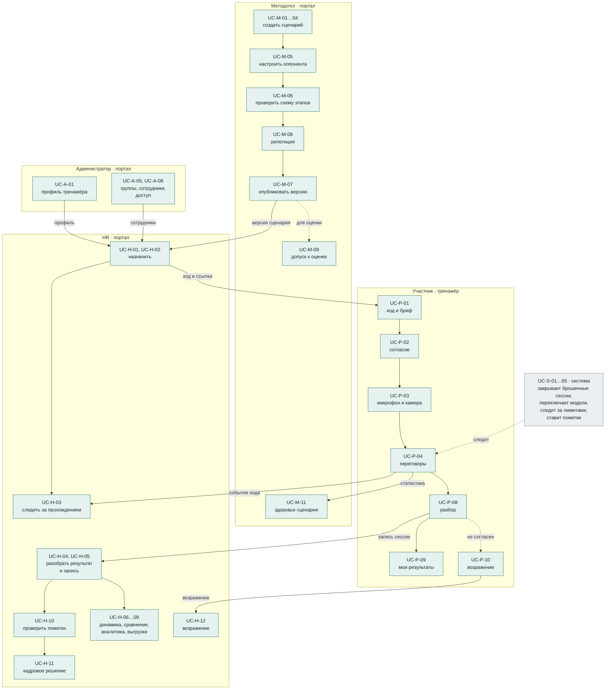
```mermaid
flowchart TB
  subgraph ADM["Администратор · портал"]
    A01["UC-A-01<br/>профиль тренажёра"]
    A05["UC-A-05, UC-A-06<br/>группы, сотрудники,<br/>доступ"]
  end
  subgraph MET["Методолог · портал"]
    M01["UC-M-01…04<br/>создать сценарий"] --> M05["UC-M-05<br/>настроить оппонента"]
    M05 --> M06["UC-M-06<br/>проверить схему этапов"]
    M06 --> M08["UC-M-08<br/>репетиция"]
    M08 --> M07["UC-M-07<br/>опубликовать версию"]
    M07 -.->|"для оценки"| M09["UC-M-09<br/>допуск к оценке"]
    M11["UC-M-11<br/>здоровье сценария"]
  end
  subgraph HRG["HR · портал"]
    H01["UC-H-01, UC-H-02<br/>назначить"] --> H03["UC-H-03<br/>следить за прохождением"]
    H04["UC-H-04, UC-H-05<br/>разобрать результат<br/>и запись"] --> H10["UC-H-10<br/>проверить пометки"]
    H10 --> H11["UC-H-11<br/>кадровое решение"]
    H04 --> H06["UC-H-06…09<br/>динамика, сравнение,<br/>аналитика, выгрузки"]
    H12["UC-H-12<br/>возражение"]
  end
  subgraph PAR["Участник · тренажёр"]
    P01["UC-P-01<br/>код и бриф"] --> P02["UC-P-02<br/>согласие"]
    P02 --> P03["UC-P-03<br/>микрофон и камера"]
    P03 --> P04["UC-P-04<br/>переговоры"]
    P04 --> P08["UC-P-08<br/>разбор"]
    P08 --> P09["UC-P-09<br/>мои результаты"]
    P08 -.->|"не согласен"| P10["UC-P-10<br/>возражение"]
  end
  SYS["UC-S-01…05 · система<br/>закрывает брошенные сессии,<br/>переключает модели,<br/>следит за лимитами,<br/>ставит пометки"]
  A01 -->|"профиль"| H01
  A05 -->|"сотрудники"| H01
  M07 -->|"версия сценария"| H01
  H01 -->|"код и ссылка"| P01
  P04 -->|"события хода"| H03
  P08 -->|"запись сессии"| H04
  P10 -->|"возражение"| H12
  P04 -->|"статистика"| M11
  SYS -.->|"следит"| P04
  classDef default fill:#E6F2EF,stroke:#1F6F6B,color:#0E2A28
  classDef sysn fill:#ECEFF2,stroke:#7A8793,color:#1B2229
  class SYS sysn
```

---

## Один ход переговоров

Главный цикл продукта (UC-P-04): кто кому что передаёт за одну реплику участника. Движок — часть тренажёра; три ИИ — запросы из тренажёра в OpenRouter или на наш сервер.

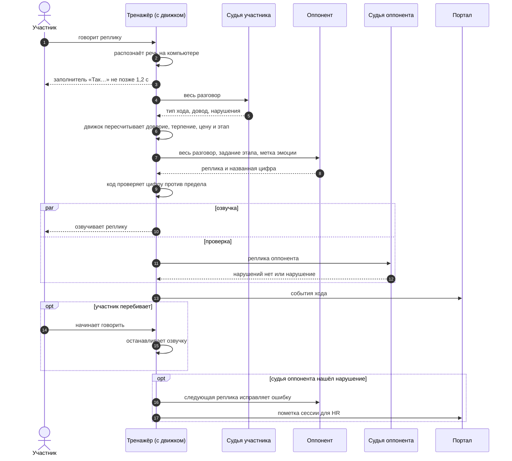
```mermaid
sequenceDiagram
  autonumber
  actor U as Участник
  participant T as Тренажёр (с движком)
  participant J1 as Судья участника
  participant O as Оппонент
  participant J2 as Судья оппонента
  participant P as Портал
  U->>T: говорит реплику
  T->>T: распознаёт речь на компьютере
  T-->>U: заполнитель «Так…» не позже 1,2 с
  T->>J1: весь разговор
  J1-->>T: тип хода, довод, нарушения
  T->>T: движок пересчитывает доверие, терпение, цену и этап
  T->>O: весь разговор, задание этапа, метка эмоции
  O-->>T: реплика и названная цифра
  T->>T: код проверяет цифру против предела
  par озвучка
    T-->>U: озвучивает реплику
  and проверка
    T->>J2: реплика оппонента
    J2-->>T: нарушений нет или нарушение
  end
  T->>P: события хода
  opt участник перебивает
    U->>T: начинает говорить
    T->>T: останавливает озвучку
  end
  opt судья оппонента нашёл нарушение
    T->>O: следующая реплика исправляет ошибку
    T->>P: пометка сессии для HR
  end
```

---

## Переходы между экранами

Основа для макетов. Сплошные стрелки — обычный путь, пунктир — особые случаи.

### Тренажёр

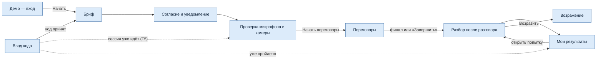
```mermaid
flowchart LR
  demo["Демо — вход"] -->|"Начать"| brief
  code["Ввод кода"] -->|"код принят"| brief["Бриф"]
  brief --> consent["Согласие и уведомление"]
  consent --> check["Проверка микрофона и камеры"]
  check -->|"Начать переговоры"| talk["Переговоры"]
  talk -->|"финал или «Завершить»"| debrief["Разбор после разговора"]
  debrief --> results["Мои результаты"]
  debrief -->|"Возразить"| objection["Возражение"]
  results -->|"открыть попытку"| debrief
  code -.->|"сессия уже идёт (F5)"| check
  code -.->|"уже пройдено"| results
  classDef default fill:#DCEBFA,stroke:#3B6EA8,color:#0F2238
```

### Портал

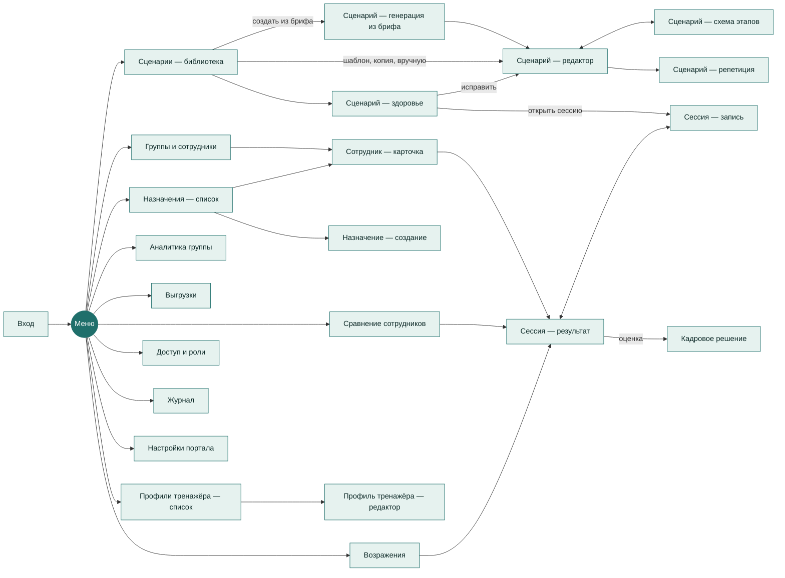
```mermaid
flowchart LR
  login["Вход"] --> menu(("Меню"))
  menu --> lib["Сценарии — библиотека"]
  menu --> asg["Назначения — список"]
  menu --> grp["Группы и сотрудники"]
  menu --> cmp["Сравнение сотрудников"]
  menu --> ana["Аналитика группы"]
  menu --> exp["Выгрузки"]
  menu --> obj["Возражения"]
  menu --> prof["Профили тренажёра — список"]
  menu --> acc["Доступ и роли"]
  menu --> jrn["Журнал"]
  menu --> set["Настройки портала"]
  lib -->|"создать из брифа"| gen["Сценарий — генерация из брифа"]
  gen --> ed["Сценарий — редактор"]
  lib -->|"шаблон, копия, вручную"| ed
  ed <--> map["Сценарий — схема этапов"]
  ed --> reh["Сценарий — репетиция"]
  lib --> health["Сценарий — здоровье"]
  health -->|"исправить"| ed
  health -->|"открыть сессию"| rec
  asg --> newa["Назначение — создание"]
  grp --> card["Сотрудник — карточка"]
  asg --> card
  card --> res["Сессия — результат"]
  cmp --> res
  obj --> res
  res <--> rec["Сессия — запись"]
  res -->|"оценка"| dec["Кадровое решение"]
  prof --> pe["Профиль тренажёра — редактор"]
  classDef default fill:#E6F2EF,stroke:#1F6F6B,color:#0E2A28
  classDef hub fill:#1F6F6B,stroke:#1F6F6B,color:#FFFFFF
  class menu hub
```

---

## Варианты использования по ролям

Кто что делает и где. Пунктир — один вариант использования ведёт к другому: «дальше» — по основному ходу, «если…» — в особом случае, «передаёт» — другой роли.

### Участник и гость демо (UC-P)

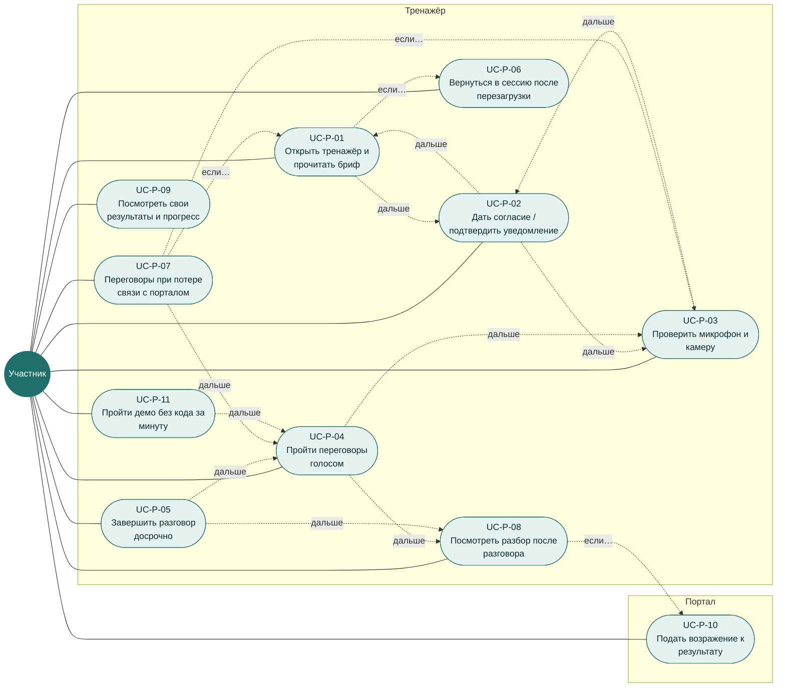
```mermaid
flowchart LR
  WHO(("Участник")):::who
  subgraph T["Тренажёр"]
    UC_P_01(["UC-P-01<br/>Открыть тренажёр и<br/>прочитать бриф"]):::uc
    UC_P_02(["UC-P-02<br/>Дать согласие /<br/>подтвердить уведомление"]):::uc
    UC_P_03(["UC-P-03<br/>Проверить микрофон и<br/>камеру"]):::uc
    UC_P_04(["UC-P-04<br/>Пройти переговоры<br/>голосом"]):::uc
    UC_P_05(["UC-P-05<br/>Завершить разговор<br/>досрочно"]):::uc
    UC_P_06(["UC-P-06<br/>Вернуться в сессию после<br/>перезагрузки"]):::uc
    UC_P_07(["UC-P-07<br/>Переговоры при потере<br/>связи с порталом"]):::uc
    UC_P_08(["UC-P-08<br/>Посмотреть разбор после<br/>разговора"]):::uc
    UC_P_09(["UC-P-09<br/>Посмотреть свои<br/>результаты и прогресс"]):::uc
    UC_P_11(["UC-P-11<br/>Пройти демо без кода за<br/>минуту"]):::uc
  end
  subgraph W["Портал"]
    UC_P_10(["UC-P-10<br/>Подать возражение к<br/>результату"]):::uc
  end
  WHO --- UC_P_01
  WHO --- UC_P_02
  WHO --- UC_P_03
  WHO --- UC_P_04
  WHO --- UC_P_05
  WHO --- UC_P_06
  WHO --- UC_P_07
  WHO --- UC_P_08
  WHO --- UC_P_09
  WHO --- UC_P_10
  WHO --- UC_P_11
  UC_P_01 -.->|"дальше"| UC_P_02
  UC_P_01 -.->|"если…"| UC_P_06
  UC_P_02 -.->|"дальше"| UC_P_01
  UC_P_02 -.->|"дальше"| UC_P_03
  UC_P_03 -.->|"дальше"| UC_P_02
  UC_P_04 -.->|"дальше"| UC_P_03
  UC_P_04 -.->|"дальше"| UC_P_08
  UC_P_05 -.->|"дальше"| UC_P_04
  UC_P_05 -.->|"дальше"| UC_P_08
  UC_P_07 -.->|"дальше"| UC_P_04
  UC_P_07 -.->|"если…"| UC_P_01
  UC_P_07 -.->|"если…"| UC_P_03
  UC_P_08 -.->|"если…"| UC_P_10
  UC_P_11 -.->|"дальше"| UC_P_04
  classDef act fill:#DCEBFA,stroke:#3B6EA8,color:#0F2238
  classDef sys fill:#ECEFF2,stroke:#7A8793,color:#1B2229
  classDef alt fill:#FFF1DC,stroke:#B7791F,color:#3A2606
  classDef uc fill:#E6F2EF,stroke:#1F6F6B,color:#0E2A28
  classDef ext fill:#F4F4F4,stroke:#A0A8B0,color:#4A535B,stroke-dasharray:4 3
  classDef who fill:#1F6F6B,stroke:#1F6F6B,color:#FFFFFF
```

### Методолог (UC-M)

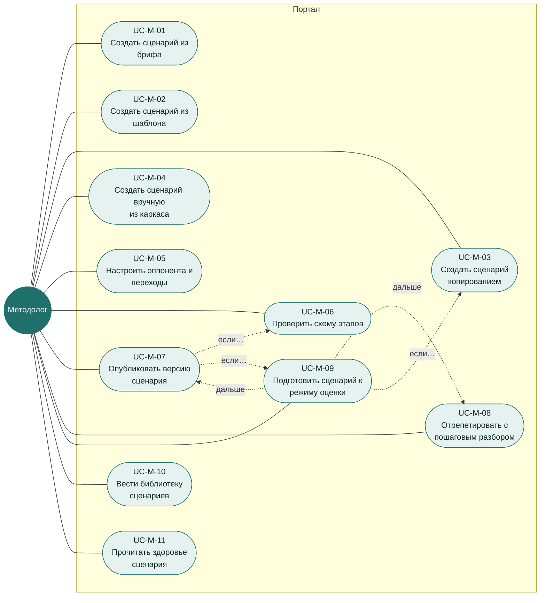
```mermaid
flowchart LR
  WHO(("Методолог")):::who
  subgraph W["Портал"]
    UC_M_01(["UC-M-01<br/>Создать сценарий из<br/>брифа"]):::uc
    UC_M_02(["UC-M-02<br/>Создать сценарий из<br/>шаблона"]):::uc
    UC_M_03(["UC-M-03<br/>Создать сценарий<br/>копированием"]):::uc
    UC_M_04(["UC-M-04<br/>Создать сценарий вручную<br/>из каркаса"]):::uc
    UC_M_05(["UC-M-05<br/>Настроить оппонента и<br/>переходы"]):::uc
    UC_M_06(["UC-M-06<br/>Проверить схему этапов"]):::uc
    UC_M_07(["UC-M-07<br/>Опубликовать версию<br/>сценария"]):::uc
    UC_M_08(["UC-M-08<br/>Отрепетировать с<br/>пошаговым разбором"]):::uc
    UC_M_09(["UC-M-09<br/>Подготовить сценарий к<br/>режиму оценки"]):::uc
    UC_M_10(["UC-M-10<br/>Вести библиотеку<br/>сценариев"]):::uc
    UC_M_11(["UC-M-11<br/>Прочитать здоровье<br/>сценария"]):::uc
  end
  WHO --- UC_M_01
  WHO --- UC_M_02
  WHO --- UC_M_03
  WHO --- UC_M_04
  WHO --- UC_M_05
  WHO --- UC_M_06
  WHO --- UC_M_07
  WHO --- UC_M_08
  WHO --- UC_M_09
  WHO --- UC_M_10
  WHO --- UC_M_11
  UC_M_07 -.->|"если…"| UC_M_06
  UC_M_07 -.->|"если…"| UC_M_09
  UC_M_09 -.->|"дальше"| UC_M_07
  UC_M_09 -.->|"дальше"| UC_M_08
  UC_M_09 -.->|"если…"| UC_M_03
  classDef act fill:#DCEBFA,stroke:#3B6EA8,color:#0F2238
  classDef sys fill:#ECEFF2,stroke:#7A8793,color:#1B2229
  classDef alt fill:#FFF1DC,stroke:#B7791F,color:#3A2606
  classDef uc fill:#E6F2EF,stroke:#1F6F6B,color:#0E2A28
  classDef ext fill:#F4F4F4,stroke:#A0A8B0,color:#4A535B,stroke-dasharray:4 3
  classDef who fill:#1F6F6B,stroke:#1F6F6B,color:#FFFFFF
```

### HR (UC-H)

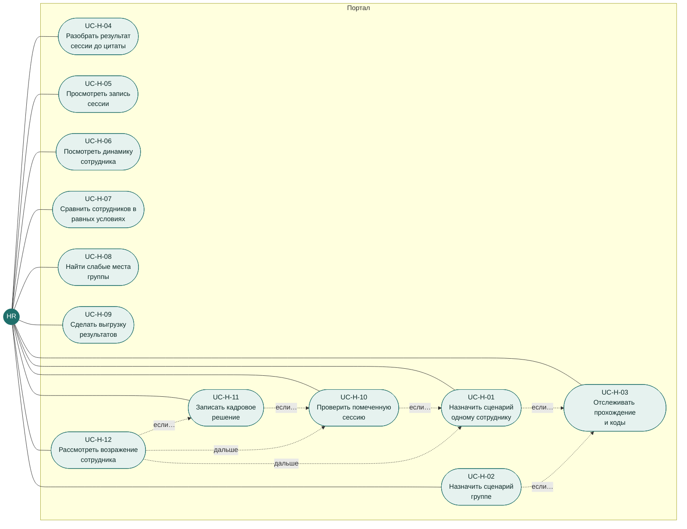
```mermaid
flowchart LR
  WHO(("HR")):::who
  subgraph W["Портал"]
    UC_H_01(["UC-H-01<br/>Назначить сценарий<br/>одному сотруднику"]):::uc
    UC_H_02(["UC-H-02<br/>Назначить сценарий<br/>группе"]):::uc
    UC_H_03(["UC-H-03<br/>Отслеживать прохождение<br/>и коды"]):::uc
    UC_H_04(["UC-H-04<br/>Разобрать результат<br/>сессии до цитаты"]):::uc
    UC_H_05(["UC-H-05<br/>Просмотреть запись<br/>сессии"]):::uc
    UC_H_06(["UC-H-06<br/>Посмотреть динамику<br/>сотрудника"]):::uc
    UC_H_07(["UC-H-07<br/>Сравнить сотрудников в<br/>равных условиях"]):::uc
    UC_H_08(["UC-H-08<br/>Найти слабые места<br/>группы"]):::uc
    UC_H_09(["UC-H-09<br/>Сделать выгрузку<br/>результатов"]):::uc
    UC_H_10(["UC-H-10<br/>Проверить помеченную<br/>сессию"]):::uc
    UC_H_11(["UC-H-11<br/>Записать кадровое<br/>решение"]):::uc
    UC_H_12(["UC-H-12<br/>Рассмотреть возражение<br/>сотрудника"]):::uc
  end
  WHO --- UC_H_01
  WHO --- UC_H_02
  WHO --- UC_H_03
  WHO --- UC_H_04
  WHO --- UC_H_05
  WHO --- UC_H_06
  WHO --- UC_H_07
  WHO --- UC_H_08
  WHO --- UC_H_09
  WHO --- UC_H_10
  WHO --- UC_H_11
  WHO --- UC_H_12
  UC_H_01 -.->|"если…"| UC_H_03
  UC_H_02 -.->|"если…"| UC_H_03
  UC_H_10 -.->|"если…"| UC_H_01
  UC_H_11 -.->|"если…"| UC_H_10
  UC_H_12 -.->|"дальше"| UC_H_01
  UC_H_12 -.->|"дальше"| UC_H_10
  UC_H_12 -.->|"если…"| UC_H_11
  classDef act fill:#DCEBFA,stroke:#3B6EA8,color:#0F2238
  classDef sys fill:#ECEFF2,stroke:#7A8793,color:#1B2229
  classDef alt fill:#FFF1DC,stroke:#B7791F,color:#3A2606
  classDef uc fill:#E6F2EF,stroke:#1F6F6B,color:#0E2A28
  classDef ext fill:#F4F4F4,stroke:#A0A8B0,color:#4A535B,stroke-dasharray:4 3
  classDef who fill:#1F6F6B,stroke:#1F6F6B,color:#FFFFFF
```

### Администратор (UC-A)

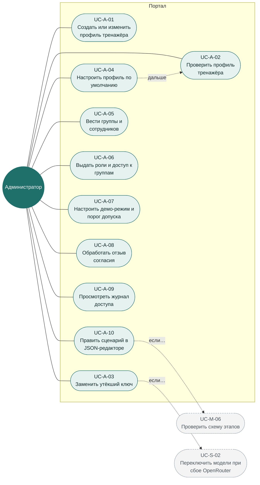
```mermaid
flowchart LR
  WHO(("Администратор")):::who
  subgraph W["Портал"]
    UC_A_01(["UC-A-01<br/>Создать или изменить<br/>профиль тренажёра"]):::uc
    UC_A_02(["UC-A-02<br/>Проверить профиль<br/>тренажёра"]):::uc
    UC_A_03(["UC-A-03<br/>Заменить утёкший ключ"]):::uc
    UC_A_04(["UC-A-04<br/>Настроить профиль по<br/>умолчанию"]):::uc
    UC_A_05(["UC-A-05<br/>Вести группы и<br/>сотрудников"]):::uc
    UC_A_06(["UC-A-06<br/>Выдать роли и доступ к<br/>группам"]):::uc
    UC_A_07(["UC-A-07<br/>Настроить демо-режим и<br/>порог допуска"]):::uc
    UC_A_08(["UC-A-08<br/>Обработать отзыв<br/>согласия"]):::uc
    UC_A_09(["UC-A-09<br/>Просмотреть журнал<br/>доступа"]):::uc
    UC_A_10(["UC-A-10<br/>Править сценарий в<br/>JSON-редакторе"]):::uc
  end
  UC_M_06(["UC-M-06<br/>Проверить схему этапов"]):::ext
  UC_S_02(["UC-S-02<br/>Переключить модели при<br/>сбое OpenRouter"]):::ext
  WHO --- UC_A_01
  WHO --- UC_A_02
  WHO --- UC_A_03
  WHO --- UC_A_04
  WHO --- UC_A_05
  WHO --- UC_A_06
  WHO --- UC_A_07
  WHO --- UC_A_08
  WHO --- UC_A_09
  WHO --- UC_A_10
  UC_A_03 -.->|"если…"| UC_S_02
  UC_A_04 -.->|"дальше"| UC_A_02
  UC_A_10 -.->|"если…"| UC_M_06
  classDef act fill:#DCEBFA,stroke:#3B6EA8,color:#0F2238
  classDef sys fill:#ECEFF2,stroke:#7A8793,color:#1B2229
  classDef alt fill:#FFF1DC,stroke:#B7791F,color:#3A2606
  classDef uc fill:#E6F2EF,stroke:#1F6F6B,color:#0E2A28
  classDef ext fill:#F4F4F4,stroke:#A0A8B0,color:#4A535B,stroke-dasharray:4 3
  classDef who fill:#1F6F6B,stroke:#1F6F6B,color:#FFFFFF
```

### Система (UC-S)

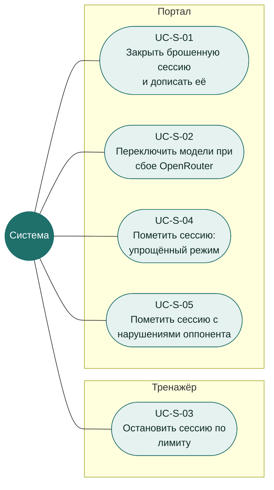
```mermaid
flowchart LR
  WHO(("Система")):::who
  subgraph T["Тренажёр"]
    UC_S_03(["UC-S-03<br/>Остановить сессию по<br/>лимиту"]):::uc
  end
  subgraph W["Портал"]
    UC_S_01(["UC-S-01<br/>Закрыть брошенную сессию<br/>и дописать её"]):::uc
    UC_S_02(["UC-S-02<br/>Переключить модели при<br/>сбое OpenRouter"]):::uc
    UC_S_04(["UC-S-04<br/>Пометить сессию:<br/>упрощённый режим"]):::uc
    UC_S_05(["UC-S-05<br/>Пометить сессию с<br/>нарушениями оппонента"]):::uc
  end
  WHO --- UC_S_01
  WHO --- UC_S_02
  WHO --- UC_S_03
  WHO --- UC_S_04
  WHO --- UC_S_05
  classDef act fill:#DCEBFA,stroke:#3B6EA8,color:#0F2238
  classDef sys fill:#ECEFF2,stroke:#7A8793,color:#1B2229
  classDef alt fill:#FFF1DC,stroke:#B7791F,color:#3A2606
  classDef uc fill:#E6F2EF,stroke:#1F6F6B,color:#0E2A28
  classDef ext fill:#F4F4F4,stroke:#A0A8B0,color:#4A535B,stroke-dasharray:4 3
  classDef who fill:#1F6F6B,stroke:#1F6F6B,color:#FFFFFF
```

---

## Ход: Участник и гость демо

### UC-P-01 · Открыть тренажёр по ссылке или коду и прочитать бриф

*Участник (сотрудник) · экраны: Ввод кода, Бриф, Мои результаты*

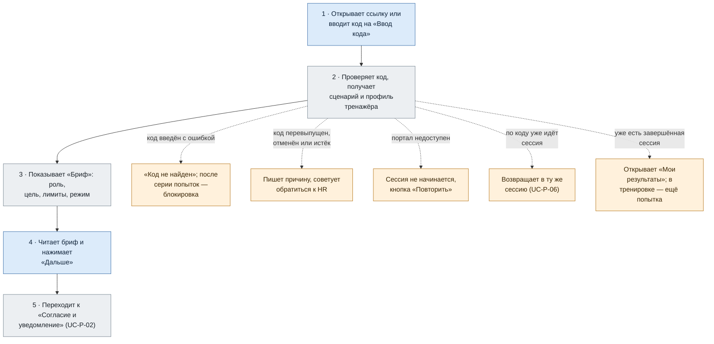
```mermaid
flowchart TD
  s1["1 · Открывает ссылку или<br/>вводит код на «Ввод кода»"]:::act
  s2["2 · Проверяет код, получает<br/>сценарий и профиль<br/>тренажёра"]:::sys
  s3["3 · Показывает «Бриф»: роль,<br/>цель, лимиты, режим"]:::sys
  s4["4 · Читает бриф и нажимает<br/>«Дальше»"]:::act
  s5["5 · Переходит к «Согласие и<br/>уведомление» (UC-P-02)"]:::sys
  s1 --> s2
  s2 --> s3
  s3 --> s4
  s4 --> s5
  a1["«Код не найден»; после<br/>серии попыток —<br/>блокировка"]:::alt
  s2 -.->|"код введён с ошибкой"| a1
  a2["Пишет причину, советует<br/>обратиться к HR"]:::alt
  s2 -.->|"код перевыпущен,<br/>отменён или истёк"| a2
  a3["Сессия не начинается,<br/>кнопка «Повторить»"]:::alt
  s2 -.->|"портал недоступен"| a3
  a4["Возвращает в ту же<br/>сессию (UC-P-06)"]:::alt
  s2 -.->|"по коду уже идёт<br/>сессия"| a4
  a5["Открывает «Мои<br/>результаты»; в<br/>тренировке — ещё попытка"]:::alt
  s2 -.->|"уже есть завершённая<br/>сессия"| a5
  classDef act fill:#DCEBFA,stroke:#3B6EA8,color:#0F2238
  classDef sys fill:#ECEFF2,stroke:#7A8793,color:#1B2229
  classDef alt fill:#FFF1DC,stroke:#B7791F,color:#3A2606
  classDef uc fill:#E6F2EF,stroke:#1F6F6B,color:#0E2A28
  classDef ext fill:#F4F4F4,stroke:#A0A8B0,color:#4A535B,stroke-dasharray:4 3
  classDef who fill:#1F6F6B,stroke:#1F6F6B,color:#FFFFFF
```

### UC-P-02 · Дать согласие или подтвердить уведомление

*Участник (сотрудник) · экраны: Согласие и уведомление*

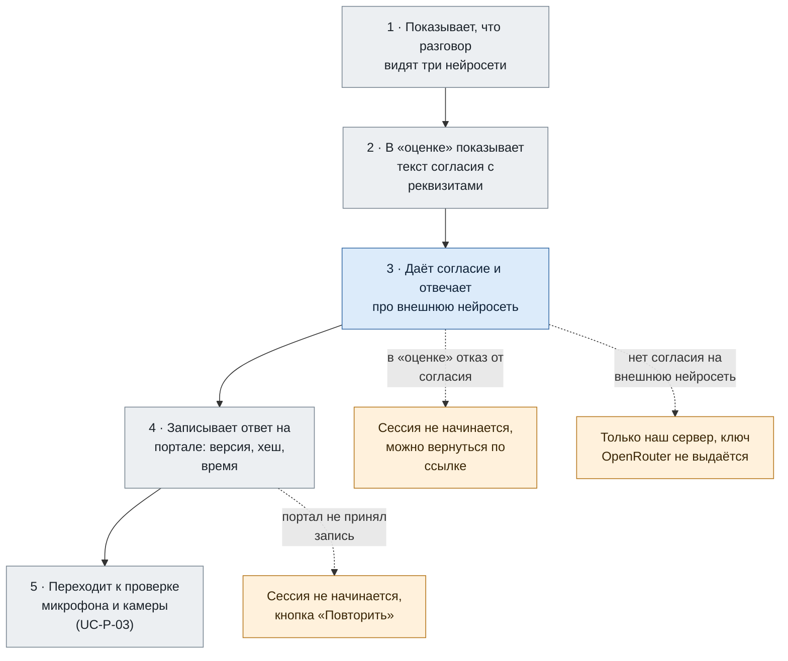
```mermaid
flowchart TD
  s1["1 · Показывает, что разговор<br/>видят три нейросети"]:::sys
  s2["2 · В «оценке» показывает<br/>текст согласия с<br/>реквизитами"]:::sys
  s3["3 · Даёт согласие и отвечает<br/>про внешнюю нейросеть"]:::act
  s4["4 · Записывает ответ на<br/>портале: версия, хеш,<br/>время"]:::sys
  s5["5 · Переходит к проверке<br/>микрофона и камеры<br/>(UC-P-03)"]:::sys
  s1 --> s2
  s2 --> s3
  s3 --> s4
  s4 --> s5
  a1["Сессия не начинается,<br/>можно вернуться по<br/>ссылке"]:::alt
  s3 -.->|"в «оценке» отказ от<br/>согласия"| a1
  a2["Только наш сервер, ключ<br/>OpenRouter не выдаётся"]:::alt
  s3 -.->|"нет согласия на<br/>внешнюю нейросеть"| a2
  a3["Сессия не начинается,<br/>кнопка «Повторить»"]:::alt
  s4 -.->|"портал не принял<br/>запись"| a3
  classDef act fill:#DCEBFA,stroke:#3B6EA8,color:#0F2238
  classDef sys fill:#ECEFF2,stroke:#7A8793,color:#1B2229
  classDef alt fill:#FFF1DC,stroke:#B7791F,color:#3A2606
  classDef uc fill:#E6F2EF,stroke:#1F6F6B,color:#0E2A28
  classDef ext fill:#F4F4F4,stroke:#A0A8B0,color:#4A535B,stroke-dasharray:4 3
  classDef who fill:#1F6F6B,stroke:#1F6F6B,color:#FFFFFF
```

### UC-P-03 · Проверить микрофон и камеру

*Участник (сотрудник) · экраны: Проверка микрофона и камеры, Переговоры*

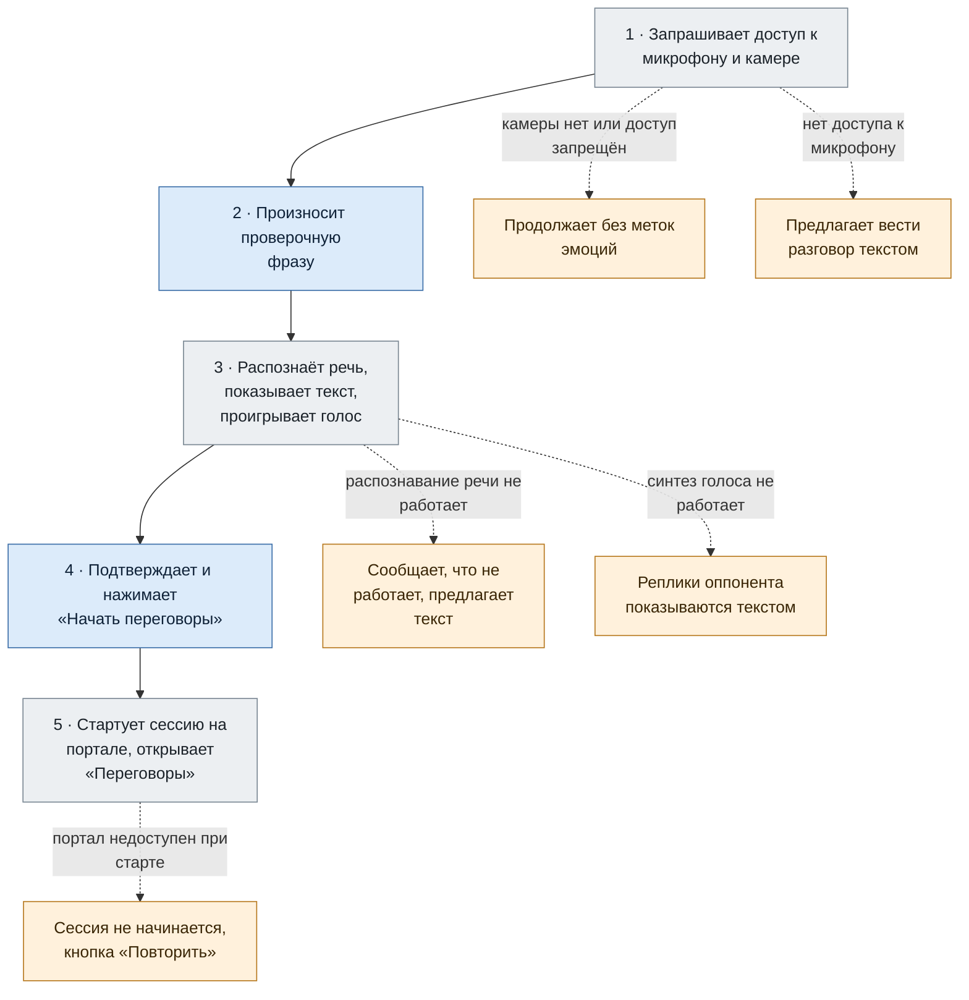
```mermaid
flowchart TD
  s1["1 · Запрашивает доступ к<br/>микрофону и камере"]:::sys
  s2["2 · Произносит проверочную<br/>фразу"]:::act
  s3["3 · Распознаёт речь,<br/>показывает текст,<br/>проигрывает голос"]:::sys
  s4["4 · Подтверждает и нажимает<br/>«Начать переговоры»"]:::act
  s5["5 · Стартует сессию на<br/>портале, открывает<br/>«Переговоры»"]:::sys
  s1 --> s2
  s2 --> s3
  s3 --> s4
  s4 --> s5
  a1["Продолжает без меток<br/>эмоций"]:::alt
  s1 -.->|"камеры нет или доступ<br/>запрещён"| a1
  a2["Предлагает вести<br/>разговор текстом"]:::alt
  s1 -.->|"нет доступа к<br/>микрофону"| a2
  a3["Сообщает, что не<br/>работает, предлагает<br/>текст"]:::alt
  s3 -.->|"распознавание речи не<br/>работает"| a3
  a4["Реплики оппонента<br/>показываются текстом"]:::alt
  s3 -.->|"синтез голоса не<br/>работает"| a4
  a5["Сессия не начинается,<br/>кнопка «Повторить»"]:::alt
  s5 -.->|"портал недоступен при<br/>старте"| a5
  classDef act fill:#DCEBFA,stroke:#3B6EA8,color:#0F2238
  classDef sys fill:#ECEFF2,stroke:#7A8793,color:#1B2229
  classDef alt fill:#FFF1DC,stroke:#B7791F,color:#3A2606
  classDef uc fill:#E6F2EF,stroke:#1F6F6B,color:#0E2A28
  classDef ext fill:#F4F4F4,stroke:#A0A8B0,color:#4A535B,stroke-dasharray:4 3
  classDef who fill:#1F6F6B,stroke:#1F6F6B,color:#FFFFFF
```

### UC-P-04 · Пройти переговоры голосом

*Участник (сотрудник) · экраны: Переговоры, Разбор после разговора*

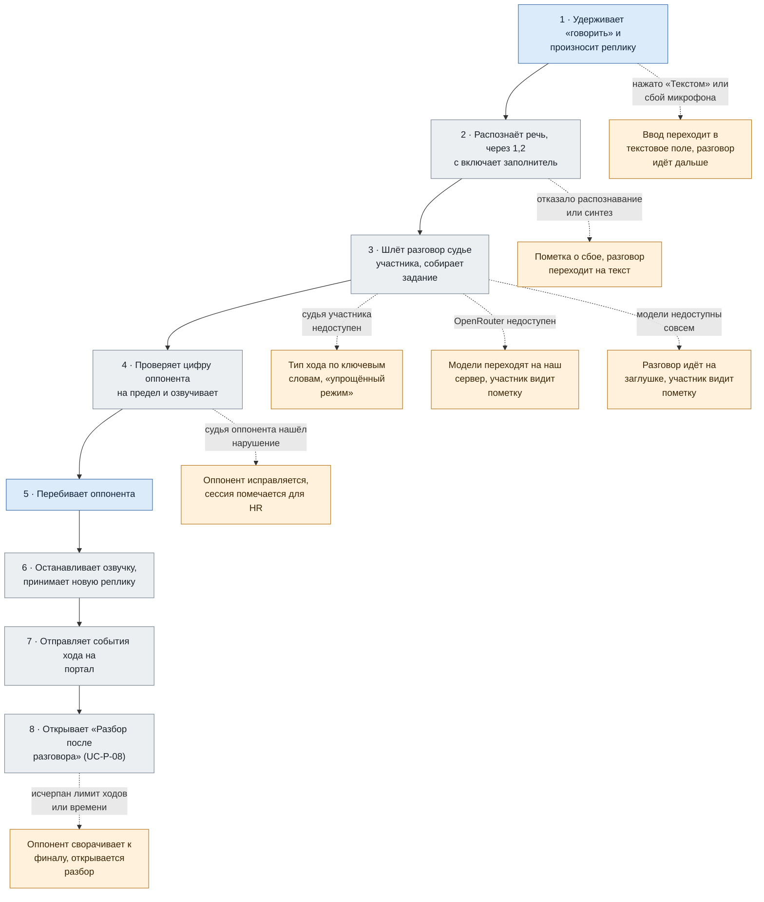
```mermaid
flowchart TD
  s1["1 · Удерживает «говорить» и<br/>произносит реплику"]:::act
  s2["2 · Распознаёт речь, через 1,2<br/>с включает заполнитель"]:::sys
  s3["3 · Шлёт разговор судье<br/>участника, собирает<br/>задание"]:::sys
  s4["4 · Проверяет цифру оппонента<br/>на предел и озвучивает"]:::sys
  s5["5 · Перебивает оппонента"]:::act
  s6["6 · Останавливает озвучку,<br/>принимает новую реплику"]:::sys
  s7["7 · Отправляет события хода на<br/>портал"]:::sys
  s8["8 · Открывает «Разбор после<br/>разговора» (UC-P-08)"]:::sys
  s1 --> s2
  s2 --> s3
  s3 --> s4
  s4 --> s5
  s5 --> s6
  s6 --> s7
  s7 --> s8
  a1["Ввод переходит в<br/>текстовое поле, разговор<br/>идёт дальше"]:::alt
  s1 -.->|"нажато «Текстом» или<br/>сбой микрофона"| a1
  a2["Пометка о сбое, разговор<br/>переходит на текст"]:::alt
  s2 -.->|"отказало распознавание<br/>или синтез"| a2
  a3["Тип хода по ключевым<br/>словам, «упрощённый<br/>режим»"]:::alt
  s3 -.->|"судья участника<br/>недоступен"| a3
  a4["Модели переходят на наш<br/>сервер, участник видит<br/>пометку"]:::alt
  s3 -.->|"OpenRouter недоступен"| a4
  a5["Разговор идёт на<br/>заглушке, участник видит<br/>пометку"]:::alt
  s3 -.->|"модели недоступны<br/>совсем"| a5
  a6["Оппонент исправляется,<br/>сессия помечается для HR"]:::alt
  s4 -.->|"судья оппонента нашёл<br/>нарушение"| a6
  a7["Оппонент сворачивает к<br/>финалу, открывается<br/>разбор"]:::alt
  s8 -.->|"исчерпан лимит ходов<br/>или времени"| a7
  classDef act fill:#DCEBFA,stroke:#3B6EA8,color:#0F2238
  classDef sys fill:#ECEFF2,stroke:#7A8793,color:#1B2229
  classDef alt fill:#FFF1DC,stroke:#B7791F,color:#3A2606
  classDef uc fill:#E6F2EF,stroke:#1F6F6B,color:#0E2A28
  classDef ext fill:#F4F4F4,stroke:#A0A8B0,color:#4A535B,stroke-dasharray:4 3
  classDef who fill:#1F6F6B,stroke:#1F6F6B,color:#FFFFFF
```

### UC-P-05 · Завершить разговор досрочно

*Участник (сотрудник) · экраны: Переговоры, Разбор после разговора, Мои результаты*

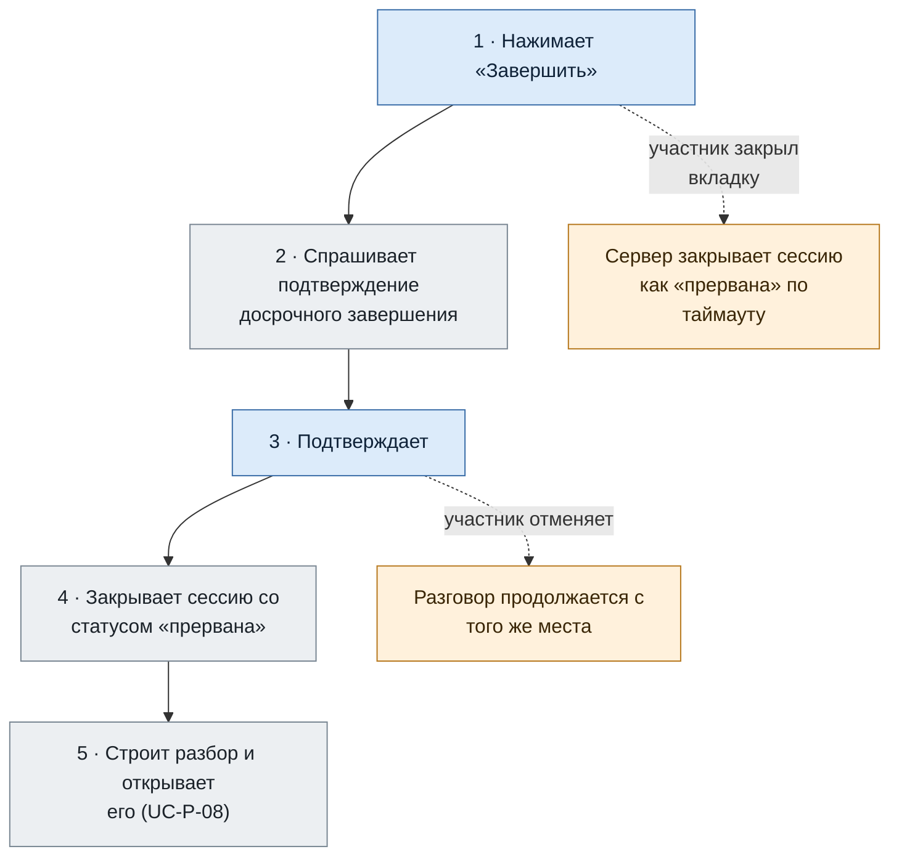
```mermaid
flowchart TD
  s1["1 · Нажимает «Завершить»"]:::act
  s2["2 · Спрашивает подтверждение<br/>досрочного завершения"]:::sys
  s3["3 · Подтверждает"]:::act
  s4["4 · Закрывает сессию со<br/>статусом «прервана»"]:::sys
  s5["5 · Строит разбор и открывает<br/>его (UC-P-08)"]:::sys
  s1 --> s2
  s2 --> s3
  s3 --> s4
  s4 --> s5
  a1["Разговор продолжается с<br/>того же места"]:::alt
  s3 -.->|"участник отменяет"| a1
  a2["Сервер закрывает сессию<br/>как «прервана» по<br/>таймауту"]:::alt
  s1 -.->|"участник закрыл<br/>вкладку"| a2
  classDef act fill:#DCEBFA,stroke:#3B6EA8,color:#0F2238
  classDef sys fill:#ECEFF2,stroke:#7A8793,color:#1B2229
  classDef alt fill:#FFF1DC,stroke:#B7791F,color:#3A2606
  classDef uc fill:#E6F2EF,stroke:#1F6F6B,color:#0E2A28
  classDef ext fill:#F4F4F4,stroke:#A0A8B0,color:#4A535B,stroke-dasharray:4 3
  classDef who fill:#1F6F6B,stroke:#1F6F6B,color:#FFFFFF
```

### UC-P-06 · Вернуться в сессию после перезагрузки страницы

*Участник (сотрудник) · экраны: Ввод кода, Проверка микрофона и камеры, Переговоры, Мои результаты*

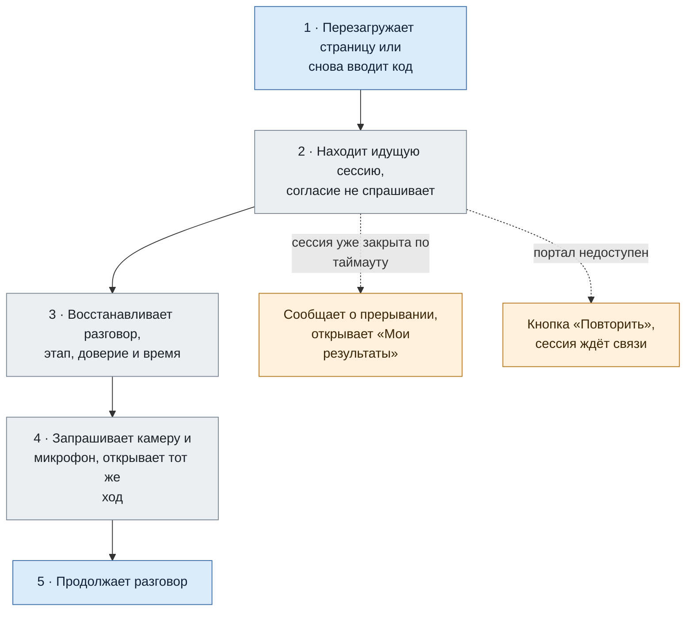
```mermaid
flowchart TD
  s1["1 · Перезагружает страницу или<br/>снова вводит код"]:::act
  s2["2 · Находит идущую сессию,<br/>согласие не спрашивает"]:::sys
  s3["3 · Восстанавливает разговор,<br/>этап, доверие и время"]:::sys
  s4["4 · Запрашивает камеру и<br/>микрофон, открывает тот же<br/>ход"]:::sys
  s5["5 · Продолжает разговор"]:::act
  s1 --> s2
  s2 --> s3
  s3 --> s4
  s4 --> s5
  a1["Сообщает о прерывании,<br/>открывает «Мои<br/>результаты»"]:::alt
  s2 -.->|"сессия уже закрыта по<br/>таймауту"| a1
  a2["Кнопка «Повторить»,<br/>сессия ждёт связи"]:::alt
  s2 -.->|"портал недоступен"| a2
  classDef act fill:#DCEBFA,stroke:#3B6EA8,color:#0F2238
  classDef sys fill:#ECEFF2,stroke:#7A8793,color:#1B2229
  classDef alt fill:#FFF1DC,stroke:#B7791F,color:#3A2606
  classDef uc fill:#E6F2EF,stroke:#1F6F6B,color:#0E2A28
  classDef ext fill:#F4F4F4,stroke:#A0A8B0,color:#4A535B,stroke-dasharray:4 3
  classDef who fill:#1F6F6B,stroke:#1F6F6B,color:#FFFFFF
```

### UC-P-07 · Продолжить переговоры при потере связи с порталом

*Участник (сотрудник) · экраны: Переговоры, Разбор после разговора*

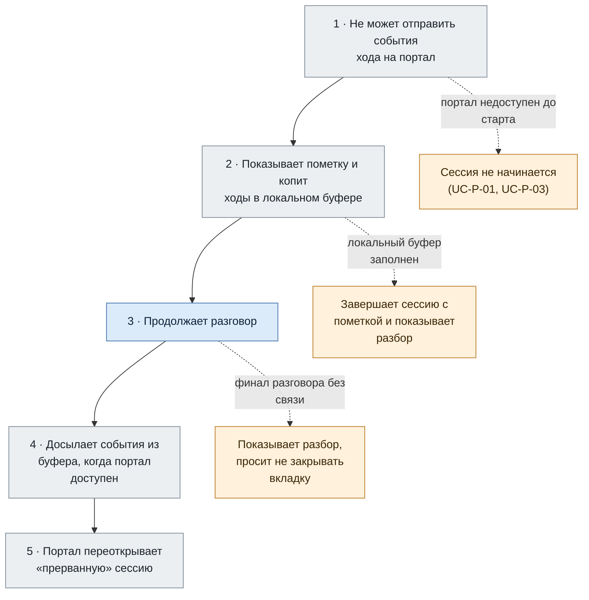
```mermaid
flowchart TD
  s1["1 · Не может отправить события<br/>хода на портал"]:::sys
  s2["2 · Показывает пометку и копит<br/>ходы в локальном буфере"]:::sys
  s3["3 · Продолжает разговор"]:::act
  s4["4 · Досылает события из<br/>буфера, когда портал<br/>доступен"]:::sys
  s5["5 · Портал переоткрывает<br/>«прерванную» сессию"]:::sys
  s1 --> s2
  s2 --> s3
  s3 --> s4
  s4 --> s5
  a1["Завершает сессию с<br/>пометкой и показывает<br/>разбор"]:::alt
  s2 -.->|"локальный буфер<br/>заполнен"| a1
  a2["Показывает разбор,<br/>просит не закрывать<br/>вкладку"]:::alt
  s3 -.->|"финал разговора без<br/>связи"| a2
  a3["Сессия не начинается<br/>(UC-P-01, UC-P-03)"]:::alt
  s1 -.->|"портал недоступен до<br/>старта"| a3
  classDef act fill:#DCEBFA,stroke:#3B6EA8,color:#0F2238
  classDef sys fill:#ECEFF2,stroke:#7A8793,color:#1B2229
  classDef alt fill:#FFF1DC,stroke:#B7791F,color:#3A2606
  classDef uc fill:#E6F2EF,stroke:#1F6F6B,color:#0E2A28
  classDef ext fill:#F4F4F4,stroke:#A0A8B0,color:#4A535B,stroke-dasharray:4 3
  classDef who fill:#1F6F6B,stroke:#1F6F6B,color:#FFFFFF
```

### UC-P-08 · Посмотреть разбор после разговора

*Участник (сотрудник) · экраны: Разбор после разговора, Возражение*

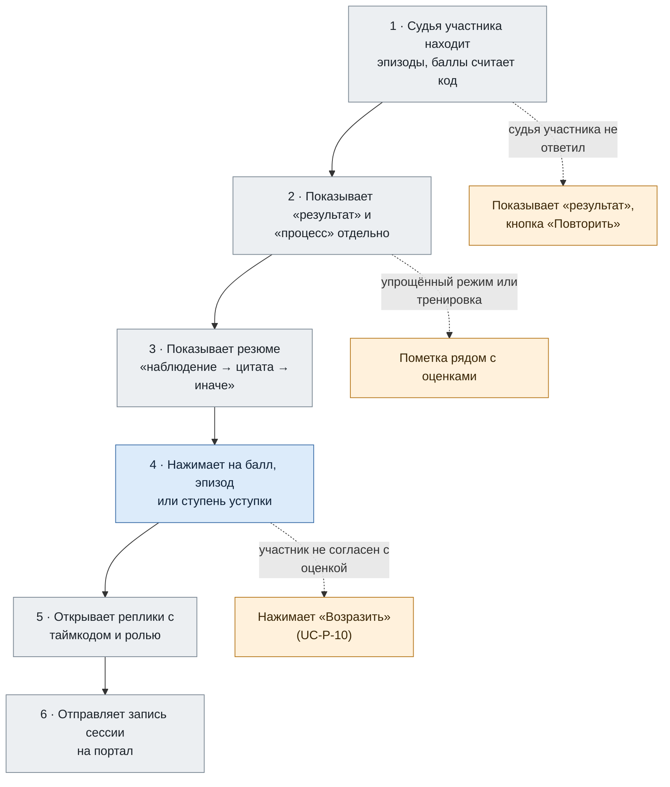
```mermaid
flowchart TD
  s1["1 · Судья участника находит<br/>эпизоды, баллы считает код"]:::sys
  s2["2 · Показывает «результат» и<br/>«процесс» отдельно"]:::sys
  s3["3 · Показывает резюме<br/>«наблюдение → цитата →<br/>иначе»"]:::sys
  s4["4 · Нажимает на балл, эпизод<br/>или ступень уступки"]:::act
  s5["5 · Открывает реплики с<br/>таймкодом и ролью"]:::sys
  s6["6 · Отправляет запись сессии<br/>на портал"]:::sys
  s1 --> s2
  s2 --> s3
  s3 --> s4
  s4 --> s5
  s5 --> s6
  a1["Показывает «результат»,<br/>кнопка «Повторить»"]:::alt
  s1 -.->|"судья участника не<br/>ответил"| a1
  a2["Пометка рядом с оценками"]:::alt
  s2 -.->|"упрощённый режим или<br/>тренировка"| a2
  a3["Нажимает «Возразить»<br/>(UC-P-10)"]:::alt
  s4 -.->|"участник не согласен с<br/>оценкой"| a3
  classDef act fill:#DCEBFA,stroke:#3B6EA8,color:#0F2238
  classDef sys fill:#ECEFF2,stroke:#7A8793,color:#1B2229
  classDef alt fill:#FFF1DC,stroke:#B7791F,color:#3A2606
  classDef uc fill:#E6F2EF,stroke:#1F6F6B,color:#0E2A28
  classDef ext fill:#F4F4F4,stroke:#A0A8B0,color:#4A535B,stroke-dasharray:4 3
  classDef who fill:#1F6F6B,stroke:#1F6F6B,color:#FFFFFF
```

### UC-P-09 · Посмотреть свои результаты и прогресс

*Участник (сотрудник) · экраны: Мои результаты, Разбор после разговора*

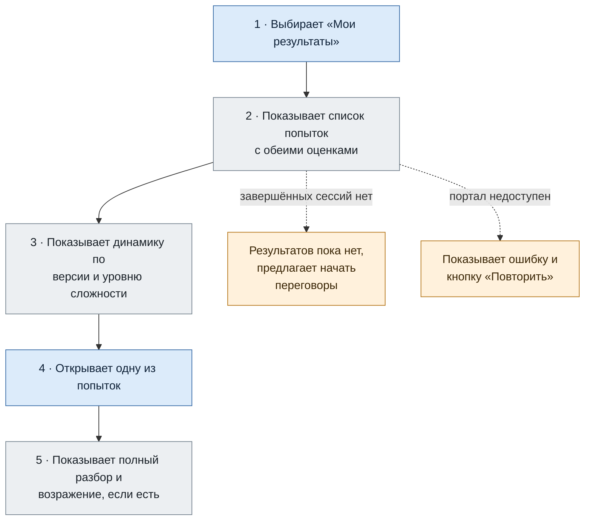
```mermaid
flowchart TD
  s1["1 · Выбирает «Мои результаты»"]:::act
  s2["2 · Показывает список попыток<br/>с обеими оценками"]:::sys
  s3["3 · Показывает динамику по<br/>версии и уровню сложности"]:::sys
  s4["4 · Открывает одну из попыток"]:::act
  s5["5 · Показывает полный разбор и<br/>возражение, если есть"]:::sys
  s1 --> s2
  s2 --> s3
  s3 --> s4
  s4 --> s5
  a1["Результатов пока нет,<br/>предлагает начать<br/>переговоры"]:::alt
  s2 -.->|"завершённых сессий нет"| a1
  a2["Показывает ошибку и<br/>кнопку «Повторить»"]:::alt
  s2 -.->|"портал недоступен"| a2
  classDef act fill:#DCEBFA,stroke:#3B6EA8,color:#0F2238
  classDef sys fill:#ECEFF2,stroke:#7A8793,color:#1B2229
  classDef alt fill:#FFF1DC,stroke:#B7791F,color:#3A2606
  classDef uc fill:#E6F2EF,stroke:#1F6F6B,color:#0E2A28
  classDef ext fill:#F4F4F4,stroke:#A0A8B0,color:#4A535B,stroke-dasharray:4 3
  classDef who fill:#1F6F6B,stroke:#1F6F6B,color:#FFFFFF
```

### UC-P-10 · Подать возражение к результату

*Участник (сотрудник) · экраны: Разбор после разговора, Мои результаты, Возражение, Сессия — результат*

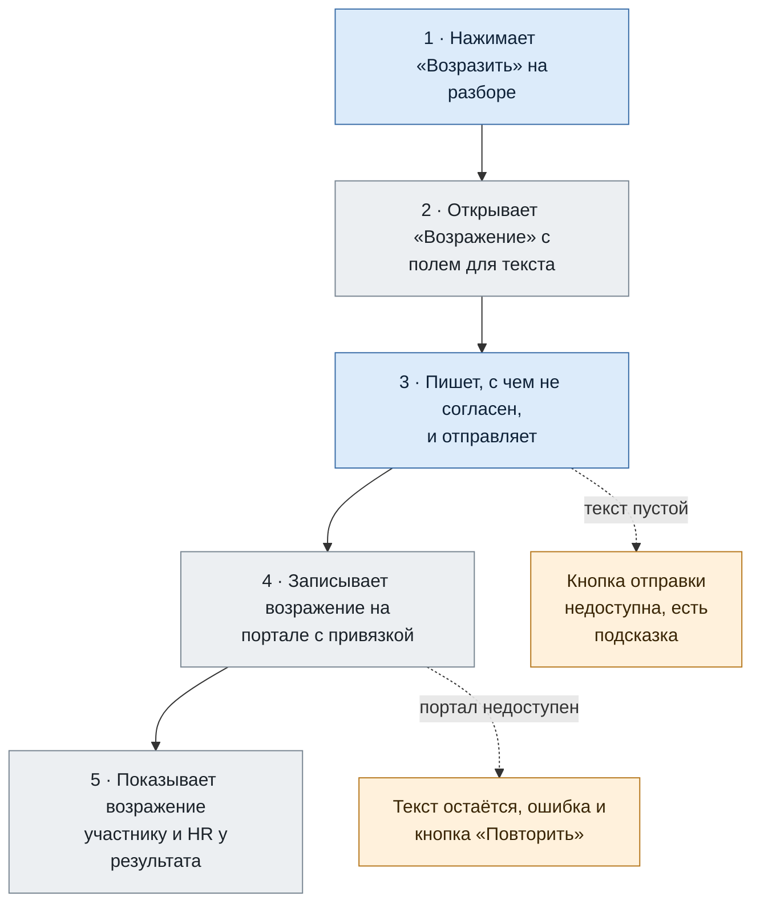
```mermaid
flowchart TD
  s1["1 · Нажимает «Возразить» на<br/>разборе"]:::act
  s2["2 · Открывает «Возражение» с<br/>полем для текста"]:::sys
  s3["3 · Пишет, с чем не согласен,<br/>и отправляет"]:::act
  s4["4 · Записывает возражение на<br/>портале с привязкой"]:::sys
  s5["5 · Показывает возражение<br/>участнику и HR у<br/>результата"]:::sys
  s1 --> s2
  s2 --> s3
  s3 --> s4
  s4 --> s5
  a1["Кнопка отправки<br/>недоступна, есть<br/>подсказка"]:::alt
  s3 -.->|"текст пустой"| a1
  a2["Текст остаётся, ошибка и<br/>кнопка «Повторить»"]:::alt
  s4 -.->|"портал недоступен"| a2
  classDef act fill:#DCEBFA,stroke:#3B6EA8,color:#0F2238
  classDef sys fill:#ECEFF2,stroke:#7A8793,color:#1B2229
  classDef alt fill:#FFF1DC,stroke:#B7791F,color:#3A2606
  classDef uc fill:#E6F2EF,stroke:#1F6F6B,color:#0E2A28
  classDef ext fill:#F4F4F4,stroke:#A0A8B0,color:#4A535B,stroke-dasharray:4 3
  classDef who fill:#1F6F6B,stroke:#1F6F6B,color:#FFFFFF
```

### UC-P-11 · Пройти демо без кода меньше чем за минуту

*Гость демо (жюри) · экраны: Демо — вход, Бриф, Согласие и уведомление, Переговоры, Разбор после разговора*

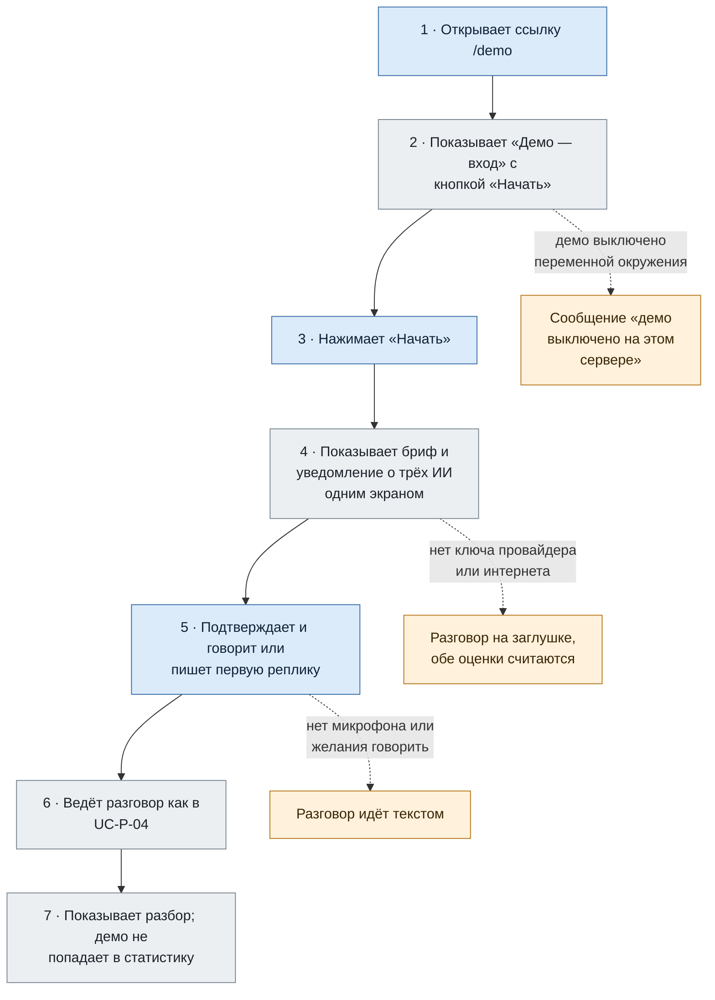
```mermaid
flowchart TD
  s1["1 · Открывает ссылку /demo"]:::act
  s2["2 · Показывает «Демо — вход» с<br/>кнопкой «Начать»"]:::sys
  s3["3 · Нажимает «Начать»"]:::act
  s4["4 · Показывает бриф и<br/>уведомление о трёх ИИ<br/>одним экраном"]:::sys
  s5["5 · Подтверждает и говорит или<br/>пишет первую реплику"]:::act
  s6["6 · Ведёт разговор как в<br/>UC-P-04"]:::sys
  s7["7 · Показывает разбор; демо не<br/>попадает в статистику"]:::sys
  s1 --> s2
  s2 --> s3
  s3 --> s4
  s4 --> s5
  s5 --> s6
  s6 --> s7
  a1["Сообщение «демо<br/>выключено на этом<br/>сервере»"]:::alt
  s2 -.->|"демо выключено<br/>переменной окружения"| a1
  a2["Разговор на заглушке,<br/>обе оценки считаются"]:::alt
  s4 -.->|"нет ключа провайдера<br/>или интернета"| a2
  a3["Разговор идёт текстом"]:::alt
  s5 -.->|"нет микрофона или<br/>желания говорить"| a3
  classDef act fill:#DCEBFA,stroke:#3B6EA8,color:#0F2238
  classDef sys fill:#ECEFF2,stroke:#7A8793,color:#1B2229
  classDef alt fill:#FFF1DC,stroke:#B7791F,color:#3A2606
  classDef uc fill:#E6F2EF,stroke:#1F6F6B,color:#0E2A28
  classDef ext fill:#F4F4F4,stroke:#A0A8B0,color:#4A535B,stroke-dasharray:4 3
  classDef who fill:#1F6F6B,stroke:#1F6F6B,color:#FFFFFF
```

---

## Ход: Методолог

### UC-M-01 · Создать сценарий из брифа

*Методолог · экраны: Сценарии — библиотека, Сценарий — генерация из брифа, Сценарий — редактор*

```mermaid
flowchart TD
  s1["1 · Нажимает «Создать» → «Из<br/>брифа»"]:::act
  s2["2 · Открывает анкету из 10<br/>полей (обязательны 2)"]:::sys
  s3["3 · Заполняет сферу и тему,<br/>выбирает режим, запускает"]:::act
  s4["4 · Генерирует шаг 1: легенда,<br/>оппонент, интересы"]:::sys
  s5["5 · Правит текст и<br/>подтверждает шаг 1"]:::act
  s6["6 · Генерирует шаг 2: числа и<br/>зона сделки на шкале"]:::sys
  s7["7 · Правит числа и<br/>подтверждает шаг 2"]:::act
  s8["8 · Генерирует шаг 3: механика<br/>и проверка сценария"]:::sys
  s9["9 · Смотрит механику и<br/>проверку, подтверждает шаг<br/>3"]:::act
  s10["10 · Сохраняет «создан из<br/>брифа», открывает редактор"]:::sys
  s1 --> s2
  s2 --> s3
  s3 --> s4
  s4 --> s5
  s5 --> s6
  s6 --> s7
  s7 --> s8
  s8 --> s9
  s9 --> s10
  a1["Пишет причину и когда<br/>повторить; анкета<br/>сохранена"]:::alt
  s4 -.->|"генерация не удалась<br/>или лимит частоты"| a1
  a2["Подсвечивает мешающие<br/>числа на шкале,<br/>методолог правит"]:::alt
  s6 -.->|"числа не дают зоны<br/>сделки"| a2
  a3["«Сгенерировать шаг 3<br/>заново», шаги 1 и 2 не<br/>меняются"]:::alt
  s9 -.->|"механика не устраивает"| a3
  classDef act fill:#DCEBFA,stroke:#3B6EA8,color:#0F2238
  classDef sys fill:#ECEFF2,stroke:#7A8793,color:#1B2229
  classDef alt fill:#FFF1DC,stroke:#B7791F,color:#3A2606
  classDef uc fill:#E6F2EF,stroke:#1F6F6B,color:#0E2A28
  classDef ext fill:#F4F4F4,stroke:#A0A8B0,color:#4A535B,stroke-dasharray:4 3
  classDef who fill:#1F6F6B,stroke:#1F6F6B,color:#FFFFFF
```

### UC-M-02 · Создать сценарий из шаблона

*Методолог · экраны: Сценарии — библиотека, Сценарий — редактор*

```mermaid
flowchart TD
  s1["1 · Нажимает «Создать» → «Из<br/>шаблона»"]:::act
  s2["2 · Показывает 6 шаблонов с<br/>описанием и весами доводов"]:::sys
  s3["3 · Выбирает шаблон, например<br/>«Внутреннее повышение»"]:::act
  s4["4 · Просит выбрать режим:<br/>после 1-й сессии не<br/>поменять"]:::sys
  s5["5 · Выбирает режим и<br/>подтверждает"]:::act
  s6["6 · Создаёт черновик «из<br/>шаблона», открывает<br/>редактор"]:::sys
  s7["7 · Меняет имена, легенду и<br/>числа под свою ситуацию"]:::act
  s8["8 · Проверяет шкалу с учётом<br/>направления уступки"]:::sys
  s1 --> s2
  s2 --> s3
  s3 --> s4
  s4 --> s5
  s5 --> s6
  s6 --> s7
  s7 --> s8
  a1["Проверка объясняет<br/>ошибку и даёт ссылку на<br/>поле"]:::alt
  s8 -.->|"правка сломала<br/>сценарий"| a1
  classDef act fill:#DCEBFA,stroke:#3B6EA8,color:#0F2238
  classDef sys fill:#ECEFF2,stroke:#7A8793,color:#1B2229
  classDef alt fill:#FFF1DC,stroke:#B7791F,color:#3A2606
  classDef uc fill:#E6F2EF,stroke:#1F6F6B,color:#0E2A28
  classDef ext fill:#F4F4F4,stroke:#A0A8B0,color:#4A535B,stroke-dasharray:4 3
  classDef who fill:#1F6F6B,stroke:#1F6F6B,color:#FFFFFF
```

### UC-M-03 · Создать сценарий копированием

*Методолог · экраны: Сценарии — библиотека, Сценарий — редактор*

```mermaid
flowchart TD
  s1["1 · Нажимает «Копировать» в<br/>меню сценария"]:::act
  s2["2 · Просит выбрать версию,<br/>режим копии и название"]:::sys
  s3["3 · Выбирает версию и режим,<br/>вводит название"]:::act
  s4["4 · Создаёт черновик «копия»,<br/>исходник не меняется"]:::sys
  s5["5 · Меняет настройки, например<br/>вес довода"]:::act
  s6["6 · Сохраняет черновик и<br/>обновляет проверку"]:::sys
  s1 --> s2
  s2 --> s3
  s3 --> s4
  s4 --> s5
  s5 --> s6
  a1["Выбирает для копии<br/>другой режим —<br/>единственный способ"]:::alt
  s2 -.->|"нужен другой режим, а<br/>сессии уже есть"| a1
  a2["Включает фильтр «архив»<br/>и копирует оттуда"]:::alt
  s1 -.->|"исходный сценарий в<br/>архиве"| a2
  classDef act fill:#DCEBFA,stroke:#3B6EA8,color:#0F2238
  classDef sys fill:#ECEFF2,stroke:#7A8793,color:#1B2229
  classDef alt fill:#FFF1DC,stroke:#B7791F,color:#3A2606
  classDef uc fill:#E6F2EF,stroke:#1F6F6B,color:#0E2A28
  classDef ext fill:#F4F4F4,stroke:#A0A8B0,color:#4A535B,stroke-dasharray:4 3
  classDef who fill:#1F6F6B,stroke:#1F6F6B,color:#FFFFFF
```

### UC-M-04 · Создать сценарий вручную из готового каркаса

*Методолог · экраны: Сценарии — библиотека, Сценарий — редактор, Сценарий — схема этапов*

```mermaid
flowchart TD
  s1["1 · Нажимает «Создать» →<br/>«Вручную», выбирает режим"]:::act
  s2["2 · Создаёт каркас «вручную»,<br/>открывает редактор"]:::sys
  s3["3 · Открывает результат<br/>проверки сценария"]:::act
  s4["4 · Показывает: ошибок нет,<br/>можно публиковать"]:::sys
  s5["5 · Заменяет текст каркаса,<br/>добавляет предметы и факты"]:::act
  s6["6 · Обновляет проверку и схему<br/>этапов после сохранения"]:::sys
  s1 --> s2
  s2 --> s3
  s3 --> s4
  s4 --> s5
  s5 --> s6
  a1["Проверка говорит, чего<br/>не хватает, и ведёт к<br/>разделу"]:::alt
  s5 -.->|"удалён единственный<br/>факт/развилка/финал"| a1
  classDef act fill:#DCEBFA,stroke:#3B6EA8,color:#0F2238
  classDef sys fill:#ECEFF2,stroke:#7A8793,color:#1B2229
  classDef alt fill:#FFF1DC,stroke:#B7791F,color:#3A2606
  classDef uc fill:#E6F2EF,stroke:#1F6F6B,color:#0E2A28
  classDef ext fill:#F4F4F4,stroke:#A0A8B0,color:#4A535B,stroke-dasharray:4 3
  classDef who fill:#1F6F6B,stroke:#1F6F6B,color:#FFFFFF
```

### UC-M-05 · Настроить оппонента и условия переходов

*Методолог · экраны: Сценарий — редактор, Сценарий — схема этапов*

```mermaid
flowchart TD
  s1["1 · Описывает оппонента<br/>прозой, выбирает голос и<br/>облик"]:::act
  s2["2 · Сохраняет текст без формул<br/>и спецсимволов"]:::sys
  s3["3 · Задаёт на шкале старт,<br/>предел, лимит, веса<br/>доводов"]:::act
  s4["4 · Показывает зону сделки на<br/>каждом уровне сложности"]:::sys
  s5["5 · Выбирает переход и<br/>нажимает «Добавить<br/>условие»"]:::act
  s6["6 · Открывает конструктор с<br/>выпадающими списками"]:::sys
  s7["7 · Собирает условие, например<br/>«доверие ‹ 25 → уходит»"]:::act
  s8["8 · Показывает условие фразой,<br/>обновляет проверку и схему"]:::sys
  s1 --> s2
  s2 --> s3
  s3 --> s4
  s4 --> s5
  s5 --> s6
  s6 --> s7
  s7 --> s8
  a1["Первая правка создаёт<br/>новый черновик"]:::alt
  s1 -.->|"открыта опубликованная<br/>версия"| a1
  a2["Называет уровень и<br/>число, ведёт к полю"]:::alt
  s4 -.->|"на уровне сложности<br/>зона сделки пуста"| a2
  a3["Проверка ведёт к<br/>условию, публикация<br/>заблокирована"]:::alt
  s7 -.->|"условие ссылается на<br/>удалённое"| a3
  a4["Проверка просит добавить<br/>примеры реплик до трёх"]:::alt
  s3 -.->|"у своего типа хода<br/>меньше 3 примеров"| a4
  a5["Правит этапы на схеме в<br/>режиме «Эксперт»"]:::alt
  s7 -.->|"переход не собрать в<br/>конструкторе"| a5
  classDef act fill:#DCEBFA,stroke:#3B6EA8,color:#0F2238
  classDef sys fill:#ECEFF2,stroke:#7A8793,color:#1B2229
  classDef alt fill:#FFF1DC,stroke:#B7791F,color:#3A2606
  classDef uc fill:#E6F2EF,stroke:#1F6F6B,color:#0E2A28
  classDef ext fill:#F4F4F4,stroke:#A0A8B0,color:#4A535B,stroke-dasharray:4 3
  classDef who fill:#1F6F6B,stroke:#1F6F6B,color:#FFFFFF
```

### UC-M-06 · Проверить схему этапов и исправить ошибки

*Методолог · экраны: Сценарий — схема этапов, Сценарий — редактор*

```mermaid
flowchart TD
  s1["1 · Открывает «Сценарий —<br/>схема этапов»"]:::act
  s2["2 · Строит схему, подсвечивает<br/>проблемы, список сообщений"]:::sys
  s3["3 · Выбирает сообщение<br/>проверки"]:::act
  s4["4 · Подсвечивает этап и<br/>открывает нужное поле"]:::sys
  s5["5 · Исправляет поле и<br/>сохраняет"]:::act
  s6["6 · Проверяет заново, убирает<br/>исправленное сообщение"]:::sys
  s7["7 · Повторяет, пока есть<br/>блокирующие ошибки"]:::act
  s8["8 · Показывает «Ошибок нет —<br/>можно публиковать»"]:::sys
  s1 --> s2
  s2 --> s3
  s3 --> s4
  s4 --> s5
  s5 --> s6
  s6 --> s7
  s7 --> s8
  a1["Появляется сообщение с<br/>уровнем и ссылкой на<br/>поле"]:::alt
  s6 -.->|"исправление вызвало<br/>новую ошибку"| a1
  a2["Правит этапы на схеме в<br/>режиме «Эксперт»"]:::alt
  s5 -.->|"нужно менять сами<br/>этапы"| a2
  classDef act fill:#DCEBFA,stroke:#3B6EA8,color:#0F2238
  classDef sys fill:#ECEFF2,stroke:#7A8793,color:#1B2229
  classDef alt fill:#FFF1DC,stroke:#B7791F,color:#3A2606
  classDef uc fill:#E6F2EF,stroke:#1F6F6B,color:#0E2A28
  classDef ext fill:#F4F4F4,stroke:#A0A8B0,color:#4A535B,stroke-dasharray:4 3
  classDef who fill:#1F6F6B,stroke:#1F6F6B,color:#FFFFFF
```

### UC-M-07 · Опубликовать версию сценария

*Методолог · экраны: Сценарий — редактор, Сценарий — схема этапов, Сценарии — библиотека*

```mermaid
flowchart TD
  s1["1 · Нажимает «Опубликовать»"]:::act
  s2["2 · Проверяет все уровни,<br/>просит подтвердить<br/>публикацию"]:::sys
  s3["3 · Подтверждает публикацию"]:::act
  s4["4 · Фиксирует версию с<br/>отпечатком и номером"]:::sys
  s5["5 · Позже снова начинает<br/>править сценарий"]:::act
  s6["6 · Создаёт новый черновик,<br/>назначения не меняются"]:::sys
  s1 --> s2
  s2 --> s3
  s3 --> s4
  s4 --> s5
  s5 --> s6
  a1["Публикации нет, список<br/>ошибок (см. UC-M-06)"]:::alt
  s2 -.->|"проверка нашла ошибки"| a1
  a2["Публикации нет,<br/>«проведено k из N» (см.<br/>UC-M-09)"]:::alt
  s2 -.->|"режим «оценка»,<br/>репетиций меньше N"| a2
  classDef act fill:#DCEBFA,stroke:#3B6EA8,color:#0F2238
  classDef sys fill:#ECEFF2,stroke:#7A8793,color:#1B2229
  classDef alt fill:#FFF1DC,stroke:#B7791F,color:#3A2606
  classDef uc fill:#E6F2EF,stroke:#1F6F6B,color:#0E2A28
  classDef ext fill:#F4F4F4,stroke:#A0A8B0,color:#4A535B,stroke-dasharray:4 3
  classDef who fill:#1F6F6B,stroke:#1F6F6B,color:#FFFFFF
```

### UC-M-08 · Отрепетировать сценарий с пошаговым разбором

*Методолог · экраны: Сценарий — репетиция, Сценарий — редактор*

```mermaid
flowchart TD
  s1["1 · Нажимает «Репетировать»"]:::act
  s2["2 · Просит выбрать уровень и<br/>профиль тренажёра"]:::sys
  s3["3 · Выбирает уровень и<br/>профиль, вводит первую<br/>реплику"]:::act
  s4["4 · Показывает ответ оппонента<br/>и разбор хода по шагам"]:::sys
  s5["5 · Меняет вес довода и<br/>повторяет ту же реплику"]:::act
  s6["6 · Показывает новый разбор с<br/>приростом очков доводов"]:::sys
  s7["7 · Доводит до финала или<br/>завершает репетицию"]:::act
  s8["8 · Показывает финал и оценки,<br/>сохраняет репетицию"]:::sys
  s1 --> s2
  s2 --> s3
  s3 --> s4
  s4 --> s5
  s5 --> s6
  s6 --> s7
  s7 --> s8
  a1["Разбор показывает<br/>причину; выбирает другой<br/>профиль"]:::alt
  s4 -.->|"модель из профиля не<br/>отвечает"| a1
  a2["Шаг выделен, нарушение<br/>названо обычными словами"]:::alt
  s4 -.->|"судья оппонента нашёл<br/>нарушение"| a2
  a3["Предупреждает об<br/>обнулении счётчика<br/>репетиций"]:::alt
  s5 -.->|"режим «оценка», правка<br/>черновика"| a3
  classDef act fill:#DCEBFA,stroke:#3B6EA8,color:#0F2238
  classDef sys fill:#ECEFF2,stroke:#7A8793,color:#1B2229
  classDef alt fill:#FFF1DC,stroke:#B7791F,color:#3A2606
  classDef uc fill:#E6F2EF,stroke:#1F6F6B,color:#0E2A28
  classDef ext fill:#F4F4F4,stroke:#A0A8B0,color:#4A535B,stroke-dasharray:4 3
  classDef who fill:#1F6F6B,stroke:#1F6F6B,color:#FFFFFF
```

### UC-M-09 · Подготовить сценарий к режиму оценки

*Методолог · экраны: Сценарий — редактор, Сценарий — репетиция*

```mermaid
flowchart TD
  s1["1 · Выбирает режим «оценка»"]:::act
  s2["2 · Проверяет, что сессий нет,<br/>показывает «0 из N»"]:::sys
  s3["3 · Проводит репетицию<br/>(UC-M-08)"]:::act
  s4["4 · Запоминает отпечаток<br/>документа, растит счётчик"]:::sys
  s5["5 · Проводит остальные<br/>репетиции, не меняя<br/>черновик"]:::act
  s6["6 · При N показывает «допуск<br/>получен»"]:::sys
  s7["7 · Публикует версию (UC-M-07)"]:::act
  s8["8 · Публикует ровно<br/>отрепетированный документ"]:::sys
  s1 --> s2
  s2 --> s3
  s3 --> s4
  s4 --> s5
  s5 --> s6
  s6 --> s7
  s7 --> s8
  a1["Режим не сменить,<br/>предлагает копию<br/>(UC-M-03)"]:::alt
  s2 -.->|"по сценарию уже есть<br/>сессии"| a1
  a2["Предупреждает и обнуляет<br/>счётчик репетиций"]:::alt
  s5 -.->|"черновик изменён между<br/>репетициями"| a2
  classDef act fill:#DCEBFA,stroke:#3B6EA8,color:#0F2238
  classDef sys fill:#ECEFF2,stroke:#7A8793,color:#1B2229
  classDef alt fill:#FFF1DC,stroke:#B7791F,color:#3A2606
  classDef uc fill:#E6F2EF,stroke:#1F6F6B,color:#0E2A28
  classDef ext fill:#F4F4F4,stroke:#A0A8B0,color:#4A535B,stroke-dasharray:4 3
  classDef who fill:#1F6F6B,stroke:#1F6F6B,color:#FFFFFF
```

### UC-M-10 · Вести библиотеку сценариев

*Методолог · экраны: Сценарии — библиотека*

```mermaid
flowchart TD
  s1["1 · Ищет по слову и выбирает<br/>фильтры"]:::act
  s2["2 · Показывает сценарии: теги,<br/>режим, версия, статус"]:::sys
  s3["3 · Отправляет устаревший<br/>сценарий в архив"]:::act
  s4["4 · Убирает из списка и из<br/>новых назначений"]:::sys
  s5["5 · Нажимает «Экспорт» у<br/>другого сценария"]:::act
  s6["6 · Отдаёт файл JSON с<br/>документом сценария"]:::sys
  s7["7 · Нажимает «Импорт» и<br/>выбирает файл"]:::act
  s8["8 · Проверяет файл и создаёт<br/>сценарий в библиотеке"]:::sys
  s1 --> s2
  s2 --> s3
  s3 --> s4
  s4 --> s5
  s5 --> s6
  s6 --> s7
  s7 --> s8
  a1["Импорт отклонён с<br/>понятной причиной,<br/>ничего не создано"]:::alt
  s8 -.->|"файл повреждён или не<br/>того формата"| a1
  a2["Сообщает об этом и<br/>предлагает сбросить<br/>фильтры"]:::alt
  s2 -.->|"ничего не найдено"| a2
  a3["Фильтр «архив» и кнопка<br/>«Вернуть»"]:::alt
  s3 -.->|"сценарий нужно вернуть<br/>из архива"| a3
  classDef act fill:#DCEBFA,stroke:#3B6EA8,color:#0F2238
  classDef sys fill:#ECEFF2,stroke:#7A8793,color:#1B2229
  classDef alt fill:#FFF1DC,stroke:#B7791F,color:#3A2606
  classDef uc fill:#E6F2EF,stroke:#1F6F6B,color:#0E2A28
  classDef ext fill:#F4F4F4,stroke:#A0A8B0,color:#4A535B,stroke-dasharray:4 3
  classDef who fill:#1F6F6B,stroke:#1F6F6B,color:#FFFFFF
```

### UC-M-11 · Прочитать здоровье сценария и исправить его

*Методолог · экраны: Сценарий — здоровье, Сценарий — схема этапов, Сессия — запись, Сценарий — редактор*

```mermaid
flowchart TD
  s1["1 · Открывает экран здоровья и<br/>выбирает версию"]:::act
  s2["2 · Показывает статистику; при<br/>n ‹ 30 — «мало данных»"]:::sys
  s3["3 · Выбирает проблему,<br/>например непройденный этап"]:::act
  s4["4 · Выделяет этап и показывает<br/>сессии с проблемой"]:::sys
  s5["5 · Открывает одну из сессий"]:::act
  s6["6 · Показывает урезанный или<br/>полный вид (с журналом)"]:::sys
  s7["7 · Правит условие перехода<br/>или описание оппонента"]:::act
  s8["8 · Создаёт новый черновик,<br/>опубликованное не меняется"]:::sys
  s1 --> s2
  s2 --> s3
  s3 --> s4
  s4 --> s5
  s5 --> s6
  s6 --> s7
  s7 --> s8
  a1["Пишет, что данных нет и<br/>откуда они появятся"]:::alt
  s2 -.->|"сессий по версии ещё<br/>нет"| a1
  a2["Полный вид закрыт,<br/>просит доступ у<br/>администратора"]:::alt
  s6 -.->|"нужен текст реплик,<br/>доступа к группе нет"| a2
  classDef act fill:#DCEBFA,stroke:#3B6EA8,color:#0F2238
  classDef sys fill:#ECEFF2,stroke:#7A8793,color:#1B2229
  classDef alt fill:#FFF1DC,stroke:#B7791F,color:#3A2606
  classDef uc fill:#E6F2EF,stroke:#1F6F6B,color:#0E2A28
  classDef ext fill:#F4F4F4,stroke:#A0A8B0,color:#4A535B,stroke-dasharray:4 3
  classDef who fill:#1F6F6B,stroke:#1F6F6B,color:#FFFFFF
```

---

## Ход: HR

### UC-H-01 · Назначить сценарий одному сотруднику

*HR (методолог или наблюдатель с доступом к группе) · экраны: Назначение — создание, Назначения — список, Группы и сотрудники*

```mermaid
flowchart TD
  s1["1 · Открывает «Назначение —<br/>создание», выбирает<br/>сотрудника"]:::act
  s2["2 · Показывает опубликованные<br/>сценарии с режимом"]:::sys
  s3["3 · Выбирает сценарий, версию<br/>и уровень сложности"]:::act
  s4["4 · Подставляет профиль<br/>тренажёра группы"]:::sys
  s5["5 · Меняет профиль при нужде,<br/>ставит срок, «Создать»"]:::act
  s6["6 · Проверяет ФИО для оценки,<br/>сохраняет, пишет в журнал"]:::sys
  s7["7 · Показывает код ARENA-… и<br/>ссылку один раз"]:::sys
  s8["8 · Передаёт код или ссылку<br/>сотруднику"]:::act
  s1 --> s2
  s2 --> s3
  s3 --> s4
  s4 --> s5
  s5 --> s6
  s6 --> s7
  s7 --> s8
  a1["Назначение не создаётся,<br/>ссылка на карточку"]:::alt
  s6 -.->|"оценка, а у сотрудника<br/>нет ФИО"| a1
  a2["Назначение остаётся на<br/>выбранной версии"]:::alt
  s3 -.->|"вышла новая версия<br/>сценария"| a2
  a3["Код не показать снова:<br/>перевыпуск (UC-H-03)"]:::alt
  s8 -.->|"окно закрыто без<br/>сохранения кода"| a3
  classDef act fill:#DCEBFA,stroke:#3B6EA8,color:#0F2238
  classDef sys fill:#ECEFF2,stroke:#7A8793,color:#1B2229
  classDef alt fill:#FFF1DC,stroke:#B7791F,color:#3A2606
  classDef uc fill:#E6F2EF,stroke:#1F6F6B,color:#0E2A28
  classDef ext fill:#F4F4F4,stroke:#A0A8B0,color:#4A535B,stroke-dasharray:4 3
  classDef who fill:#1F6F6B,stroke:#1F6F6B,color:#FFFFFF
```

### UC-H-02 · Назначить сценарий группе

*HR (методолог или наблюдатель с доступом к группе) · экраны: Назначение — создание, Группы и сотрудники, Назначения — список*

```mermaid
flowchart TD
  s1["1 · Выбирает группу и отмечает<br/>сотрудников"]:::act
  s2["2 · Показывает сотрудников и<br/>сценарии с режимом"]:::sys
  s3["3 · Выбирает сценарий, версию,<br/>уровень, профиль, срок"]:::act
  s4["4 · Проверяет каждого: без ФИО<br/>— «не назначено»"]:::sys
  s5["5 · Создаёт назначение и код<br/>на каждого, пишет в журнал"]:::sys
  s6["6 · Показывает таблицу кодов<br/>один раз, «Скачать CSV»"]:::sys
  s7["7 · Скачивает таблицу и<br/>раздаёт коды"]:::act
  s1 --> s2
  s2 --> s3
  s3 --> s4
  s4 --> s5
  s5 --> s6
  s6 --> s7
  a1["Остальным назначено, не<br/>назначенные — списком"]:::alt
  s4 -.->|"у части нет ФИО,<br/>сценарий оценочный"| a1
  a2["Подставляется профиль по<br/>умолчанию"]:::alt
  s3 -.->|"у группы не выбран<br/>профиль тренажёра"| a2
  a3["Коды не показываются:<br/>перевыпуск (UC-H-03)"]:::alt
  s7 -.->|"таблица кодов не<br/>скачана"| a3
  classDef act fill:#DCEBFA,stroke:#3B6EA8,color:#0F2238
  classDef sys fill:#ECEFF2,stroke:#7A8793,color:#1B2229
  classDef alt fill:#FFF1DC,stroke:#B7791F,color:#3A2606
  classDef uc fill:#E6F2EF,stroke:#1F6F6B,color:#0E2A28
  classDef ext fill:#F4F4F4,stroke:#A0A8B0,color:#4A535B,stroke-dasharray:4 3
  classDef who fill:#1F6F6B,stroke:#1F6F6B,color:#FFFFFF
```

### UC-H-03 · Проследить прохождение и управлять кодами

*HR (методолог или наблюдатель с доступом к группе) · экраны: Назначения — список, Сотрудник — карточка*

```mermaid
flowchart TD
  s1["1 · Открывает «Назначения —<br/>список», ставит фильтры"]:::act
  s2["2 · Показывает статус и дату<br/>последней попытки"]:::sys
  s3["3 · Отмечает сотрудников,<br/>«Перевыпустить код»"]:::act
  s4["4 · Аннулирует старый код,<br/>показывает новый один раз"]:::sys
  s5["5 · Передаёт новый код<br/>сотруднику"]:::act
  s6["6 · Нажимает «Отменить» у<br/>ненужного назначения"]:::act
  s7["7 · Аннулирует код, ставит<br/>«отменено», пишет в журнал"]:::sys
  s1 --> s2
  s2 --> s3
  s3 --> s4
  s4 --> s5
  s5 --> s6
  s6 --> s7
  a1["Видна точка обрыва; код<br/>открывает «Мои<br/>результаты»"]:::alt
  s2 -.->|"сессия прервана по<br/>таймауту"| a1
  a2["Предупреждение; идущая<br/>сессия доигрывается"]:::alt
  s6 -.->|"у назначения идёт<br/>сессия"| a2
  a3["HR продлевает срок, код<br/>прежний"]:::alt
  s2 -.->|"срок истёк, сотрудник<br/>не прошёл"| a3
  classDef act fill:#DCEBFA,stroke:#3B6EA8,color:#0F2238
  classDef sys fill:#ECEFF2,stroke:#7A8793,color:#1B2229
  classDef alt fill:#FFF1DC,stroke:#B7791F,color:#3A2606
  classDef uc fill:#E6F2EF,stroke:#1F6F6B,color:#0E2A28
  classDef ext fill:#F4F4F4,stroke:#A0A8B0,color:#4A535B,stroke-dasharray:4 3
  classDef who fill:#1F6F6B,stroke:#1F6F6B,color:#FFFFFF
```

### UC-H-04 · Разобрать результат сессии до цитаты

*HR (методолог или наблюдатель с доступом к группе) · экраны: Сессия — результат, Сессия — запись, Сотрудник — карточка*

```mermaid
flowchart TD
  s1["1 · Открывает сессию"]:::act
  s2["2 · Пишет в журнал, показывает<br/>«Сессия — результат»"]:::sys
  s3["3 · Нажимает на балл «процесс»<br/>или критерий"]:::act
  s4["4 · Показывает эпизоды судьи<br/>участника и их баллы"]:::sys
  s5["5 · Нажимает на эпизод,<br/>уступку или пункт резюме"]:::act
  s6["6 · Показывает реплики с<br/>таймкодом и ссылку на<br/>запись"]:::sys
  s7["7 · Открывает пошаговый разбор<br/>хода"]:::act
  s8["8 · Показывает решения судей,<br/>доводы и изменения чисел"]:::sys
  s1 --> s2
  s2 --> s3
  s3 --> s4
  s4 --> s5
  s5 --> s6
  s6 --> s7
  s7 --> s8
  a1["Отказ с объяснением,<br/>запись в журнал"]:::alt
  s2 -.->|"нет доступа к группе<br/>сотрудника"| a1
  a2["Оценки по состоявшейся<br/>части, пометка<br/>«прервана»"]:::alt
  s2 -.->|"сессия завершена<br/>досрочно"| a2
  a3["Путь по этапам и точка<br/>обрыва, без буквы финала"]:::alt
  s2 -.->|"сессию закрыл сервер<br/>по таймауту"| a3
  classDef act fill:#DCEBFA,stroke:#3B6EA8,color:#0F2238
  classDef sys fill:#ECEFF2,stroke:#7A8793,color:#1B2229
  classDef alt fill:#FFF1DC,stroke:#B7791F,color:#3A2606
  classDef uc fill:#E6F2EF,stroke:#1F6F6B,color:#0E2A28
  classDef ext fill:#F4F4F4,stroke:#A0A8B0,color:#4A535B,stroke-dasharray:4 3
  classDef who fill:#1F6F6B,stroke:#1F6F6B,color:#FFFFFF
```

### UC-H-05 · Просмотреть запись сессии

*HR (методолог или наблюдатель с доступом к группе) · экраны: Сессия — запись, Сессия — результат*

```mermaid
flowchart TD
  s1["1 · Нажимает «Запись» в<br/>результате сессии"]:::act
  s2["2 · Пишет в журнал, показывает<br/>транскрипт и графики"]:::sys
  s3["3 · Выбирает реплику или точку<br/>на графике"]:::act
  s4["4 · Синхронно переходит к<br/>этому месту"]:::sys
  s5["5 · Открывает сведения о<br/>проведении сессии"]:::act
  s6["6 · Показывает версии,<br/>профиль, модели, адрес,<br/>отказы"]:::sys
  s1 --> s2
  s2 --> s3
  s3 --> s4
  s4 --> s5
  s5 --> s6
  a1["Аудиодорожки нет,<br/>остальное работает"]:::alt
  s2 -.->|"нет согласия на запись<br/>голоса"| a1
  a2["Реплика подсвечена,<br/>показано нарушение"]:::alt
  s4 -.->|"судья оппонента нашёл<br/>нарушение"| a2
  classDef act fill:#DCEBFA,stroke:#3B6EA8,color:#0F2238
  classDef sys fill:#ECEFF2,stroke:#7A8793,color:#1B2229
  classDef alt fill:#FFF1DC,stroke:#B7791F,color:#3A2606
  classDef uc fill:#E6F2EF,stroke:#1F6F6B,color:#0E2A28
  classDef ext fill:#F4F4F4,stroke:#A0A8B0,color:#4A535B,stroke-dasharray:4 3
  classDef who fill:#1F6F6B,stroke:#1F6F6B,color:#FFFFFF
```

### UC-H-06 · Посмотреть динамику сотрудника

*HR (методолог или наблюдатель с доступом к группе) · экраны: Сотрудник — карточка, Группы и сотрудники, Сессия — результат*

```mermaid
flowchart TD
  s1["1 · Открывает «Сотрудник —<br/>карточка»"]:::act
  s2["2 · Показывает назначения,<br/>попытки, возражения,<br/>решения"]:::sys
  s3["3 · Строит линии на каждую<br/>пару версия + уровень"]:::sys
  s4["4 · Выделяет критерии без<br/>роста за три попытки"]:::sys
  s5["5 · Нажимает на точку на линии"]:::act
  s6["6 · Открывает «Сессия —<br/>результат», пишет в журнал"]:::sys
  s1 --> s2
  s2 --> s3
  s3 --> s4
  s4 --> s5
  s5 --> s6
  a1["Вывода о росте нет,<br/>пометка «мало данных (n<br/>= …)»"]:::alt
  s3 -.->|"меньше трёх попыток в<br/>одних условиях"| a1
  a2["Своя линия на версию,<br/>соединять нельзя"]:::alt
  s3 -.->|"пройдены разные версии<br/>сценария"| a2
  classDef act fill:#DCEBFA,stroke:#3B6EA8,color:#0F2238
  classDef sys fill:#ECEFF2,stroke:#7A8793,color:#1B2229
  classDef alt fill:#FFF1DC,stroke:#B7791F,color:#3A2606
  classDef uc fill:#E6F2EF,stroke:#1F6F6B,color:#0E2A28
  classDef ext fill:#F4F4F4,stroke:#A0A8B0,color:#4A535B,stroke-dasharray:4 3
  classDef who fill:#1F6F6B,stroke:#1F6F6B,color:#FFFFFF
```

### UC-H-07 · Сравнить сотрудников в равных условиях

*HR (методолог или наблюдатель с доступом к группе) · экраны: Сравнение сотрудников, Сотрудник — карточка, Сессия — результат*

```mermaid
flowchart TD
  s1["1 · Открывает «Сравнение<br/>сотрудников», выбирает<br/>группу"]:::act
  s2["2 · Просит выбрать режим,<br/>сценарий, версию, уровень"]:::sys
  s3["3 · Выбирает условия"]:::act
  s4["4 · Показывает таблицу без<br/>упрощённого режима"]:::sys
  s5["5 · Сортирует по «результат»<br/>или «процесс»"]:::act
  s6["6 · Сортирует по одной оценке;<br/>‹30 — «мало данных»"]:::sys
  s7["7 · Нажимает на сотрудника или<br/>балл"]:::act
  s8["8 · Открывает карточку<br/>сотрудника или результат"]:::sys
  s1 --> s2
  s2 --> s3
  s3 --> s4
  s4 --> s5
  s5 --> s6
  s6 --> s7
  s7 --> s8
  a1["Пометка «тренировка — не<br/>основание для решения»"]:::alt
  s3 -.->|"выбран режим<br/>«тренировка»"| a1
  a2["Сессии видны с пометкой<br/>«непригодны для решения»"]:::alt
  s4 -.->|"включён показ<br/>упрощённого режима"| a2
  a3["Число попыток; по<br/>нажатию раскрываются все"]:::alt
  s4 -.->|"у сотрудника несколько<br/>попыток"| a3
  classDef act fill:#DCEBFA,stroke:#3B6EA8,color:#0F2238
  classDef sys fill:#ECEFF2,stroke:#7A8793,color:#1B2229
  classDef alt fill:#FFF1DC,stroke:#B7791F,color:#3A2606
  classDef uc fill:#E6F2EF,stroke:#1F6F6B,color:#0E2A28
  classDef ext fill:#F4F4F4,stroke:#A0A8B0,color:#4A535B,stroke-dasharray:4 3
  classDef who fill:#1F6F6B,stroke:#1F6F6B,color:#FFFFFF
```

### UC-H-08 · Найти слабые места группы

*HR (методолог или наблюдатель с доступом к группе) · экраны: Аналитика группы, Сессия — результат*

```mermaid
flowchart TD
  s1["1 · Открывает «Аналитика<br/>группы», выбирает группу"]:::act
  s2["2 · Показывает самый слабый<br/>критерий готовой фразой"]:::sys
  s3["3 · Сужает выборку фильтрами"]:::act
  s4["4 · Пересчитывает; ‹30 сессий<br/>— «мало данных»"]:::sys
  s5["5 · Нажимает на слабый<br/>критерий"]:::act
  s6["6 · Показывает сессии и<br/>примеры цитат со ссылками"]:::sys
  s7["7 · Добавляет вторую группу<br/>для сравнения"]:::act
  s8["8 · Показывает группы рядом<br/>при равных версии и уровне"]:::sys
  s1 --> s2
  s2 --> s3
  s3 --> s4
  s4 --> s5
  s5 --> s6
  s6 --> s7
  s7 --> s8
  a1["Просит выбрать одну<br/>версию и один уровень"]:::alt
  s8 -.->|"разные версии или<br/>уровни у групп"| a1
  a2["Сообщение «по этим<br/>условиям сессий нет»"]:::alt
  s4 -.->|"по фильтрам нет сессий"| a2
  classDef act fill:#DCEBFA,stroke:#3B6EA8,color:#0F2238
  classDef sys fill:#ECEFF2,stroke:#7A8793,color:#1B2229
  classDef alt fill:#FFF1DC,stroke:#B7791F,color:#3A2606
  classDef uc fill:#E6F2EF,stroke:#1F6F6B,color:#0E2A28
  classDef ext fill:#F4F4F4,stroke:#A0A8B0,color:#4A535B,stroke-dasharray:4 3
  classDef who fill:#1F6F6B,stroke:#1F6F6B,color:#FFFFFF
```

### UC-H-09 · Сделать выгрузку результатов

*HR (методолог или наблюдатель с доступом к группе) · экраны: Выгрузки, Журнал*

```mermaid
flowchart TD
  s1["1 · Открывает «Выгрузки»,<br/>выбирает срез"]:::act
  s2["2 · Показывает фильтры"]:::sys
  s3["3 · Задаёт фильтры, вид<br/>таблицы и формат CSV/XLSX"]:::act
  s4["4 · Показывает число сессий и<br/>строк"]:::sys
  s5["5 · Нажимает «Выгрузить»"]:::act
  s6["6 · Формирует файл: обе оценки<br/>отдельно, пометки"]:::sys
  s7["7 · Пишет выгрузку в журнал и<br/>отдаёт файл"]:::sys
  s1 --> s2
  s2 --> s3
  s3 --> s4
  s4 --> s5
  s5 --> s6
  s6 --> s7
  a1["Выгрузка отклоняется с<br/>объяснением"]:::alt
  s5 -.->|"группа без доступа в<br/>фильтрах"| a1
  a2["«Выгрузить» неактивна,<br/>написано, что сессий нет"]:::alt
  s4 -.->|"по фильтрам нет сессий"| a2
  classDef act fill:#DCEBFA,stroke:#3B6EA8,color:#0F2238
  classDef sys fill:#ECEFF2,stroke:#7A8793,color:#1B2229
  classDef alt fill:#FFF1DC,stroke:#B7791F,color:#3A2606
  classDef uc fill:#E6F2EF,stroke:#1F6F6B,color:#0E2A28
  classDef ext fill:#F4F4F4,stroke:#A0A8B0,color:#4A535B,stroke-dasharray:4 3
  classDef who fill:#1F6F6B,stroke:#1F6F6B,color:#FFFFFF
```

### UC-H-10 · Проверить помеченную сессию

*HR (методолог или наблюдатель с доступом к группе) · экраны: Сессия — результат, Сессия — запись, Кадровое решение*

```mermaid
flowchart TD
  s1["1 · Открывает сессию «оппонент<br/>нарушил правила»"]:::act
  s2["2 · Показывает нарушения с<br/>цитатами и ссылками"]:::sys
  s3["3 · Проверяет в «Сессия —<br/>запись» влияние на исход"]:::act
  s4["4 · Нажимает «Просмотрено,<br/>сессия годится»"]:::act
  s5["5 · Сохраняет отметку, пишет в<br/>журнал, разрешает привязку"]:::sys
  s1 --> s2
  s2 --> s3
  s3 --> s4
  s4 --> s5
  a1["Отметки нет; при нужде<br/>новая попытка (UC-H-01)"]:::alt
  s4 -.->|"нарушение исказило<br/>результат"| a1
  a2["Показаны реплики кода;<br/>сессия непригодна<br/>целиком"]:::alt
  s2 -.->|"сессия в упрощённом<br/>режиме"| a2
  a3["Показано в сведениях,<br/>проверка не нужна"]:::alt
  s2 -.->|"отказали камера, речь<br/>или сменён адрес"| a3
  classDef act fill:#DCEBFA,stroke:#3B6EA8,color:#0F2238
  classDef sys fill:#ECEFF2,stroke:#7A8793,color:#1B2229
  classDef alt fill:#FFF1DC,stroke:#B7791F,color:#3A2606
  classDef uc fill:#E6F2EF,stroke:#1F6F6B,color:#0E2A28
  classDef ext fill:#F4F4F4,stroke:#A0A8B0,color:#4A535B,stroke-dasharray:4 3
  classDef who fill:#1F6F6B,stroke:#1F6F6B,color:#FFFFFF
```

### UC-H-11 · Записать кадровое решение

*HR (методолог или наблюдатель с доступом к группе) · экраны: Кадровое решение, Сотрудник — карточка, Сессия — результат*

```mermaid
flowchart TD
  s1["1 · Нажимает «Записать<br/>кадровое решение»"]:::act
  s2["2 · Предлагает только<br/>оценочные сессии с<br/>пометками"]:::sys
  s3["3 · Выбирает сессии и<br/>указывает решение"]:::act
  s4["4 · Проверяет: не тренировка,<br/>не упрощённый режим"]:::sys
  s5["5 · Пишет основания своими<br/>словами, «Сохранить»"]:::act
  s6["6 · Без оснований отклоняет,<br/>иначе сохраняет в журнал"]:::sys
  s7["7 · Показывает запись в<br/>карточке и результатах"]:::sys
  s1 --> s2
  s2 --> s3
  s3 --> s4
  s4 --> s5
  s5 --> s6
  s6 --> s7
  a1["Отказ на уровне базы<br/>данных с объяснением"]:::alt
  s4 -.->|"выбрана тренировочная<br/>сессия"| a1
  a2["Привязать нельзя:<br/>сначала проверка<br/>(UC-H-10)"]:::alt
  s4 -.->|"нарушения оппонента не<br/>проверены"| a2
  a3["Привязка отклоняется:<br/>сессия непригодна"]:::alt
  s4 -.->|"сессия в упрощённом<br/>режиме"| a3
  a4["Возражение видно до<br/>сохранения, сохранить<br/>можно"]:::alt
  s2 -.->|"на сессию есть<br/>возражение"| a4
  classDef act fill:#DCEBFA,stroke:#3B6EA8,color:#0F2238
  classDef sys fill:#ECEFF2,stroke:#7A8793,color:#1B2229
  classDef alt fill:#FFF1DC,stroke:#B7791F,color:#3A2606
  classDef uc fill:#E6F2EF,stroke:#1F6F6B,color:#0E2A28
  classDef ext fill:#F4F4F4,stroke:#A0A8B0,color:#4A535B,stroke-dasharray:4 3
  classDef who fill:#1F6F6B,stroke:#1F6F6B,color:#FFFFFF
```

### UC-H-12 · Рассмотреть возражение сотрудника

*HR (методолог или наблюдатель с доступом к группе) · экраны: Возражения, Сессия — результат, Сессия — запись, Кадровое решение*

```mermaid
flowchart TD
  s1["1 · Открывает «Возражения»,<br/>выбирает новое"]:::act
  s2["2 · Показывает текст,<br/>сотрудника, сессию со<br/>ссылками"]:::sys
  s3["3 · Переходит к спорному месту"]:::act
  s4["4 · Показывает реплики,<br/>решения судей и пометки"]:::sys
  s5["5 · Проверяет сессию (UC-H-10)<br/>или назначает (UC-H-01)"]:::act
  s1 --> s2
  s2 --> s3
  s3 --> s4
  s4 --> s5
  a1["Проверка (UC-H-10), при<br/>нужде новая попытка"]:::alt
  s4 -.->|"ошибка оппонента,<br/>сессия помечена"| a1
  a2["Возражение видно в<br/>решении; новое — UC-H-11"]:::alt
  s2 -.->|"по сессии уже есть<br/>кадровое решение"| a2
  a3["Рассматривается без<br/>связи с кадровыми<br/>решениями"]:::alt
  s2 -.->|"возражение на<br/>тренировочную сессию"| a3
  classDef act fill:#DCEBFA,stroke:#3B6EA8,color:#0F2238
  classDef sys fill:#ECEFF2,stroke:#7A8793,color:#1B2229
  classDef alt fill:#FFF1DC,stroke:#B7791F,color:#3A2606
  classDef uc fill:#E6F2EF,stroke:#1F6F6B,color:#0E2A28
  classDef ext fill:#F4F4F4,stroke:#A0A8B0,color:#4A535B,stroke-dasharray:4 3
  classDef who fill:#1F6F6B,stroke:#1F6F6B,color:#FFFFFF
```

---

## Ход: Администратор

### UC-A-01 · Создать или изменить профиль тренажёра

*Администратор · экраны: Профили тренажёра — список, Профиль тренажёра — редактор, Журнал*

```mermaid
flowchart TD
  s1["1 · Открывает список профилей,<br/>жмёт «Создать профиль»"]:::act
  s2["2 · Показывает редактор со<br/>значениями по умолчанию"]:::sys
  s3["3 · Вводит название, адрес<br/>моделей, ключ и запасной<br/>сервер"]:::act
  s4["4 · Выбирает три модели и окно<br/>контекста каждой"]:::act
  s5["5 · Задаёт речь, режим ввода,<br/>камеру и метки эмоций"]:::act
  s6["6 · Задаёт лимиты ходов,<br/>времени, ответа; жмёт<br/>«Сохранить»"]:::act
  s7["7 · Проверяет: ходы помещаются<br/>в окно, длина ответа<br/>задана"]:::sys
  s8["8 · Сохраняет, маскирует ключ<br/>(4 символа), пишет в<br/>журнал"]:::sys
  s9["9 · Применяет к новым сессиям;<br/>идущие — по-старому"]:::sys
  s1 --> s2
  s2 --> s3
  s3 --> s4
  s4 --> s5
  s5 --> s6
  s6 --> s7
  s7 --> s8
  s8 --> s9
  a1["«Копировать» открывает<br/>копию под новым<br/>названием"]:::alt
  s1 -.->|"нужен похожий профиль"| a1
  a2["Не сохраняет,<br/>подсказывает допустимое<br/>число ходов"]:::alt
  s7 -.->|"ходы не помещаются или<br/>нет длины ответа"| a2
  a3["Изменения подействуют со<br/>следующего старта"]:::alt
  s9 -.->|"по профилю идут сессии"| a3
  classDef act fill:#DCEBFA,stroke:#3B6EA8,color:#0F2238
  classDef sys fill:#ECEFF2,stroke:#7A8793,color:#1B2229
  classDef alt fill:#FFF1DC,stroke:#B7791F,color:#3A2606
  classDef uc fill:#E6F2EF,stroke:#1F6F6B,color:#0E2A28
  classDef ext fill:#F4F4F4,stroke:#A0A8B0,color:#4A535B,stroke-dasharray:4 3
  classDef who fill:#1F6F6B,stroke:#1F6F6B,color:#FFFFFF
```

### UC-A-02 · Проверить профиль тренажёра

*Администратор · экраны: Профиль тренажёра — редактор*

```mermaid
flowchart TD
  s1["1 · Жмёт «Проверить профиль» в<br/>редакторе"]:::act
  s2["2 · Шлёт тестовый запрос трём<br/>моделям и синтезу речи"]:::sys
  s3["3 · Показывает по строке:<br/>ответ, время, текст ошибки"]:::sys
  s4["4 · Исправляет поле, сохраняет<br/>и проверяет снова"]:::act
  s5["5 · Показывает, что все четыре<br/>проверки прошли"]:::sys
  s1 --> s2
  s2 --> s3
  s3 --> s4
  s4 --> s5
  a1["В строке модели: ключ<br/>отклонён или адрес<br/>недоступен"]:::alt
  s3 -.->|"неверный ключ или<br/>адрес"| a1
  a2["Показывает время и<br/>предупреждает о сроке<br/>хода"]:::alt
  s3 -.->|"модель ответила<br/>слишком долго"| a2
  classDef act fill:#DCEBFA,stroke:#3B6EA8,color:#0F2238
  classDef sys fill:#ECEFF2,stroke:#7A8793,color:#1B2229
  classDef alt fill:#FFF1DC,stroke:#B7791F,color:#3A2606
  classDef uc fill:#E6F2EF,stroke:#1F6F6B,color:#0E2A28
  classDef ext fill:#F4F4F4,stroke:#A0A8B0,color:#4A535B,stroke-dasharray:4 3
  classDef who fill:#1F6F6B,stroke:#1F6F6B,color:#FFFFFF
```

### UC-A-03 · Заменить утёкший ключ

*Администратор · экраны: Профили тренажёра — список, Профиль тренажёра — редактор, Журнал*

```mermaid
flowchart TD
  s1["1 · Открывает профиль и жмёт<br/>«Заменить ключ»"]:::act
  s2["2 · Показывает поле ключа и<br/>напоминание о лимите<br/>расходов"]:::sys
  s3["3 · Вводит новый ключ и<br/>сохраняет"]:::act
  s4["4 · Сохраняет, маскирует ключ,<br/>пишет в журнал кто и когда"]:::sys
  s5["5 · Выдаёт новый ключ клиентам<br/>при следующем старте"]:::sys
  s6["6 · Отзывает старый ключ в<br/>кабинете провайдера"]:::act
  s1 --> s2
  s2 --> s3
  s3 --> s4
  s4 --> s5
  s5 --> s6
  a1["На наш сервер (UC-S-02)<br/>или заглушку, с пометкой"]:::alt
  s5 -.->|"идут сессии, старый<br/>ключ уже отозван"| a1
  a2["Замена в каждом; список<br/>подсказывает по 4<br/>символам"]:::alt
  s1 -.->|"ключ стоит в<br/>нескольких профилях"| a2
  classDef act fill:#DCEBFA,stroke:#3B6EA8,color:#0F2238
  classDef sys fill:#ECEFF2,stroke:#7A8793,color:#1B2229
  classDef alt fill:#FFF1DC,stroke:#B7791F,color:#3A2606
  classDef uc fill:#E6F2EF,stroke:#1F6F6B,color:#0E2A28
  classDef ext fill:#F4F4F4,stroke:#A0A8B0,color:#4A535B,stroke-dasharray:4 3
  classDef who fill:#1F6F6B,stroke:#1F6F6B,color:#FFFFFF
```

### UC-A-04 · Настроить профиль по умолчанию

*Администратор · экраны: Профили тренажёра — список, Профиль тренажёра — редактор*

```mermaid
flowchart TD
  s1["1 · Открывает «Профили<br/>тренажёра — список»"]:::act
  s2["2 · Показывает профиль по<br/>умолчанию первым, без<br/>удаления"]:::sys
  s3["3 · Меняет нужные поля (адрес<br/>моделей, ключ), сохраняет"]:::act
  s4["4 · Сохраняет; пустые поля<br/>профилей берутся из него"]:::sys
  s5["5 · Жмёт «Проверить профиль»<br/>(UC-A-02)"]:::act
  s1 --> s2
  s2 --> s3
  s3 --> s4
  s4 --> s5
  a1["Отклоняет: без него не<br/>работают демо и<br/>назначения"]:::alt
  s2 -.->|"удаление профиля по<br/>умолчанию через API"| a1
  a2["Сохраняет; демо идут на<br/>заглушке с записанным<br/>диалогом"]:::alt
  s3 -.->|"нет ключа провайдера"| a2
  classDef act fill:#DCEBFA,stroke:#3B6EA8,color:#0F2238
  classDef sys fill:#ECEFF2,stroke:#7A8793,color:#1B2229
  classDef alt fill:#FFF1DC,stroke:#B7791F,color:#3A2606
  classDef uc fill:#E6F2EF,stroke:#1F6F6B,color:#0E2A28
  classDef ext fill:#F4F4F4,stroke:#A0A8B0,color:#4A535B,stroke-dasharray:4 3
  classDef who fill:#1F6F6B,stroke:#1F6F6B,color:#FFFFFF
```

### UC-A-05 · Вести группы и сотрудников

*Администратор · экраны: Группы и сотрудники, Сотрудник — карточка*

```mermaid
flowchart TD
  s1["1 · Создаёт группу в «Группы и<br/>сотрудники»"]:::act
  s2["2 · Создаёт группу и<br/>предлагает выбрать профиль<br/>тренажёра"]:::sys
  s3["3 · Выбирает профиль,<br/>добавляет сотрудников:<br/>ФИО, должность"]:::act
  s4["4 · Присваивает каждому<br/>обезличенный номер для<br/>журналов"]:::sys
  s5["5 · Правит данные или группу в<br/>«Сотрудник — карточка»"]:::act
  s6["6 · Сохраняет; история попыток<br/>остаётся при сотруднике"]:::sys
  s1 --> s2
  s2 --> s3
  s3 --> s4
  s4 --> s5
  s5 --> s6
  a1["Только тренировки;<br/>оценочное назначение<br/>отклоняется"]:::alt
  s3 -.->|"сотрудник только с<br/>псевдонимом"| a1
  a2["«Снять блокировку кода»;<br/>при переборе HR<br/>перевыпускает"]:::alt
  s5 -.->|"код заблокирован после<br/>неверных попыток"| a2
  classDef act fill:#DCEBFA,stroke:#3B6EA8,color:#0F2238
  classDef sys fill:#ECEFF2,stroke:#7A8793,color:#1B2229
  classDef alt fill:#FFF1DC,stroke:#B7791F,color:#3A2606
  classDef uc fill:#E6F2EF,stroke:#1F6F6B,color:#0E2A28
  classDef ext fill:#F4F4F4,stroke:#A0A8B0,color:#4A535B,stroke-dasharray:4 3
  classDef who fill:#1F6F6B,stroke:#1F6F6B,color:#FFFFFF
```

### UC-A-06 · Выдать роли и доступ к группам

*Администратор · экраны: Доступ и роли, Группы и сотрудники*

```mermaid
flowchart TD
  s1["1 · Открывает «Доступ и роли»<br/>и выбирает пользователя"]:::act
  s2["2 · Показывает его роль и<br/>группы с доступом"]:::sys
  s3["3 · Назначает роль и отмечает<br/>доступные группы"]:::act
  s4["4 · Сохраняет; доступ<br/>действует сразу, без<br/>повторного входа"]:::sys
  s5["5 · Снимает доступ к группе у<br/>пользователя"]:::act
  s6["6 · Отвечает отказом (403) на<br/>сессии и выгрузку группы"]:::sys
  s1 --> s2
  s2 --> s3
  s3 --> s4
  s4 --> s5
  s5 --> s6
  a1["Сессии группы урезаны:<br/>без текста реплик и<br/>имени"]:::alt
  s3 -.->|"методологу не открыта<br/>группа"| a1
  a2["Ключи профилей не<br/>приходят даже<br/>замаскированными"]:::alt
  s3 -.->|"пользователь не<br/>администратор"| a2
  classDef act fill:#DCEBFA,stroke:#3B6EA8,color:#0F2238
  classDef sys fill:#ECEFF2,stroke:#7A8793,color:#1B2229
  classDef alt fill:#FFF1DC,stroke:#B7791F,color:#3A2606
  classDef uc fill:#E6F2EF,stroke:#1F6F6B,color:#0E2A28
  classDef ext fill:#F4F4F4,stroke:#A0A8B0,color:#4A535B,stroke-dasharray:4 3
  classDef who fill:#1F6F6B,stroke:#1F6F6B,color:#FFFFFF
```

### UC-A-07 · Настроить демо-режим и порог допуска к оценке

*Администратор · экраны: Настройки портала, Демо — вход*

```mermaid
flowchart TD
  s1["1 · Переключает демо<br/>переменной окружения,<br/>перезапускает"]:::act
  s2["2 · Печатает в лог при старте,<br/>включён ли демо-режим"]:::sys
  s3["3 · Открывает «Настройки<br/>портала»"]:::act
  s4["4 · Показывает демо-режим и<br/>порог репетиций (по умолч.<br/>3)"]:::sys
  s5["5 · Меняет число репетиций и<br/>сохраняет"]:::act
  s6["6 · Применяет порог к<br/>следующим переводам в<br/>«оценка»"]:::sys
  s1 --> s2
  s2 --> s3
  s3 --> s4
  s4 --> s5
  s5 --> s6
  a1["«Демо — вход»: «демо<br/>выключено на этом<br/>сервере»"]:::alt
  s2 -.->|"демо-режим выключен"| a1
  a2["Гость играет сценарий;<br/>демо вне статистики и<br/>оценки"]:::alt
  s2 -.->|"демо-режим включён"| a2
  classDef act fill:#DCEBFA,stroke:#3B6EA8,color:#0F2238
  classDef sys fill:#ECEFF2,stroke:#7A8793,color:#1B2229
  classDef alt fill:#FFF1DC,stroke:#B7791F,color:#3A2606
  classDef uc fill:#E6F2EF,stroke:#1F6F6B,color:#0E2A28
  classDef ext fill:#F4F4F4,stroke:#A0A8B0,color:#4A535B,stroke-dasharray:4 3
  classDef who fill:#1F6F6B,stroke:#1F6F6B,color:#FFFFFF
```

### UC-A-08 · Обработать отзыв согласия

*Администратор · экраны: Сотрудник — карточка, Журнал*

```mermaid
flowchart TD
  s1["1 · Жмёт «Отозвать согласие» в<br/>карточке, выбирает какое"]:::act
  s2["2 · Показывает последствия:<br/>связь и ключ будут<br/>уничтожены"]:::sys
  s3["3 · Подтверждает, вводя ФИО<br/>сотрудника"]:::act
  s4["4 · Отменяет открытые<br/>назначения и аннулирует<br/>коды"]:::sys
  s5["5 · Удаляет связь «номер →<br/>человек» и ключ шифрования"]:::sys
  s6["6 · Пишет в журнал отзыв под<br/>обезличенным номером"]:::sys
  s7["7 · Проверяет в «Журнал», что<br/>записи есть, а имени нет"]:::act
  s1 --> s2
  s2 --> s3
  s3 --> s4
  s4 --> s5
  s5 --> s6
  s6 --> s7
  a1["Данные целы; сессии без<br/>OpenRouter, только наш<br/>сервер"]:::alt
  s1 -.->|"отозвано согласие на<br/>внешнюю нейросеть"| a1
  a2["Сессия доигрывается;<br/>новые старты по кодам<br/>невозможны"]:::alt
  s4 -.->|"у сотрудника идёт<br/>сессия"| a2
  classDef act fill:#DCEBFA,stroke:#3B6EA8,color:#0F2238
  classDef sys fill:#ECEFF2,stroke:#7A8793,color:#1B2229
  classDef alt fill:#FFF1DC,stroke:#B7791F,color:#3A2606
  classDef uc fill:#E6F2EF,stroke:#1F6F6B,color:#0E2A28
  classDef ext fill:#F4F4F4,stroke:#A0A8B0,color:#4A535B,stroke-dasharray:4 3
  classDef who fill:#1F6F6B,stroke:#1F6F6B,color:#FFFFFF
```

### UC-A-09 · Просмотреть журнал доступа

*Администратор · экраны: Журнал, Доступ и роли*

```mermaid
flowchart TD
  s1["1 · Открывает «Журнал»"]:::act
  s2["2 · Показывает кто, когда,<br/>какое действие, над чем,<br/>сколько"]:::sys
  s3["3 · Фильтрует по периоду,<br/>пользователю, группе,<br/>действию"]:::act
  s4["4 · Показывает записи без<br/>кнопок изменения и<br/>удаления"]:::sys
  s5["5 · Выгружает отфильтрованный<br/>журнал"]:::act
  s6["6 · Формирует файл и пишет в<br/>журнал запись о выгрузке"]:::sys
  s1 --> s2
  s2 --> s3
  s3 --> s4
  s4 --> s5
  s5 --> s6
  a1["Вместо имени<br/>обезличенный номер;<br/>запись остаётся"]:::alt
  s2 -.->|"сотрудник отозвал<br/>согласие"| a1
  a2["Администратор проверяет<br/>права в «Доступ и роли»"]:::alt
  s4 -.->|"в журнале видны отказы<br/>в доступе"| a2
  classDef act fill:#DCEBFA,stroke:#3B6EA8,color:#0F2238
  classDef sys fill:#ECEFF2,stroke:#7A8793,color:#1B2229
  classDef alt fill:#FFF1DC,stroke:#B7791F,color:#3A2606
  classDef uc fill:#E6F2EF,stroke:#1F6F6B,color:#0E2A28
  classDef ext fill:#F4F4F4,stroke:#A0A8B0,color:#4A535B,stroke-dasharray:4 3
  classDef who fill:#1F6F6B,stroke:#1F6F6B,color:#FFFFFF
```

### UC-A-10 · Править сценарий в JSON-редакторе

*Администратор · экраны: Сценарий — редактор, Сценарий — схема этапов*

```mermaid
flowchart TD
  s1["1 · Переключает «Сценарий —<br/>редактор» на вид «JSON»"]:::act
  s2["2 · Показывает документ с<br/>подсветкой и<br/>автодополнением"]:::sys
  s3["3 · Правит документ и жмёт<br/>«Сохранить»"]:::act
  s4["4 · Проверяет документ по<br/>схеме"]:::sys
  s5["5 · Сохраняет черновик,<br/>проверяет сценарий,<br/>обновляет этапы"]:::sys
  s1 --> s2
  s2 --> s3
  s3 --> s4
  s4 --> s5
  a1["Не сохраняет; называет<br/>строку и объясняет<br/>ошибку"]:::alt
  s4 -.->|"ошибка схемы или<br/>неизвестный ключ"| a1
  a2["Вида «JSON» нет;<br/>сохранение через API<br/>отклоняется"]:::alt
  s1 -.->|"пользователь не<br/>администратор"| a2
  a3["Черновик сохранён,<br/>публикация заблокирована<br/>(UC-M-06)"]:::alt
  s5 -.->|"правка ломает сценарий"| a3
  classDef act fill:#DCEBFA,stroke:#3B6EA8,color:#0F2238
  classDef sys fill:#ECEFF2,stroke:#7A8793,color:#1B2229
  classDef alt fill:#FFF1DC,stroke:#B7791F,color:#3A2606
  classDef uc fill:#E6F2EF,stroke:#1F6F6B,color:#0E2A28
  classDef ext fill:#F4F4F4,stroke:#A0A8B0,color:#4A535B,stroke-dasharray:4 3
  classDef who fill:#1F6F6B,stroke:#1F6F6B,color:#FFFFFF
```

---

## Ход: Система

### UC-S-01 · Закрыть брошенную сессию и дописать её при поздних событиях

*Система (сервер портала) · экраны: Сценарий — здоровье, Сессия — запись, Переговоры*

```mermaid
flowchart TD
  s1["1 · Перестаёт присылать<br/>события (вкладка закрыта)"]:::act
  s2["2 · Отсчитывает таймаут, пока<br/>портал доступен"]:::sys
  s3["3 · Закрывает сессию<br/>«прервана», пишет точку<br/>обрыва"]:::sys
  s4["4 · Учитывает обрыв на<br/>«Сценарий — здоровье»"]:::sys
  s5["5 · Досылает события из<br/>локального буфера"]:::act
  s6["6 · Открывает сессию снова,<br/>дописывает ходы"]:::sys
  s1 --> s2
  s2 --> s3
  s3 --> s4
  s4 --> s5
  s5 --> s6
  a1["Время недоступности не<br/>входит в таймаут"]:::alt
  s2 -.->|"портал был недоступен"| a1
  a2["Клиент завершает с<br/>пометкой, сервер хранит<br/>пришедшее"]:::alt
  s5 -.->|"буфер клиента исчерпан"| a2
  a3["Продолжается та же<br/>сессия с сохранённым<br/>состоянием"]:::alt
  s1 -.->|"участник вернулся до<br/>таймаута"| a3
  classDef act fill:#DCEBFA,stroke:#3B6EA8,color:#0F2238
  classDef sys fill:#ECEFF2,stroke:#7A8793,color:#1B2229
  classDef alt fill:#FFF1DC,stroke:#B7791F,color:#3A2606
  classDef uc fill:#E6F2EF,stroke:#1F6F6B,color:#0E2A28
  classDef ext fill:#F4F4F4,stroke:#A0A8B0,color:#4A535B,stroke-dasharray:4 3
  classDef who fill:#1F6F6B,stroke:#1F6F6B,color:#FFFFFF
```

### UC-S-02 · Переключить модели на наш сервер при недоступности OpenRouter

*Система (клиент-тренажёр) · экраны: Переговоры, Сессия — запись, Сессия — результат*

```mermaid
flowchart TD
  s1["1 · Не отвечает или возвращает<br/>ошибку"]:::act
  s2["2 · Переключает все три модели<br/>на наш сервер"]:::sys
  s3["3 · Показывает на<br/>«Переговоры»: запасной<br/>сервер"]:::sys
  s4["4 · Записывает ход и адрес<br/>моделей; не упрощённый<br/>режим"]:::sys
  s5["5 · Снова становится доступен"]:::act
  s6["6 · Возвращается на OpenRouter<br/>только при согласии"]:::sys
  s1 --> s2
  s2 --> s3
  s3 --> s4
  s4 --> s5
  s5 --> s6
  a1["Переходит на заглушку с<br/>записанным диалогом"]:::alt
  s2 -.->|"наш сервер тоже<br/>недоступен"| a1
  a2["Адреса и ключа<br/>OpenRouter нет —<br/>переключения нет"]:::alt
  s6 -.->|"нет согласия на<br/>внешнюю нейросеть"| a2
  classDef act fill:#DCEBFA,stroke:#3B6EA8,color:#0F2238
  classDef sys fill:#ECEFF2,stroke:#7A8793,color:#1B2229
  classDef alt fill:#FFF1DC,stroke:#B7791F,color:#3A2606
  classDef uc fill:#E6F2EF,stroke:#1F6F6B,color:#0E2A28
  classDef ext fill:#F4F4F4,stroke:#A0A8B0,color:#4A535B,stroke-dasharray:4 3
  classDef who fill:#1F6F6B,stroke:#1F6F6B,color:#FFFFFF
```

### UC-S-03 · Остановить сессию по лимиту ходов или времени

*Система (клиент-тренажёр) · экраны: Переговоры, Разбор после разговора*

```mermaid
flowchart TD
  s1["1 · Делает очередную реплику"]:::act
  s2["2 · Проверяет ходы, время и<br/>размер разговора"]:::sys
  s3["3 · У лимита велит оппоненту<br/>свернуть к финалу"]:::sys
  s4["4 · Останавливает сессию и<br/>сообщает причину"]:::sys
  s5["5 · Считает оценки, открывает<br/>«Разбор после разговора»"]:::sys
  s1 --> s2
  s2 --> s3
  s3 --> s4
  s4 --> s5
  a1["Действуют лимиты старта,<br/>новые — со следующей"]:::alt
  s2 -.->|"профиль изменили во<br/>время сессии"| a1
  a2["Сессия закрывается<br/>обычно, без пометки о<br/>лимите"]:::alt
  s4 -.->|"финал раньше лимита"| a2
  classDef act fill:#DCEBFA,stroke:#3B6EA8,color:#0F2238
  classDef sys fill:#ECEFF2,stroke:#7A8793,color:#1B2229
  classDef alt fill:#FFF1DC,stroke:#B7791F,color:#3A2606
  classDef uc fill:#E6F2EF,stroke:#1F6F6B,color:#0E2A28
  classDef ext fill:#F4F4F4,stroke:#A0A8B0,color:#4A535B,stroke-dasharray:4 3
  classDef who fill:#1F6F6B,stroke:#1F6F6B,color:#FFFFFF
```

### UC-S-04 · Пометить сессию как прошедшую в упрощённом режиме

*Система (клиент-тренажёр и портал) · экраны: Переговоры, Сессия — результат, Сравнение сотрудников, Кадровое решение*

```mermaid
flowchart TD
  s1["1 · Не отвечает на запрос по<br/>реплике"]:::act
  s2["2 · Определяет тип хода по<br/>ключевым словам"]:::sys
  s3["3 · Показывает, что разбор<br/>идёт в упрощённом режиме"]:::sys
  s4["4 · Помечает сессию<br/>«упрощённый режим» с<br/>номерами реплик"]:::sys
  s5["5 · Исключает сессию из<br/>«Сравнение сотрудников»"]:::sys
  s6["6 · Пытается привязать сессию<br/>к кадровому решению"]:::act
  s7["7 · Отклоняет привязку: сессия<br/>непригодна целиком"]:::sys
  s1 --> s2
  s2 --> s3
  s3 --> s4
  s4 --> s5
  s5 --> s6
  s6 --> s7
  a1["Упрощённый режим не<br/>ставится; сессия<br/>пригодна"]:::alt
  s1 -.->|"отказали только камера<br/>или речь"| a1
  a2["Видны отдельной пометкой<br/>рядом с остальными"]:::alt
  s5 -.->|"включён показ<br/>упрощённых в сравнении"| a2
  classDef act fill:#DCEBFA,stroke:#3B6EA8,color:#0F2238
  classDef sys fill:#ECEFF2,stroke:#7A8793,color:#1B2229
  classDef alt fill:#FFF1DC,stroke:#B7791F,color:#3A2606
  classDef uc fill:#E6F2EF,stroke:#1F6F6B,color:#0E2A28
  classDef ext fill:#F4F4F4,stroke:#A0A8B0,color:#4A535B,stroke-dasharray:4 3
  classDef who fill:#1F6F6B,stroke:#1F6F6B,color:#FFFFFF
```

### UC-S-05 · Пометить сессию, где оппонент нарушил правила

*Система (судья оппонента) · экраны: Переговоры, Сессия — результат, Сессия — запись, Кадровое решение, Сценарий — здоровье*

```mermaid
flowchart TD
  s1["1 · Произносит реплику; судья<br/>оппонента проверяет её"]:::act
  s2["2 · Фиксирует нарушение: роль,<br/>предел, факт, цифра"]:::sys
  s3["3 · Исправляет ошибку<br/>следующей репликой"]:::sys
  s4["4 · Помечает сессию перечнем<br/>нарушений и цитатами"]:::sys
  s5["5 · Просматривает нарушения,<br/>нажимает «Просмотрено»"]:::act
  s6["6 · Сохраняет отметку и<br/>разрешает привязку к<br/>решению"]:::sys
  s1 --> s2
  s2 --> s3
  s3 --> s4
  s4 --> s5
  s5 --> s6
  a1["Привязка отклоняется:<br/>сессию нужно проверить"]:::alt
  s5 -.->|"привязка без отметки<br/>«просмотрено»"| a1
  a2["Сигнал методологу на<br/>экране здоровья"]:::alt
  s4 -.->|"нарушения по сценарию<br/>часты"| a2
  classDef act fill:#DCEBFA,stroke:#3B6EA8,color:#0F2238
  classDef sys fill:#ECEFF2,stroke:#7A8793,color:#1B2229
  classDef alt fill:#FFF1DC,stroke:#B7791F,color:#3A2606
  classDef uc fill:#E6F2EF,stroke:#1F6F6B,color:#0E2A28
  classDef ext fill:#F4F4F4,stroke:#A0A8B0,color:#4A535B,stroke-dasharray:4 3
  classDef who fill:#1F6F6B,stroke:#1F6F6B,color:#FFFFFF
```
